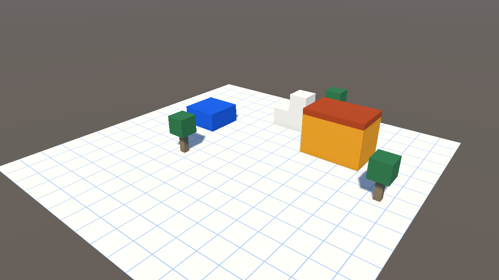

# 01일차 개발 일지 — 기반 구성

- **날짜**: 2026-10-08
- **단계**: 0단계 기반
- **목표**: Unity 3D 프로젝트·URP·기본 씬·PC 조작 구성
- **검사 기준**: PC에서 모눈 바닥 위에 블록이 놓인 장면을 걷고 둘러볼 수 있다
- **결과**: ✅ 구성 완료 (자동 검사 12개 통과, 에디터에서 직접 걸어 보는 확인은 아직)

---

## 오늘 한 일 요약

게임 내용을 만들기 전에 앞으로 사용할 **작업장**을 준비했다.
구현 방식을 "Unity 앱 하나로 PC와 VR 모두"로 정하고, 저장소의 `unity/` 폴더에 프로젝트를 만들었다. 모눈 바닥 위에 블록 몇 개를 놓은 시험 장면과, 키보드와 마우스로 걷는 캐릭터를 넣었다. VR은 2일차에 붙인다.



## 작업 내역

### 1. 프로젝트
- Unity `6000.3.21f1`, 3D(URP) 템플릿으로 생성. 위치는 저장소의 `unity/`
- 렌더 파이프라인: URP 17.3.0. 템플릿의 PC용·모바일용 설정(`Assets/Settings`)을 그대로 둠. 모바일용은 Quest에서 쓸 예정
- 입력: Input System 1.20.0
- 회사 이름 `Palettra Games`, 제품 이름 `Atelier Verse`(파일 이름에 쓸 수 없는 `|`는 뺌)
- 템플릿의 예제 씬·안내 자산(`SampleScene`, `TutorialInfo`, `Readme`, `InputSystem_Actions`) 정리

### 2. 버전 관리
- `unity/.gitignore`: Library, Temp, Logs, UserSettings, IDE 파일 제외 (Project-Mu와 같은 규칙)
- `unity/.gitattributes`: Unity YAML은 LF, 이미지와 사운드는 바이너리

### 3. 폴더 구조
```
Assets/_Project/
  Art/Materials/    GridFloor, Block_Gold·Blue·Clay·Leaf·Ivory·Wood
  Art/Textures/     Grid.png (한 칸에 한 번 반복되는 모눈 무늬)
  Editor/           Day1Setup, ProjectSetupRunner, DevCapture
  Input/            AtelierInput.inputactions
  Prefabs/          Player_Desktop
  Scenes/           Boot, Sandbox
  Scripts/Core/     Bootstrap, AtelierPalette
  Scripts/Player/   DesktopPlayerController
  Scripts/World/    GridMath
  Tests/EditMode/   GridMathTests
  Tests/PlayMode/   SandboxPlayTests
```

### 4. 스크립트
| 파일 | 내용 |
|---|---|
| `AtelierPalette` | 햇살 작업실 테마의 기준 색. 웹 화면 시안의 색 값과 같다 |
| `Bootstrap` | Boot 씬에서 Sandbox 씬으로 넘어간다 |
| `GridMath` | 위치를 모눈 칸 번호로 바꾸고 칸의 가운데로 맞춘다. 부품 놓기의 바탕 |
| `DesktopPlayerController` | WASD 이동, 마우스로 둘러보기, Space 점프, Shift 달리기. 화면을 누르면 마우스가 잠기고 Esc로 풀린다. 바닥 밖으로 떨어지면 시작 위치로 돌아온다 |

### 5. 입력 (`AtelierInput.inputactions`)
| 동작 | 키보드·마우스 | 게임패드 |
|---|---|---|
| Move | W A S D | 왼쪽 스틱 |
| Look | 마우스 이동 | 오른쪽 스틱 |
| Jump | Space | 아래 버튼 |
| Sprint | 왼쪽 Shift | 왼쪽 스틱 누르기 |

### 6. 씬
- **Sandbox**: 16×16칸 모눈 바닥(한 칸 1m), 해, 골드 집(3×2×2칸에 테라코타 지붕), 블루 단, 흰 계단 블록, 나무 세 그루, PC 캐릭터
- **Boot**: `Bootstrap`만 있는 시작 씬
- 빌드 설정에 Boot → Sandbox 순서로 등록

### 7. 자동 셋업
- `Day1Setup`: 위 재질·프리팹·씬·설정을 한 번에 만든다. 여러 번 실행해도 결과가 같다. 메뉴 `Atelier Verse/1일차 셋업 실행`
- `ProjectSetupRunner`: 에디터를 열면 아직 적용하지 않은 일차의 셋업을 자동으로 실행한다. 적용 기록은 `ProjectSettings/AtelierVerseSetupState.txt`
- 이번 1일차는 에디터 창 없이 명령줄로 이미 적용해 결과(씬·재질·프리팹)를 함께 커밋했다. 에디터를 열어도 다시 실행되지 않는다
- `DevCapture`: 일지에 넣을 장면 그림을 에디터 창 없이 찍는다

## 검사

| 항목 | 방법 | 결과 |
|---|---|---|
| 스크립트 컴파일 | 명령줄 실행 로그 | 오류 없음 |
| 모눈 계산 | 편집 모드 테스트 `GridMathTests` 7개 | 통과 |
| 씬 실행과 걷기 | 플레이 모드 테스트 `SandboxPlayTests` 5개 | 통과 |
| 장면 표시 | `DevCapture`로 찍은 그림 | 위 그림 |
| 직접 걸어 보기 | 에디터에서 Sandbox 씬 실행 | **아직 하지 않음** |
| Quest에서 실행 | 기기에 설치 | **아직 하지 않음** (2일차) |

모든 검사는 에디터 창 없이 명령줄로 실행했다. 마우스로 둘러보기와 점프는 자동 검사에 넣지 않았으므로 직접 확인이 필요하다.

### 플레이 모드 검사

`SandboxPlayTests`는 씬을 실제로 실행하고 가상 키보드로 입력을 넣어 확인한다.

| 테스트 | 확인하는 것 |
|---|---|
| Boot 씬은 Sandbox 씬으로 넘어간다 | 시작 씬에서 다음 씬으로 이동 |
| 캐릭터는 시작하면 바닥에 선다 | 바닥 충돌과 중력 |
| W 키를 누르고 있으면 앞으로 걷고 놓으면 멈춘다 | 1초에 약 3.5m 이동, 키를 놓으면 정지 |
| 프레임 수 제한이 없어도 같은 속도로 걷는다 | 초당 수천 프레임에서도 같은 거리 이동 |
| 바닥 밖으로 떨어지면 시작 위치로 돌아온다 | 낙하 복귀 |

### 검사에서 찾은 문제와 수정

- **증상**: 플레이 모드 테스트를 처음 돌렸을 때 W 키를 1초 눌러도 0.2m만 움직였고, 캐릭터가 바닥에 닿아 있지 않다고 나왔다.
- **원인**: 창 없이 실행하면 초당 수천 프레임으로 돈다. 이때 한 프레임 이동량(약 0.0005m)이 `CharacterController`의 최소 이동 거리 기본값(0.001m)보다 작아 이동이 통째로 무시됐다. 캐릭터는 실제로는 바닥에 서 있었다.
- **수정**: 캐릭터 프리팹의 최소 이동 거리를 0으로 설정했다(`Day1Setup`). 테스트는 실제 화면과 같은 초당 60프레임으로 맞춰 실행하고, 프레임 제한이 없는 경우를 따로 한 개 추가했다.

## 직접 확인하는 방법

1. Unity Hub에서 `unity` 폴더를 프로젝트로 추가해 연다(에디터 `6000.3.21f1`).
2. `Assets/_Project/Scenes/Sandbox`를 열고 재생 버튼을 누른다.
3. 게임 화면을 한 번 누른 뒤 W A S D로 걷고, 마우스로 둘러보고, Space로 뛴다. Esc로 마우스를 푼다.

## 알아 둘 점

- 이 컴퓨터의 Unity에는 Windows 빌드 구성만 있다. Quest용으로 만들려면 Unity Hub의 설치 항목에서 `6000.3.21f1`에 **Android Build Support**(OpenJDK, Android SDK & NDK 포함)를 추가해야 한다.
- VR 관련 패키지(XR Plugin Management, OpenXR, XR Interaction Toolkit)는 아직 넣지 않았다. 2일차에 넣는다.
- 블록은 Unity 기본 정육면체다. 부품 데이터 형식과 놓기 도구는 뒤 일차에서 만든다.

## 다음 일차

2일차: VR 리그와 Quest 빌드 설정. Android 빌드 구성 설치가 먼저 필요하다.
