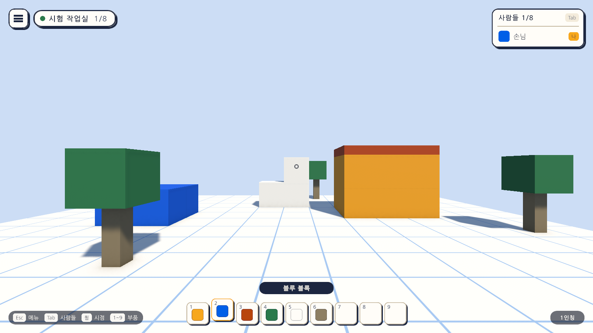
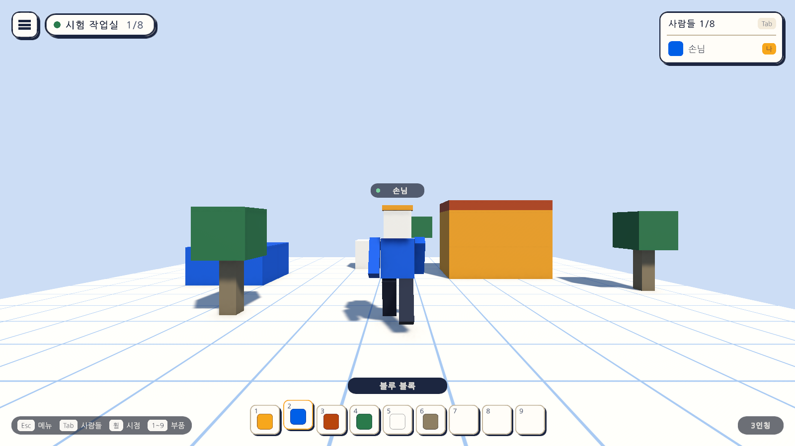
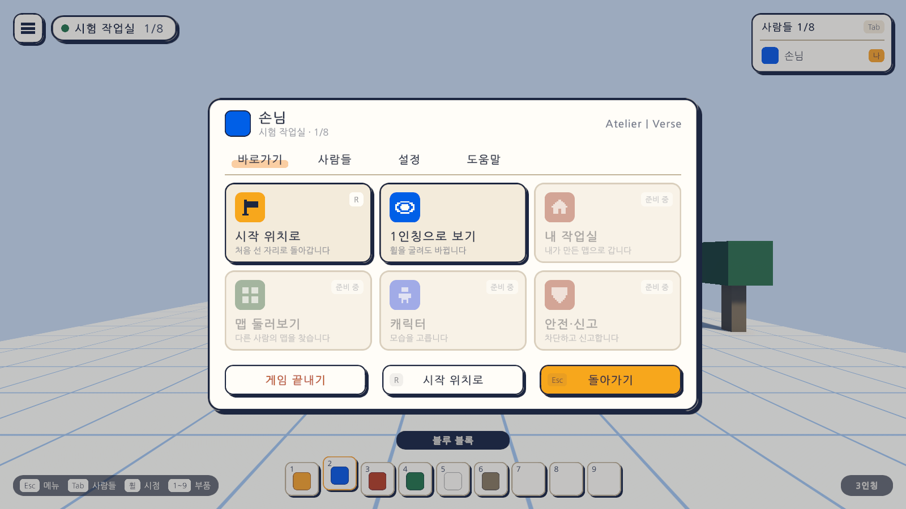

# 02일차 개발 일지 — 돌아다니기와 게임 화면

- **날짜**: 2026-10-08
- **단계**: 0단계 기반
- **목표**: 블록 캐릭터로 돌아다니고, 게임 화면(늘 보이는 화면과 Esc 메뉴)을 갖춘다
- **검사 기준**: 1인칭과 3인칭을 오가며 걷고, 메뉴를 열어 설정을 바꾸고 시작 위치로 돌아올 수 있다
- **결과**: ✅ 구성 완료 (자동 검사 40개 통과, 에디터에서 직접 해 보는 확인은 아직)

---

## 오늘 한 일 요약

1일차의 시험 장면을 **게임처럼 보이고 움직이게** 만들었다.
캐릭터에 블록 몸과 이름표가 생겼고, 마우스 휠로 1인칭과 3인칭을 오간다. 화면은 로블록스와 VRChat을 섞었다. 늘 보이는 화면은 로블록스처럼 위쪽 띠·사람들 목록·아래쪽 부품 칸으로 두고, Esc 메뉴는 로블록스의 탭과 아래 큰 단추에 VRChat의 큰 타일을 더했다.

원래 2일차로 잡았던 VR 리그와 Quest 빌드는 Android 빌드 구성이 설치된 뒤의 일차로 미뤘다.

그림은 테스트가 게임을 실행한 상태에서 찍은 것이다(1600×900). 설정·도움말·사람들 쪽 그림은 `menu-settings.png`, `menu-help.png`, `menu-people.png`에 있다.

## 화면을 어떻게 섞었나

| 화면 요소 | 따온 곳 | 내용 |
|---|---|---|
| 왼쪽 위 메뉴 단추 | 로블록스 | 누르면 Esc 메뉴가 열린다 |
| 방 이름과 인원 | 두 곳 모두 | 접속 표시 점, 방 이름, 현재 인원/8 |
| 오른쪽 위 사람들 목록 | 로블록스 | 같은 방 사람들. Tab으로 켜고 끈다 |
| 아래 가운데 부품 칸 | 로블록스 | 9칸. 숫자 키로 고르고 같은 키로 푼다 |
| 머리 위 이름표 | VRChat | 접속 표시 점과 이름. 3인칭에서 보인다 |
| Esc 메뉴의 탭과 아래 큰 단추 | 로블록스 | 바로가기·사람들·설정·도움말, 끝내기·시작 위치로·돌아가기 |
| Esc 메뉴의 큰 타일 | VRChat | 자주 가는 곳을 큰 타일로 둔다 |
| 시점 | 두 곳 모두 | 기본은 VRChat처럼 1인칭, 휠을 당기면 로블록스처럼 3인칭 |

색, 둥근 모서리, 어긋난 그림자는 웹 화면 시안(`design/assets/tokens.css`)의 값을 그대로 옮겼다.

## 작업 내역

### 1. 캐릭터
- **블록 몸**(`AvatarView`): 정육면체로 만든 머리·몸통·팔다리·모자. 걷는 속도에 맞춰 팔다리를 흔든다. 1인칭에서는 그림자만 남기고 몸을 숨긴다.
- **이름표**(`Nameplate`): 머리 위에 떠서 늘 보는 사람 쪽을 향한다. 로그인이 아직 없어 이름은 "손님"이다.
- **카메라**: 카메라를 기준점의 자식으로 옮겨 뒤로 물러날 수 있게 했다. 휠 한 칸에 한 단계씩 0(1인칭) → 2.5m → … → 8m로 바뀌고, 뒤에 벽이 있으면 벽 앞에서 멈춘다.
- **마우스 잡기**: 화면을 누르면 마우스를 잡아 시점이 돌고, 메뉴가 열리면 놓는다. 화면의 단추 위를 누를 때는 잡지 않는다.

### 2. 게임 화면 (`GameUI` 프리팹)
- 기준 화면 크기는 1920×1080이고 화면 크기에 맞춰 늘고 준다.
- **늘 보이는 화면**: 메뉴 단추, 방 이름과 인원, 사람들 목록, 부품 칸 9개, 키 안내, 시점 표시, 조준점, "화면을 누르면 둘러볼 수 있습니다" 안내.
- **Esc 메뉴**: 탭 네 개와 아래 큰 단추 세 개.
  - 바로가기: 시작 위치로, 시점 바꾸기. 내 작업실·맵 둘러보기·캐릭터·안전·신고는 아직 없어 누를 수 없고 "준비 중"으로 표시했다.
  - 사람들: 지금은 자기 자신만 보인다.
  - 설정: 마우스 감도, 시야각, 사람들 목록 보이기. 바꾸면 바로 적용되고 이 기기에 저장된다.
  - 도움말: 조작 키 목록.
  - 게임 끝내기는 실수로 누르지 않도록 두 번 눌러야 한다.
- 메뉴가 열려 있는 동안에는 캐릭터 조작과 부품 칸 키가 듣지 않는다.

### 3. 스크립트
| 파일 | 내용 |
|---|---|
| `Player/DesktopPlayerController` | 걷기에 시점 거리(휠), 마우스 잡기, 조작 막기, 시작 위치로 돌아가기를 더했다 |
| `Player/AvatarView` | 블록 몸의 팔다리 흔들기와 1인칭 숨기기 |
| `Player/Nameplate` | 머리 위 이름표 |
| `UI/GameUi` | 화면 전체를 묶고 Esc·Tab·숫자 키를 받는다 |
| `UI/HotbarModel`, `UI/HotbarView` | 부품 칸의 선택 규칙과 화면 |
| `UI/QuickMenuView` | Esc 메뉴의 탭과 단추 |
| `UI/SettingsPanel` | 설정 쪽 |
| `UI/PeopleListView` | 사람들 목록 |
| `Core/GameSettings` | 이 기기에 저장하는 개인 설정 |
| `Core/RoomRules` | 방 최대 인원 8명 |
| `Core/AppExit` | 게임 끝내기 요청 |

### 4. 입력 (`AtelierInput.inputactions`)
| 동작 | 키보드·마우스 | 게임패드 |
|---|---|---|
| Zoom | 마우스 휠 | 십자키 위아래 |
| Menu | Esc | Start |
| People | Tab | Select |
| SlotNext / SlotPrevious | - | 오른쪽·왼쪽 어깨 단추 |
| 부품 칸 1~9 | 숫자 키 | - |

### 5. 글꼴과 그림
- **글꼴**: 나눔고딕(오픈 폰트 라이선스, `Art/Fonts`에 라이선스 전문 포함). 웹 시안의 Pretendard는 이 컴퓨터에 없고 Noto Sans KR은 가변 글꼴이라 Unity에서 가장 가는 굵기로만 나와, 지금은 나눔고딕을 임시로 쓴다. 글꼴 파일 하나만 바꾸면 교체된다.
- **글꼴 자산**: 필요한 글자를 쓸 때마다 채우는 방식이라 이용자가 입력한 이름도 표시된다. 채워진 글자 그림이 커밋에 들어가지 않도록 저장할 때 비운다(`DynamicFontGuard`).
- **TextMesh Pro 기본 자산**(`Assets/TextMesh Pro`): 글자를 그리는 데 필요한 Unity 기본 자산.
- **화면용 그림**(`Art/UI`): 둥근 모서리 두 장과 12×12 블록 그림 일곱 장. 모두 셋업 스크립트가 그린다.

### 6. 자동 셋업
- `Day2Setup`(메뉴 `Atelier Verse/2일차 셋업 실행`): 글꼴 자산, 화면용 그림, 캐릭터 프리팹, `GameUI` 프리팹을 만들고 Sandbox 씬에 놓는다. `Day2Ui`가 화면을 조립하고 `UiFactory`가 상자·글자·단추를 만든다.
- `ProjectSetupRunner`: 자동 셋업이 씬을 새로 열기 전에, 저장하지 않은 변경이 있으면 저장할지 묻도록 고쳤다.

## 검사

| 항목 | 방법 | 결과 |
|---|---|---|
| 스크립트 컴파일 | 명령줄 실행 로그 | 오류 없음 |
| 2일차 셋업 적용 | 명령줄에서 `Day2Setup` 실행 | 적용됨 |
| 부품 칸 선택 규칙 | 편집 모드 테스트 `HotbarModelTests` 9개 | 통과 |
| 시점 거리와 설정 범위 | 편집 모드 테스트 `ViewAndSettingsTests` 7개 | 통과 |
| 모눈 계산(1일차) | 편집 모드 테스트 `GridMathTests` 7개 | 통과 |
| 게임 화면 | 플레이 모드 테스트 `GameUiPlayTests` 12개 | 통과 |
| 걷기(1일차) | 플레이 모드 테스트 `SandboxPlayTests` 5개 | 통과 |
| 화면 모양 | 테스트가 찍은 그림 6장을 눈으로 확인 | 위 그림 |
| 직접 해 보기 | 에디터에서 Sandbox 씬 실행 | **아직 하지 않음** |
| 실제 마우스로 단추 누르기 | 에디터 또는 빌드 | **아직 하지 않음** |
| Windows 빌드 | - | **아직 하지 않음** |
| Quest에서 실행 | - | **아직 하지 않음** |

`GameUiPlayTests`가 확인하는 것은 다음과 같다.

| 테스트 | 확인하는 것 |
|---|---|
| 처음에는 메뉴가 닫혀 있고 화면 요소가 준비되어 있다 | 부품 칸 9개, 사람들 "1/8", 이름표 "손님", 1인칭 |
| Esc 키로 메뉴를 열면 조작이 막히고 다시 누르면 돌아간다 | 메뉴가 열린 동안 W를 눌러도 걷지 않음, 닫으면 시점 조작으로 복귀 |
| 숫자 키로 부품 칸을 고르고 같은 키로 푼다 | 고르기, 바꾸기, 풀기, 빈 칸은 무시 |
| 메뉴가 열려 있으면 숫자 키가 부품 칸을 바꾸지 않는다 | 메뉴와 조작의 분리 |
| 휠을 당기면 3인칭이 되어 몸이 보이고 밀면 1인칭으로 돌아온다 | 휠 한 칸에 한 단계, 카메라 위치, 몸 보이기 |
| 화면을 눌러 마우스를 잡은 뒤에만 시점이 돈다 | 마우스 잡기 |
| 메뉴의 시작 위치로 단추는 캐릭터를 되돌리고 메뉴를 닫는다 | 단추 동작 |
| 메뉴의 시점 타일은 3인칭으로 바꾸고 메뉴를 닫는다 | 타일 동작 |
| 메뉴의 탭을 누르면 그 쪽만 보인다 | 탭 전환 |
| Tab 키로 사람들 목록을 끄고 켠다 | 목록 표시와 설정 저장 |
| 설정에서 바꾼 값은 저장되고 바로 적용된다 | 시야각이 카메라에 반영, 기본값으로 되돌리기 |
| 게임 끝내기는 두 번 눌러야 요청된다 | 실수 방지 |

검사에 대해 알아 둘 점이 세 가지 있다.

- 키와 마우스 움직임은 가상 장치로 넣었고, 화면의 단추는 테스트가 누름 동작을 직접 불렀다. **실제 마우스 포인터로 단추가 눌리는지는 확인하지 못했다.**
- 화면 그림을 찍는 테스트(`화면_그림을_찍는다`)는 `-captureDir` 인자를 줄 때만 실행되고, 평소에는 건너뛴다. 그래서 평소 실행에서는 플레이 모드 17개 통과, 1개 건너뜀으로 나온다.
- 이번 검사는 저장소의 `.verify/unity`에 만든 **사본 프로젝트**에서 실행했다. 작업하는 동안 Unity 에디터가 프로젝트를 열고 있어서 같은 폴더에서는 창 없이 실행할 수 없었다. 사본에서 만든 자산(프리팹, 씬, 글꼴 자산, 그림)을 그대로 이 프로젝트로 옮겼고, 두 곳의 파일이 같은지 비교해 확인했다.

## 직접 확인하는 방법

1. Unity 에디터로 돌아가면 새 파일을 불러온다. Sandbox 씬이 열려 있었다면 다시 불러올지 묻는데 "다시 불러오기"를 고른다.
2. `Assets/_Project/Scenes/Sandbox`에서 재생을 누른다.
3. 화면을 한 번 눌러 마우스를 잡고 걷는다. 휠을 당겨 3인칭으로, 숫자 키로 부품 칸을, Tab으로 사람들 목록을 바꿔 본다.
4. Esc로 메뉴를 열어 탭과 단추를 마우스로 눌러 본다. 설정의 막대를 끌어 시야각이 바뀌는지 본다.

## 알아 둘 점

- **부품 칸은 고르기만 된다.** 고른 블록을 놓는 것은 다음 일차에 연결한다.
- **사람들 목록과 이름표는 자기 자신만 나온다.** 여러 사람이 함께 들어오는 기능은 1-D 단계다.
- **대화(채팅) 화면은 넣지 않았다.** 함께 들어오는 기능과 같이 만든다.
- **VR에서는 아직 볼 수 없다.** 화면은 VR에서 눈앞에 띄울 수 있는 방식(uGUI)으로 만들었지만 VR 리그가 없다.
- 이름 "손님"과 방 이름 "시험 작업실"은 로그인과 맵 저장이 생기기 전의 임시 값이다.

## 다음 일차

3일차: 부품 칸에서 고른 블록을 모눈에 놓고 지우기.
