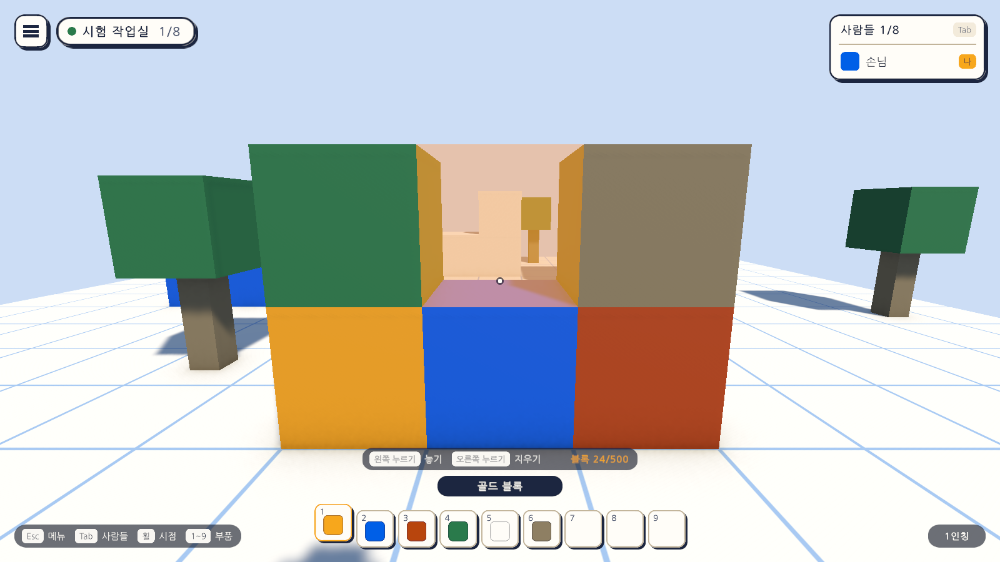
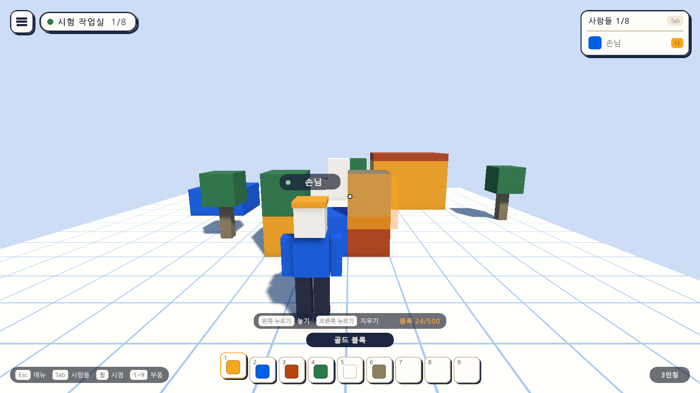

# 03일차 개발 일지 — 블록 놓고 지우기

- **날짜**: 2026-10-08
- **단계**: 0단계 기반
- **목표**: 부품 칸에서 고른 블록을 조준한 모눈 칸에 놓고, 놓인 블록을 지운다
- **검사 기준**: 부품을 고르고 바닥이나 블록을 가리켜 왼쪽을 누르면 그 자리에 블록이 놓이고, 오른쪽을 누르면 지워진다
- **결과**: ✅ 구성 완료 (자동 검사 59개 통과, 에디터에서 직접 해 보는 확인은 아직)

---

## 오늘 한 일 요약

2일차에 고르기만 되던 **부품 칸을 실제 블록 놓기에 연결했다.**
부품을 고르면 화면 가운데가 가리키는 칸에 반투명 블록이 미리 보이고, 왼쪽을 누르면 놓이고 오른쪽을 누르면 지워진다. 1일차에 씬에 놓아 둔 집·단·계단 블록도 같은 방식으로 지울 수 있게 블록 세계로 옮겼다.

그림은 테스트가 게임을 실행한 상태에서 찍은 것이다. 가운데의 반투명 블록이 왼쪽을 누르면 놓일 자리다. 바뀐 도움말은 `menu-help.png`에 있다.

## 작업 내역

### 1. 블록의 기록과 화면
- **`BlockMap`**: 칸마다 어떤 부품이 있는지의 기록. 범위, 겹침, 개수 상한을 지킨다. 화면과 무관해서 편집 모드 테스트로 검사한다. 다음에 맵을 저장할 때 이 기록을 그대로 쓴다.
- **`BlockWorld`**: 기록과 화면의 블록을 함께 맞춘다. 씬에 미리 놓인 블록은 시작할 때 기록에 올린다.
- **`PlacedBlock`**: 블록 하나가 자신의 칸과 부품 번호를 기억한다.
- **`PartCatalog`**(`Data/PartCatalog.asset`): 부품 목록. 부품 칸과 블록 세계가 같은 목록을 본다. 부품마다 저장용 이름(`block.gold` 등), 표시 이름, 재질, 색이 있다.

| 값 | 지금 | 비고 |
|---|---|---|
| 놓을 수 있는 범위 | 가로·세로 16칸(-8~7), 높이 12칸(0~11) | 모눈 바닥과 같은 넓이 |
| 블록 수 상한 | 500개 | **임시 값.** Quest에서 재 본 뒤에 정한다 |
| 손이 닿는 거리 | 머리에서 6m | |

### 2. 놓고 지우기 (`BlockBuilder`)
- 화면 가운데에서 광선을 쏘아 닿은 면의 **바깥쪽 칸**을 놓일 칸으로 삼는다. 바닥을 가리키면 바닥 위 칸, 블록의 옆면을 가리키면 그 옆 칸, 윗면을 가리키면 그 위 칸이다.
- 놓일 칸에 **반투명 미리 보기 블록**이 고른 부품의 색으로 나타난다. 놓을 수 없는 칸이면 붉은 흙색으로 바뀐다.
- 놓을 수 없는 경우: 범위 밖, 이미 블록이 있는 칸, 상한에 닿았을 때, 캐릭터나 나무·지붕 같은 다른 물체와 겹칠 때.
- 지우는 대상은 광선이 닿은 블록이다. 1일차의 나무와 지붕 판은 블록 세계의 블록이 아니라서 지워지지 않는다.
- **부품을 골랐을 때만** 놓고 지울 수 있다. 그냥 돌아다니다가 실수로 지우지 않게 하기 위해서다.
- 마우스를 잡는 첫 누름과 메뉴가 열려 있는 동안의 누름으로는 놓이지 않는다.

### 3. 캐릭터
- 조준 광선이 자기 몸에 막히지 않도록 캐릭터의 층을 `Ignore Raycast`로 옮겼다.
- 3인칭에서 화면 가운데의 조준점이 자기 머리에 가리지 않도록, 카메라가 어깨 너머(오른쪽 위)로 조금 비켜선다.
- `SetLook`으로 바라보는 방향을 정할 수 있게 했다. 테스트가 정확한 각도로 조준할 때 쓰고, 나중에 방에 들어설 때의 방향을 정하는 데도 쓴다.

### 4. 화면
- 부품을 고르면 부품 칸 위에 **놓기 안내**가 나타난다: 왼쪽 누르기 놓기, 오른쪽 누르기 지우기, 지금까지 놓인 블록 수(`블록 19/500`).
- 조준점은 1인칭일 때와, 3인칭이라도 부품을 골랐을 때 보인다.
- 도움말에 블록 놓기·지우기를 더했다.
- 부품 칸의 이름과 색은 이제 부품 목록에서 온다.

### 5. 입력 (`AtelierInput.inputactions`)
| 동작 | 키보드·마우스 | 게임패드 |
|---|---|---|
| Place | 마우스 왼쪽 | 오른쪽 방아쇠 |
| Remove | 마우스 오른쪽 | 왼쪽 방아쇠 |

### 6. 자동 셋업
- `Day3Setup`(메뉴 `Atelier Verse/3일차 셋업 실행`): 부품 목록, `Block`·`BlockGhost` 프리팹, 미리 보기 재질을 만들고, 캐릭터 프리팹에 `BlockBuilder`를 붙이고, 게임 화면을 다시 조립하고, Sandbox 씬에 `BlockWorld`를 놓는다. 1일차의 집·단·계단 블록 19개를 `BlockWorld`의 블록으로 바꾼다.
- 화면을 조립하는 스크립트의 이름을 `Day2Ui`에서 `GameUiBuilder`로 바꿨다. 일차가 지나며 화면에 요소가 늘면 이곳에 더하고 그 일차의 셋업이 다시 조립한다.
- `scripts/unity-verify.mjs`: 새 스크립트의 식별자(.meta)를 실제 프로젝트에서 먼저 정하고, 이름이 바뀌거나 지워진 소스를 사본에서도 지우도록 고쳤다.

## 검사

| 항목 | 방법 | 결과 |
|---|---|---|
| 스크립트 컴파일 | 명령줄 실행 로그 | 오류 없음 |
| 3일차 셋업 적용 | 명령줄에서 `ProjectSetupRunner` 실행 | 적용됨 (첫 실행은 실패, 아래 참고) |
| 블록 기록의 규칙 | 편집 모드 테스트 `BlockMapTests` 8개 | 통과 |
| 1·2일차의 편집 모드 테스트 | `GridMathTests` 7개, `HotbarModelTests` 9개, `ViewAndSettingsTests` 7개 | 통과 |
| 블록 놓고 지우기 | 플레이 모드 테스트 `BuildPlayTests` 11개 | 통과 |
| 1·2일차의 플레이 모드 테스트 | `SandboxPlayTests` 5개, `GameUiPlayTests` 12개 | 통과 |
| 화면 모양 | 테스트가 찍은 그림을 눈으로 확인 | 위 그림 |
| 직접 해 보기 | 에디터에서 Sandbox 씬 실행 | **아직 하지 않음** |
| 조준과 놓기의 손맛, 마우스 감도 | 에디터 또는 빌드 | **아직 하지 않음** |
| 블록 500개일 때의 성능 | - | **아직 하지 않음** |
| Windows 빌드, Quest에서 실행 | - | **아직 하지 않음** |

`BuildPlayTests`가 확인하는 것은 다음과 같다.

| 테스트 | 확인하는 것 |
|---|---|
| 씬에 미리 놓인 블록이 블록 세계에 올라 있다 | 19개, 집은 골드, 단은 블루 |
| 부품 칸의 이름은 부품 목록과 같다 | 부품 칸과 부품 목록의 일치 |
| 부품을 고르고 왼쪽을 누르면 조준한 칸에 블록이 놓인다 | 칸 번호, 부품, 위치, 재질 |
| 오른쪽을 누르면 조준한 블록이 지워진다 | 기록과 화면에서 모두 사라짐 |
| 놓인 블록의 윗면을 가리키면 그 위에 쌓인다 | 닿은 면의 바깥쪽 칸 |
| 부품을 고르지 않으면 놓이지 않는다 | 실수 방지 |
| 마우스를 잡는 첫 누름으로는 놓이지 않는다 | 실수 방지 |
| 캐릭터가 서 있는 칸에는 놓이지 않는다 | 겹침 검사 |
| 메뉴가 열려 있으면 놓이지 않는다 | 메뉴와 조작의 분리 |
| 씬에 미리 놓인 블록도 지울 수 있다 | 계단의 흰 블록 지우기 |
| 부품을 골랐을 때만 놓기 안내가 보이고 블록 수가 표시된다 | 화면 표시 |

검사에 대해 알아 둘 점이다.

- 키와 마우스 누름은 가상 장치로 넣었고, 바라보는 각도는 `SetLook`으로 정확히 정했다. **실제 마우스로 조준해 놓는 느낌은 확인하지 못했다.**
- 화면 그림을 찍는 테스트 2개는 `-captureDir` 인자를 줄 때만 실행된다. 평소에는 플레이 모드 28개 통과, 2개 건너뜀으로 나온다.
- 2일차와 같이 Unity 에디터가 프로젝트를 열고 있어서, 저장소의 `.verify/unity` **사본 프로젝트**에서 검사하고 만들어진 자산을 그대로 옮겼다. 두 곳의 파일이 같은지 비교해 확인했다.

### 검사에서 찾은 문제와 수정

- **증상**: 3일차 셋업의 첫 실행이 씬의 블록을 옮기는 곳에서 멈췄다.
- **원인**: 셋업이 씬을 새로 열면 그 전에 만들어 변수에 들고 있던 자산(블록 프리팹, 부품 목록) 가운데 쓰이지 않던 것이 메모리에서 내려가, 그 뒤의 참조가 비어 있었다.
- **수정**: 씬을 연 뒤에 필요한 자산을 경로로 다시 불러오도록 고쳤다. 다시 실행해 적용됐다.

## 직접 확인하는 방법

1. Unity 에디터로 돌아가면 새 파일을 불러온다. Sandbox 씬이 열려 있었다면 다시 불러올지 묻는데 "다시 불러오기"를 고른다.
2. `Assets/_Project/Scenes/Sandbox`에서 재생을 누르고, 화면을 한 번 눌러 마우스를 잡는다.
3. 숫자 키 1~6으로 부품을 고른다. 화면 가운데가 가리키는 곳에 반투명 블록이 보인다.
4. 마우스 왼쪽으로 놓고 오른쪽으로 지운다. 집이나 계단의 블록도 지워 본다.
5. 휠을 당겨 3인칭에서도 놓아 본다. 같은 숫자 키를 다시 누르면 부품 고르기가 풀린다.

## 알아 둘 점

- **놓은 블록은 저장되지 않는다.** 게임을 끄면 사라지고 씬에 미리 놓인 19개만 남는다. 저장과 불러오기는 맵 데이터 형식을 정하는 다음 일차에 만든다.
- 블록 하나가 게임 오브젝트 하나다. 500개까지는 문제없을 것으로 보지만 재 본 값이 아니다. Quest에서 재 본 뒤 묶어 그리는 방식이 필요한지 판단한다.
- 블록을 옮기기·돌리기·칠하기와 실행 취소는 아직 없다.
- 지붕 판과 나무는 지울 수 없다. 집의 블록을 지우면 지붕이 떠 있게 된다. 시험 장면이라 그대로 두었다.

## 다음 일차

4일차: 맵 데이터 형식을 정하고 놓은 블록을 저장하고 불러오기.
