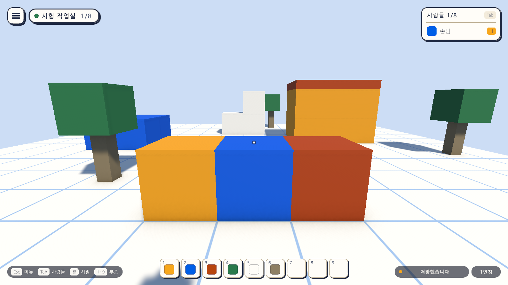

# 04일차 개발 일지 — 맵 데이터 형식과 저장·불러오기

- **날짜**: 2026-10-08
- **단계**: 0단계 기반
- **목표**: 맵 데이터 형식을 문서로 확정하고, 놓은 블록을 이 기기에 저장했다가 다시 열면 불러온다
- **검사 기준**: 블록을 놓고 게임을 껐다 켜면 놓은 블록이 그대로 있다. 깨진 파일이 있어도 게임이 시작된다
- **결과**: ✅ 구성 완료 (자동 검사 80개 통과, 에디터에서 직접 해 보는 확인은 아직)

---

## 오늘 한 일 요약

3일차까지는 놓은 블록이 게임을 끄면 사라졌다. 오늘 **맵 데이터 형식 1판**을 정해 문서(`docs/MAP-FORMAT.md`)로 남기고, 블록이 바뀌면 잠시 뒤 이 기기의 파일에 **자동으로 저장**하고 다시 열 때 **불러오도록** 했다. 화면 오른쪽 아래에 저장 상태가 보인다.

그림은 테스트가 게임을 실행한 상태에서 찍은 것이다. 앞의 담 세 칸은 테스트가 놓은 블록이고, 오른쪽 아래 "저장했습니다"가 새로 생긴 저장 표시다.

## 작업 내역

### 1. 맵 데이터 형식 (`docs/MAP-FORMAT.md`, `MapDocument`)

사업 계획서 12.2.2의 "부품 + 속성 + 동작"을 따르되, 지금 있는 것만 채우고 나머지는 자리만 두었다.

| 항목 | 내용 |
|---|---|
| 형식 이름·판 번호 | `atelier-verse-map`, `1`. 다른 이름이나 더 새 판은 거부하고, 옛 판은 한 단계씩 올려 읽는다 |
| 블록 | 부품의 **저장용 이름**(`block.gold`), 칸, 방향(`facing`, 지금은 항상 0) |
| 맵 정보 | 이름, 만든 시각, 저장 시각, 범위 |
| 자리만 둔 것 | 조립품(`assemblies`), 동작 규칙(`rules`). 항상 빈 목록 |

부품을 번호가 아니라 이름으로 적어, 부품 칸의 순서가 바뀌어도 파일이 그대로 읽힌다. 읽을 때는 모르는 부품, 범위 밖, 같은 칸의 중복, 상한 초과를 건너뛰고 그 수를 센다.

### 2. 파일 읽고 쓰기 (`MapStorage`)

- 위치: `Application.persistentDataPath/maps/local.map.json`. Windows에서는 `%USERPROFILE%\AppData\LocalLow\Palettra Games\Atelier Verse\maps\`다.
- 임시 파일(`.tmp`)에 먼저 쓰고 이름을 바꾼다. 쓰는 도중 꺼져도 이전 파일이 남는다.
- 읽지 못하는 파일은 지우지 않고 `local.map.json.broken-<시각>`으로 옮겨 둔다.
- 저장 폴더를 바꿀 수 있어 테스트는 임시 폴더를 쓴다. 이 기기의 실제 파일은 테스트가 건드리지 않는다.

### 3. 자동 저장 (`MapAutoSave`, Sandbox 씬의 `BlockWorld`에 붙음)

| 때 | 동작 |
|---|---|
| 시작할 때 파일이 있음 | 파일의 블록으로 바꿔 넣는다. 씬에 미리 놓인 19개는 치운다 |
| 시작할 때 파일이 없음 | 씬에 미리 놓인 블록을 첫 맵으로 삼아 바로 저장한다 |
| 시작할 때 파일이 깨짐 | 옆으로 옮겨 두고 씬의 블록으로 시작한 뒤 새 파일을 쓴다 |
| 블록이 바뀜 | 1초 뒤에 저장한다. 그 사이 더 바뀌면 다시 1초를 센다 |
| 앱을 끝내거나 씬을 떠남 | 남은 변경을 바로 저장한다 |
| 저장 실패 | "저장하지 못했습니다"를 보이고 5초 뒤에 다시 시도한다 |

### 4. 블록 세계 (`BlockWorld`)

- `Export`: 지금 블록을 문서로 만든다. `Import`: 블록을 모두 지우고 문서의 블록으로 바꿔 넣는다.
- 블록을 화면에 만드는 부분을 `CreateView`로 떼어 놓기와 불러오기가 같은 길을 쓴다.

### 5. 화면

- 오른쪽 아래 시점 표시 왼쪽에 **저장 표시**가 생겼다. "저장했습니다", "저장 대기 중", "불러왔습니다", "블록 N개를 읽지 못했습니다", "저장하지 못했습니다"(이때만 금색 글자)를 보인다.
- 화면은 `GameUiBuilder`에 더하고 4일차 셋업이 다시 조립했다.

### 6. 자동 셋업

- `Day4Setup`(메뉴 `Atelier Verse/4일차 셋업 실행`): Sandbox 씬의 `BlockWorld`에 `MapAutoSave`를 붙이고 게임 화면 프리팹을 다시 만들어 씬에 바꿔 넣는다.
- 프로젝트를 처음 열 때 Unity가 `Assets/Settings/Mobile_RPAsset.asset`의 판 번호를 12에서 13으로 올렸다. 함께 커밋했다.

## 검사

| 항목 | 방법 | 결과 |
|---|---|---|
| 스크립트 컴파일 | 명령줄 실행 로그 | 오류 없음 |
| 4일차 셋업 적용 | 명령줄에서 `ProjectSetupRunner` 실행 | 적용됨 |
| 형식 검사 | 편집 모드 테스트 `MapDocumentTests` 11개 | 통과 |
| 1~3일차의 편집 모드 테스트 | `GridMathTests`·`HotbarModelTests`·`ViewAndSettingsTests`·`BlockMapTests` 31개 | 통과 |
| 저장·불러오기 | 플레이 모드 테스트 `SavePlayTests` 8개 | 통과 |
| 1~3일차의 플레이 모드 테스트 | `SandboxPlayTests`·`GameUiPlayTests`·`BuildPlayTests` 30개 | 통과 |
| 화면 모양 | 테스트가 찍은 그림을 눈으로 확인 | 위 그림 |
| 글꼴 자산 크기 | 커밋 전 확인 | 6KB |
| 직접 해 보기 | 에디터에서 블록을 놓고 껐다 켜기 | **아직 하지 않음** |
| Windows 빌드에서 저장 폴더 생성 | - | **아직 하지 않음** |
| Quest에서 실행 | - | **아직 하지 않음** |

`MapDocumentTests`가 확인하는 것은 다음과 같다.

| 테스트 | 확인하는 것 |
|---|---|
| 저장하고 다시 읽으면 같은 블록이 나온다 | 형식·판·이름·시각·블록 세 개의 칸과 부품 |
| 블록은 번호가 아니라 저장용 이름으로 적힌다 | 파일에 `part`와 `block.blue`가 있고 `partIndex`가 없음 |
| 형식 이름이 다르면 거부한다 | `WrongFormat` |
| 판 번호가 없거나 새 판이면 거부한다 | `WrongFormat`, `NewerVersion` |
| 깨진 JSON과 빈 글은 거부한다 | `InvalidJson` |
| 모르는 부품과 범위 밖과 중복은 건너뛰고 수를 센다 | 1개 읽고 4개 건너뜀, 앞 블록이 덮이지 않음 |
| 상한을 넘는 블록은 상한까지만 읽는다 | 상한 3에 5개를 주면 3개 |
| 방향 값이 범위 밖이면 0으로 읽는다 | `facing: 7` → 0 |
| 항목이 빠진 파일도 빈 값으로 읽힌다 | 목록과 범위가 null이 아님 |
| 파일로 쓰고 읽을 수 있고 임시 파일은 남지 않는다 | 두 번 쓴 뒤 `.tmp` 없음, 없는 파일은 `Missing` |
| 읽지 못한 파일은 옆으로 옮겨 둔다 | 원래 이름이 비고 `.broken-` 파일에 내용이 그대로 |

`SavePlayTests`가 확인하는 것은 다음과 같다.

| 테스트 | 확인하는 것 |
|---|---|
| 파일이 없으면 씬의 블록을 첫 맵으로 저장한다 | 19개, 이름 "시험 작업실", 범위 |
| 블록을 놓으면 잠시 뒤 저장되고 다시 열면 남아 있다 | 대기 중 → 저장됨, 다시 열면 20개 |
| 씬을 떠날 때 남은 변경을 저장한다 | 1초를 기다리지 않고 씬을 다시 열어도 남아 있음 |
| 저장 파일이 있으면 씬의 블록 대신 파일의 블록이 보인다 | 2개만 있고 집의 블록은 없음, 재질이 맞음 |
| 읽지 못한 블록은 건너뛰고 수를 알린다 | "블록 2개를 읽지 못했습니다" |
| 읽지 못하는 파일은 옆으로 옮기고 씬의 블록으로 시작한다 | `Failed` → 옮긴 파일 있음 → 새 파일 저장 |
| 화면의 저장 표시는 상태를 따라 바뀐다 | "저장했습니다" → "저장 대기 중" → "저장했습니다" |
| 화면 그림을 찍는다 | `-captureDir`가 있을 때만 |

검사에 대해 알아 둘 점이다.

- 화면 그림을 찍는 테스트 3개는 `-captureDir` 인자를 줄 때만 실행된다. 평소에는 플레이 모드 35개 통과, 3개 건너뜀으로 나온다.
- 이번에는 Unity 에디터가 이 프로젝트를 열고 있지 않아 **실제 프로젝트에서 직접 검사했다**(사본을 쓰지 않음).

### 검사에서 찾은 문제와 수정

- **증상**: 3일차의 블록 놓기 테스트 3개가 "19개 기대, 21개"로 실패했다.
- **원인**: 테스트마다 임시 폴더를 새로 쓰는데, 앞 테스트의 씬이 아직 떠 있는 상태에서 폴더를 바꿨다. 앞 씬이 내려가며 남은 변경을 저장하는 시점이 그 뒤라, 앞 테스트의 블록이 다음 테스트의 파일이 되어 불러와졌다.
- **수정**: 폴더는 씬을 열기 직전에 바꾸고, 바꾸기 전에 앞 씬의 남은 변경을 앞 폴더에 먼저 저장하게 했다(`PlayTestBase.PrepareMapDirectory`). 파일을 미리 써 두는 테스트는 쓰기 전에 이 메서드를 부른다.

## 직접 확인하는 방법

1. Unity 에디터로 돌아가면 새 파일을 불러온다. Sandbox 씬이 열려 있었다면 "다시 불러오기"를 고른다.
2. `Assets/_Project/Scenes/Sandbox`에서 재생하고, 숫자 키로 부품을 골라 블록을 몇 개 놓는다. 오른쪽 아래가 "저장 대기 중"에서 "저장했습니다"로 바뀐다.
3. 재생을 멈추고 다시 재생한다. 놓은 블록이 그대로 있고 "불러왔습니다"가 보인다.
4. `%USERPROFILE%\AppData\LocalLow\Palettra Games\Atelier Verse\maps\local.map.json`을 메모장으로 열면 블록 목록이 보인다. 이 파일을 지우면 씬의 처음 블록 19개로 돌아간다.

## 알아 둘 점

- **이 기기에 맵이 하나뿐이다.** 새 맵, 맵 목록, 이름 바꾸기는 1-A의 "여러 맵 다루기"에서 만든다.
- **파일의 범위(`bounds`)는 참고용이다.** 실제 범위는 씬의 `BlockWorld` 값(가로·세로 16칸, 높이 12칸)이다.
- 마지막 변경 뒤 1초 안에 전원이 꺼지면 그 변경은 잃는다. 파일 자체는 깨지지 않는다.
- 저장 실패 안내는 작은 저장 표시의 글자뿐이다. 알림 띠는 다음 일차 후보에 있다.
- 블록을 옮기기·돌리기·칠하기와 실행 취소는 아직 없다.

## 다음 일차

`docs/BACKLOG.md` 2절의 순서대로 5일차는 실행 취소다.
