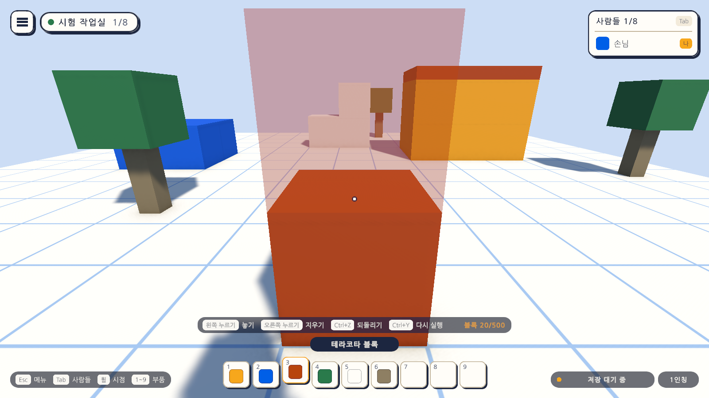
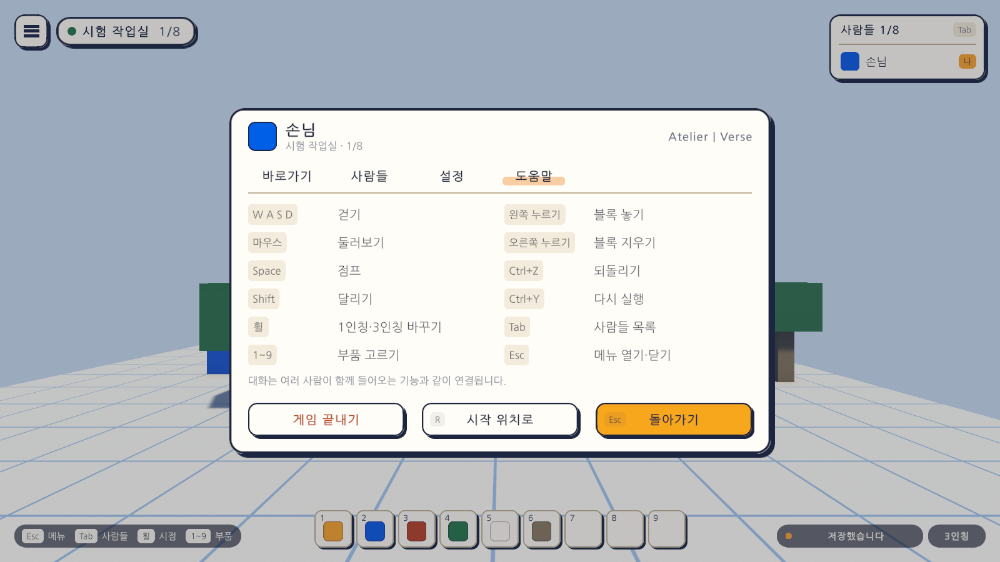

# 05일차 개발 일지 — 되돌리기와 다시 실행

- **날짜**: 2026-10-08
- **단계**: 0단계 기반 → 1-A 혼자 만들기
- **목표**: 놓기와 지우기를 하나씩 기록해 Ctrl+Z로 되돌리고 Ctrl+Y로 다시 실행한다. 되돌린 결과도 저장된다
- **검사 기준**: 블록을 놓고 Ctrl+Z를 누르면 사라지고 Ctrl+Y를 누르면 돌아온다. 지운 블록을 되돌리면 같은 부품으로 돌아온다
- **결과**: ✅ 구성 완료 (자동 검사 99개 통과, 에디터에서 직접 해 보는 확인은 아직)

---

## 오늘 한 일 요약

실수로 지운 블록을 되살릴 방법이 없었다. 블록 세계 위에 **기록 층(`EditHistory`)**을 두어 이용자의 놓기·지우기가 모두 이 층을 거치게 했고, Ctrl+Z와 Ctrl+Y로 최근 100번까지 되돌리고 다시 실행한다. 뒤에 생길 칠하기·옮기기도 같은 층을 쓰면 그대로 되돌릴 수 있다.

그림은 테스트가 게임을 실행한 상태에서 찍은 것이다. 첫 그림의 테라코타 블록은 테스트가 놓은 것이고, 부품 칸 위의 안내에 "Ctrl+Z 되돌리기 · Ctrl+Y 다시 실행"이 더해졌다.

## 작업 내역

### 1. 기록 층 (`EditHistory`, `IBlockStore`)

- `IBlockStore`: 블록 기록이 되돌리기에 내어 주는 세 동작(부품 보기, 놓기, 지우기). `BlockMap`과 `BlockWorld`가 구현한다.
- `EditHistory`: 변화 하나를 "칸, 이전 부품, 이후 부품"으로 기록한다. 놓기는 "없음 → 부품", 지우기는 "부품 → 없음"이다. 뒤에 칠하기가 생기면 "부품 → 다른 부품"으로 같은 자리에 들어간다.

| 규칙 | 내용 |
|---|---|
| 상한 | 최근 100번. 넘으면 오래된 것부터 버린다 |
| 새 편집 | 다시 실행 기록을 비운다 |
| 되돌리지 못할 때 | 상한이 가득 차 블록을 되살리지 못하면 기록을 그대로 두고 아무것도 하지 않는다 |
| 기록을 거치지 않은 변화 | 이미 그 상태면 성공으로 보고, 다른 부품이 있으면 지운 뒤 놓는다. 되돌리기가 영영 막히지 않게 하기 위해서다 |
| 맵을 바꿔 넣을 때 | 파일에서 불러오거나 모두 지우면 기록을 비운다 |

### 2. 어디서 기록을 거치나

- `BlockBuilder`의 놓기·지우기는 `world.History`를 거친다. `BlockWorld.Place`·`Remove`는 기록하지 않는 바탕 동작으로 남겨, 파일에서 불러올 때와 씬의 블록을 올릴 때는 기록이 쌓이지 않는다.
- 되돌리기도 바탕 동작을 거치므로 `BlockWorld.Changed`가 울리고 자동 저장(4일차)이 예약된다.

### 3. 입력과 화면

| 동작 | 키 | 비고 |
|---|---|---|
| Undo | Ctrl+Z | `Game` 입력 맵에 OneModifier 묶음으로 추가 |
| Redo | Ctrl+Y | Ctrl+Shift+Z는 Ctrl+Z와 겹쳐 울리므로 넣지 않았다 |

- 메뉴가 열려 있으면 되돌리지 않는다. 부품을 고르지 않았거나 마우스를 잡지 않은 상태에서는 된다.
- 부품 칸 위 놓기 안내에 "Ctrl+Z 되돌리기", "Ctrl+Y 다시 실행"을 더했다.
- 도움말을 두 줄 늘려 한 열에 여섯 줄(54px 간격)로 다시 배치했다.
- 게임패드 키는 아직 없다.

### 4. 자동 셋업

- `Day5Setup`(메뉴 `Atelier Verse/5일차 셋업 실행`): 게임 화면 프리팹을 다시 조립해 Sandbox 씬에 바꿔 넣는다. 입력 자산의 Undo·Redo는 파일에 직접 넣었다.

### 5. 테스트 틀

- 조준 도우미(`AimWithPart`)를 `PlayTestBase`로 옮겨 3일차와 5일차 테스트가 함께 쓴다. `TapWithCtrl`을 더했다.

## 검사

| 항목 | 방법 | 결과 |
|---|---|---|
| 스크립트 컴파일 | 명령줄 실행 로그 | 오류 없음 |
| 5일차 셋업 적용 | 명령줄에서 `ProjectSetupRunner` 실행 | 적용됨 |
| 기록 층의 규칙 | 편집 모드 테스트 `EditHistoryTests` 11개 | 통과 |
| 1~4일차의 편집 모드 테스트 | 42개 | 통과 |
| 되돌리기 | 플레이 모드 테스트 `UndoPlayTests` 8개 | 통과 |
| 1~4일차의 플레이 모드 테스트 | 38개 | 통과 |
| 화면 모양 | 테스트가 찍은 그림을 눈으로 확인 | 위 그림 |
| 글꼴 자산 크기 | 커밋 전 확인 | 6KB |
| 직접 해 보기 | 에디터에서 놓고 되돌리기 | **아직 하지 않음** |
| Windows 빌드, Quest에서 실행 | - | **아직 하지 않음** |

`EditHistoryTests`가 확인하는 것은 다음과 같다.

| 테스트 | 확인하는 것 |
|---|---|
| 놓기를 되돌리면 사라지고 다시 실행하면 돌아온다 | CanUndo·CanRedo의 변화 |
| 지우기를 되돌리면 같은 부품으로 돌아온다 | 이전 부품 번호 보존 |
| 새 편집을 하면 다시 실행 기록이 비워진다 | |
| 되돌릴 것이 없으면 아무 일도 하지 않는다 | false 반환 |
| 놓지 못한 편집과 없는 블록 지우기는 기록되지 않는다 | 범위 밖 놓기, 빈 칸 지우기 |
| 여러 번 되돌리면 거꾸로 하나씩 돌아간다 | 놓기·놓기·지우기 순서의 역순 |
| 기록은 상한을 넘으면 오래된 것부터 버린다 | 상한 3에 네 번 놓기 |
| 상한이 가득 차 되돌리지 못하면 기록을 남긴다 | 기록 수가 줄지 않음 |
| 기록을 거치지 않고 바뀐 칸이 있어도 되돌리기가 막히지 않는다 | 이미 없는 블록, 다른 부품이 있는 칸 |
| 비우면 되돌리기와 다시 실행이 모두 사라진다 | 블록은 그대로 |
| 기록이 바뀔 때마다 알린다 | 알림 네 번 |

`UndoPlayTests`가 확인하는 것은 다음과 같다.

| 테스트 | 확인하는 것 |
|---|---|
| 놓은 블록을 Ctrl+Z로 되돌리고 Ctrl+Y로 다시 놓는다 | 기록과 화면의 블록이 함께 사라지고 돌아옴 |
| Ctrl 없이 Z만 누르면 되돌리지 않는다 | |
| 지운 블록을 되돌리면 같은 부품으로 돌아온다 | 계단의 흰 블록, 재질까지 같음 |
| 메뉴가 열려 있으면 되돌리지 않는다 | |
| 되돌린 결과도 저장된다 | 저장 대기 → 파일의 블록 수가 줄어듦 |
| 씬을 다시 열면 기록이 비워진다 | 떠날 때 저장한 블록은 남고 기록만 없음 |
| 놓기 안내와 도움말에 되돌리기가 있다 | 화면 요소 |
| 화면 그림을 찍는다 | `-captureDir`가 있을 때만 |

검사에 대해 알아 둘 점이다.

- 화면 그림을 찍는 테스트 4개는 `-captureDir` 인자를 줄 때만 실행된다. 평소에는 플레이 모드 42개 통과, 4개 건너뜀으로 나온다.
- Unity 에디터가 이 프로젝트를 열고 있지 않아 실제 프로젝트에서 직접 검사했다.
- Ctrl+Z 조합은 가상 키보드로 Ctrl을 먼저 누른 뒤 Z를 눌러 확인했다. **실제 키보드의 손맛은 확인하지 못했다.**

## 직접 확인하는 방법

1. Unity 에디터로 돌아가면 새 파일을 불러온다. Sandbox 씬이 열려 있었다면 "다시 불러오기"를 고른다.
2. `Assets/_Project/Scenes/Sandbox`에서 재생하고, 숫자 키로 부품을 골라 블록을 몇 개 놓고 하나를 지운다.
3. Ctrl+Z를 누를 때마다 마지막 편집부터 거꾸로 돌아간다. Ctrl+Y로 다시 실행한다.
4. 오른쪽 아래 저장 표시가 "저장 대기 중"에서 "저장했습니다"로 바뀌는지 본다. 되돌린 결과도 저장된다.

## 알아 둘 점

- 기록은 게임을 끄면 사라진다. 파일에는 블록만 저장된다.
- 블록 하나가 기록 하나다. 끌어서 여러 칸을 채우는 도구가 생기면 한 번에 묶어 되돌리도록 바꾼다.
- 칠하기·옮기기는 아직 없지만, 만들 때 `EditHistory`에 동작을 더하면 같은 키로 되돌릴 수 있다.

## 다음 일차

`docs/BACKLOG.md` 2절의 순서대로 6일차는 블록 칠하기와 알림 띠다.
