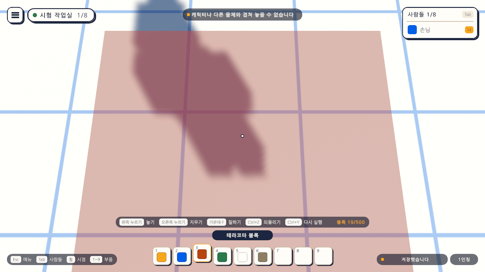
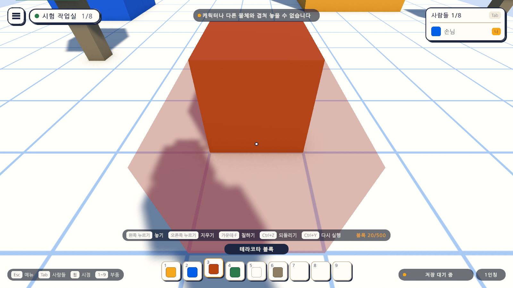

# 06일차 개발 일지 — 블록 칠하기와 알림 띠

- **날짜**: 2026-10-08
- **단계**: 1-A 혼자 만들기
- **목표**: 놓인 블록을 지우고 다시 놓지 않고 고른 부품으로 칠한다. 놓을 수 없는 까닭과 저장·불러오기의 문제를 화면의 알림 띠로 알린다
- **검사 기준**: 블록을 가리키고 가운데 단추나 F를 누르면 고른 부품의 색으로 바뀌고 Ctrl+Z로 돌아온다. 캐릭터와 겹치는 칸을 누르면 까닭이 띠로 나타났다가 사라진다
- **결과**: ✅ 구성 완료 (자동 검사 118개 통과, 에디터에서 직접 해 보는 확인은 아직)

---

## 오늘 한 일 요약

블록의 색을 바꾸려면 지우고 다시 놓아야 했고, 놓지 못할 때는 미리 보기가 붉어질 뿐 까닭을 알 수 없었다. 오늘 **칠하기**(마우스 가운데 단추 또는 F)와 화면 위 가운데의 **알림 띠**를 만들었다. 칠하기는 5일차의 기록 층을 그대로 써서 Ctrl+Z로 되돌아간다.

그림은 테스트가 게임을 실행한 상태에서 찍은 것이다. 첫 그림은 캐릭터가 선 칸을 가리켜 놓으려 한 직후이고, 둘째 그림은 블루로 놓은 블록을 테라코타 부품으로 칠한 직후다(앞 알림이 아직 남아 있다).

## 작업 내역

### 1. 칠하기

- 부품을 고르고 블록을 가리킨 채 **마우스 가운데 단추** 또는 **F**를 누르면 그 블록이 고른 부품으로 바뀐다. 블록 수는 그대로다.
- 블록이 없는 곳에서 누르면 "칠할 블록을 가리키세요", 이미 같은 부품이면 "이미 같은 부품입니다"가 띠에 뜬다.
- 기록 층(`EditHistory.Replace`)이 "이전 부품 → 새 부품"으로 기록하므로 Ctrl+Z·Ctrl+Y가 그대로 동작한다. 되돌릴 때도 블록을 지우고 다시 만들지 않고 부품만 바꾼다(`IBlockStore.Replace`).
- `BlockWorld.Replace`가 기록과 화면의 재질을 함께 바꾼다.

| 동작 | 키보드·마우스 | 게임패드 |
|---|---|---|
| Paint | 마우스 가운데, F | 서쪽 단추 |

가운데 단추만 두지 않은 것은 터치패드에서 가운데 누르기가 어렵기 때문이다.

### 2. 알림 띠 (`Notice`, `NoticeModel`, `NoticeBar`)

- `Notice.Post(문구, 종류)`: 화면을 모르는 코드(블록 놓기, 저장, 되돌리기)가 알림을 올리는 곳.
- `NoticeModel`: 마지막 알림 하나를 2.5초 동안 보이고, 새 알림이 오면 바로 바꾼다. 화면과 무관해 편집 모드 테스트로 검사한다.
- `NoticeBar`: 화면 위 가운데의 띠. 너비는 글자에 맞추고 왼쪽 점의 색이 종류를 나타낸다(안내 잎색, 주의 골드, 오류 테라코타).

| 때 | 문구 | 종류 |
|---|---|---|
| 맵 바깥에 놓으려 함 | 맵 바깥에는 놓을 수 없습니다 | 주의 |
| 캐릭터·물체와 겹침 | 캐릭터나 다른 물체와 겹쳐 놓을 수 없습니다 | 주의 |
| 블록 수 상한 | 블록이 500개에 닿아 더 놓을 수 없습니다 | 주의 |
| 칠할 블록 없음 / 같은 부품 | 칠할 블록을 가리키세요 / 이미 같은 부품입니다 | 안내 |
| 되돌릴 것 없음 | 되돌릴 것이 없습니다 / 다시 실행할 것이 없습니다 | 안내 |
| 읽지 못한 블록 | 블록 N개를 읽지 못했습니다 | 주의 |
| 깨진 맵 파일 | 맵 파일을 읽지 못했습니다. 파일은 옆으로 옮겨 두었습니다 | 오류 |
| 저장 실패 | 맵을 저장하지 못했습니다. 잠시 뒤 다시 시도합니다 | 오류 |

오른쪽 아래의 저장 표시(4일차)는 그대로 두고, 문제가 있을 때만 띠가 함께 뜬다.

### 3. 놓을 수 없는 까닭

- `BlockBuilder.Blocked`가 범위 밖·이미 있음·상한·겹침을 구분한다. 3일차까지는 "놓을 수 있다/없다"만 알았다.

### 4. 화면

- 놓기 안내에 "가운데·F 칠하기"를 더했다.
- 도움말에 "가운데 · F 블록 칠하기" 줄을 더하고, "Space"와 "Shift"를 한 줄로 합쳐 열당 여섯 줄을 유지했다.

### 5. 자동 셋업

- `Day6Setup`(메뉴 `Atelier Verse/6일차 셋업 실행`): 알림 띠와 칠하기 안내가 든 게임 화면을 다시 조립해 Sandbox 씬에 바꿔 넣는다. 입력 자산의 Paint는 파일에 직접 넣었다.

## 검사

| 항목 | 방법 | 결과 |
|---|---|---|
| 스크립트 컴파일 | 명령줄 실행 로그 | 오류 없음 |
| 6일차 셋업 적용 | 명령줄에서 `ProjectSetupRunner` 실행 | 적용됨 |
| 알림 띠 상태 | 편집 모드 테스트 `NoticeModelTests` 5개 | 통과 |
| 칠하기 기록 | `EditHistoryTests` 3개, `BlockMapTests` 1개 추가 | 통과 |
| 1~5일차의 편집 모드 테스트 | 53개 | 통과 |
| 칠하기와 알림 | 플레이 모드 테스트 `PaintPlayTests` 10개 | 통과 |
| 1~5일차의 플레이 모드 테스트 | 46개 | 통과 |
| 화면 모양 | 테스트가 찍은 그림을 눈으로 확인 | 위 그림 |
| 글꼴 자산 크기 | 커밋 전 확인 | 6KB |
| 직접 해 보기 | 에디터에서 칠하기와 알림 | **아직 하지 않음** |
| 저장 실패 알림 | 쓰기 권한이 없는 폴더에서의 실제 동작 | **아직 하지 않음** (코드 경로만 있음) |
| Windows 빌드, Quest에서 실행 | - | **아직 하지 않음** |

`PaintPlayTests`가 확인하는 것은 다음과 같다.

| 테스트 | 확인하는 것 |
|---|---|
| 가운데 단추로 조준한 블록을 고른 부품으로 칠한다 | 부품·재질이 바뀌고 블록 수는 그대로, 기록 두 개 |
| F 키로도 칠한다 | |
| 칠하기를 되돌리면 이전 부품으로 돌아온다 | Ctrl+Z → 블루, Ctrl+Y → 골드 |
| 같은 부품으로 칠하면 바뀌지 않고 알림이 나온다 | 기록이 늘지 않음 |
| 블록이 없는 곳에서 칠하면 알림이 나온다 | |
| 놓을 수 없는 곳을 누르면 까닭이 알림으로 나온다 | 겹침 문구, 주의 종류 |
| 알림은 잠시 뒤 사라진다 | 3초 뒤 띠가 꺼짐 |
| 되돌릴 것이 없으면 알림이 나온다 | 되돌리기·다시 실행 둘 다 |
| 읽지 못한 블록이 있으면 알림이 나온다 | 씬이 열리자마자 띠에 "블록 1개를 읽지 못했습니다" |
| 화면 그림을 찍는다 | `-captureDir`가 있을 때만 |

검사에 대해 알아 둘 점이다.

- 화면 그림을 찍는 테스트 5개는 `-captureDir` 인자를 줄 때만 실행된다. 평소에는 플레이 모드 51개 통과, 5개 건너뜀으로 나온다.
- Unity 에디터가 이 프로젝트를 열고 있지 않아 실제 프로젝트에서 직접 검사했다.

### 검사에서 찾은 문제와 수정

- **증상**: 1일차의 걷기 테스트 2개가 "1초에 3.5m 기대, 1.12m"로 실패했다.
- **원인**: `SandboxPlayTests`는 공통 틀(`PlayTestBase`)을 쓰지 않아 저장 폴더를 바꾸지 않았다. 바로 앞의 칠하기 테스트가 놓은 블록이 씬이 내려갈 때 저장되고, 걷기 테스트의 씬이 그 파일을 불러와 캐릭터가 그 블록에 막혔다.
- **수정**: `SandboxPlayTests`도 `PlayTestBase`를 쓰게 하고, `PlayTestBase.TearDown`에서 떠 있는 씬의 남은 변경을 먼저 저장하게 했다. 이제 어떤 순서로 돌아도 앞 테스트의 블록이 다음 테스트로 새지 않는다.

## 직접 확인하는 방법

1. Unity 에디터로 돌아가면 새 파일을 불러온다. Sandbox 씬이 열려 있었다면 "다시 불러오기"를 고른다.
2. `Assets/_Project/Scenes/Sandbox`에서 재생하고, 숫자 키로 부품을 고른 뒤 집의 블록을 가리켜 마우스 가운데 단추나 F를 누른다. 색이 바뀌고 Ctrl+Z로 돌아온다.
3. 발밑을 가리키고 왼쪽을 누르면 위 가운데에 "캐릭터나 다른 물체와 겹쳐 놓을 수 없습니다"가 떴다가 사라진다.
4. 부품을 고르지 않은 채 Ctrl+Z를 누르면 "되돌릴 것이 없습니다"가 뜬다.

## 알아 둘 점

- 알림은 마지막 하나만 보인다. 짧은 사이에 여러 알림이 오면 앞의 것이 묻힌다.
- 칠하기도 블록 하나가 기록 하나다. 끌어서 여러 칸을 칠하는 도구는 아직 없다.
- 저장 실패 알림의 코드 경로는 있지만 실제로 실패하는 상황(쓰기 권한 없음 등)에서는 확인하지 않았다.

## 다음 일차

`docs/BACKLOG.md` 2절의 순서대로 7일차는 만들기 시점(날아다니며 만들기)과 걸어 보기의 전환이다.
