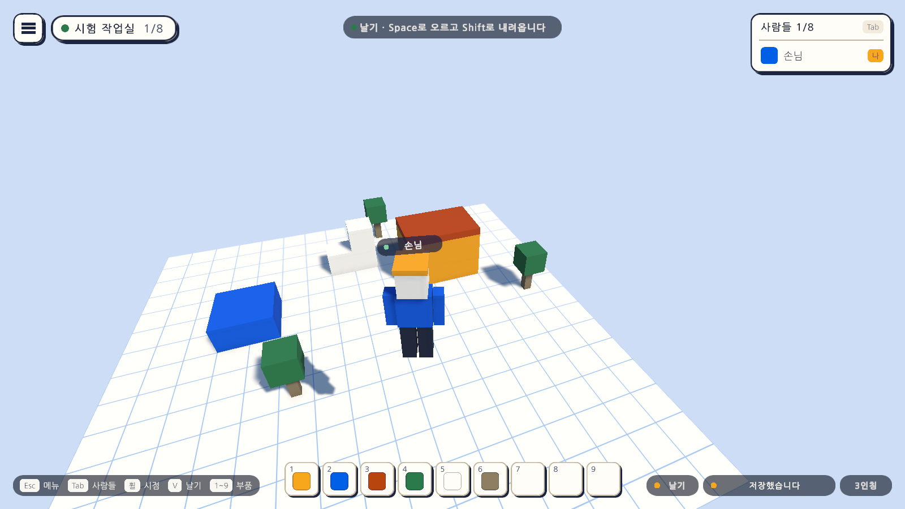
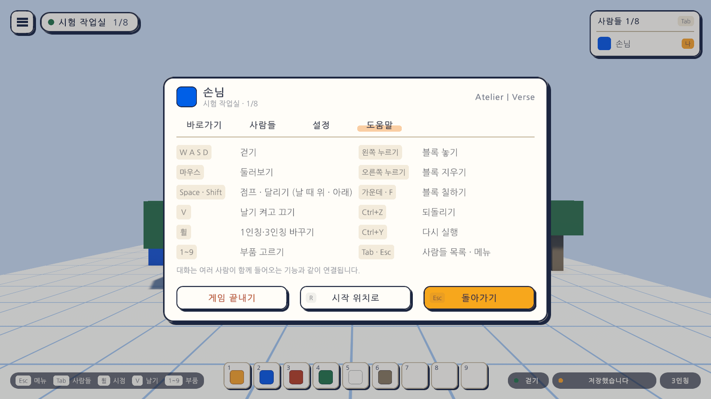

# 07일차 개발 일지 — 날기(만들기 시점)와 걸어 보기

- **날짜**: 2026-10-08
- **단계**: 1-A 혼자 만들기
- **목표**: 날아다니며 높은 곳을 만들고, 끄면 그 자리에서 떨어져 걸어 본다
- **검사 기준**: V를 누르면 날기가 켜지고 Space로 오르고 Shift로 내려오며 떨어지지 않는다. 다시 V를 누르면 바닥으로 떨어진다. 날면서도 블록을 놓을 수 있다
- **결과**: ✅ 구성 완료 (자동 검사 131개 통과, 에디터에서 직접 해 보는 확인은 아직)

---

## 오늘 한 일 요약

높은 곳을 만들려면 블록을 쌓고 올라가야 했다. 오늘 **날기**(V)를 만들어 중력 없이 떠다니며 만들 수 있게 했고, 끄면 그 자리에서 떨어져 바로 걸어 볼 수 있다. 마인크래프트 창작 모드처럼 Space로 오르고 Shift로 내려온다.

그림은 테스트가 게임을 실행한 상태에서 찍은 것이다. 첫 그림의 오른쪽 아래에 골드 점과 "날기" 표시가 보인다.

## 작업 내역

### 1. 날기 (`DesktopPlayerController`)

| 항목 | 내용 |
|---|---|
| 켜고 끄기 | V (게임패드 북쪽 단추). 시작할 때와 시작 위치로 돌아갈 때는 걷기 |
| 움직임 | W A S D는 바라보는 좌우 방향(위아래 시선과 무관), Space 위, Shift 아래. 속도 7m/s |
| 대각선 | 앞으로 가며 오를 때도 길이를 1로 맞춰 속도가 같다(`ComposeFlyMove`) |
| 중력 | 없음. 아무 키도 누르지 않으면 그 자리에 머문다 |
| 충돌 | 블록·나무와 여전히 부딪힌다(`CharacterController` 그대로) |
| 끌 때 | 그 자리에서 떨어진다. 걷기의 중력이 바로 적용된다 |
| 메뉴 | 열려 있으면 V가 듣지 않고, 날던 캐릭터는 제자리에 멈춘다 |
| 팔다리 | 날 때는 흔들지 않는다 |

날기 상태는 저장하지 않는다. 다음에 열면 걷기로 시작한다.

### 2. 입력 (`AtelierInput.inputactions`)

| 동작 | 키보드·마우스 | 게임패드 |
|---|---|---|
| Fly | V | 북쪽 단추 |

Space와 Shift는 새 동작을 만들지 않고 걷기의 Jump·Sprint 동작을 날 때 위·아래로 다시 썼다.

### 3. 화면

- 오른쪽 아래 저장 표시 왼쪽에 **걷기·날기 표시**를 더했다. 날 때는 골드 점과 "날기"다.
- 켜고 끌 때 알림 띠(6일차)에 "날기 · Space로 오르고 Shift로 내려옵니다", "걷기로 돌아왔습니다"가 뜬다.
- 왼쪽 아래 키 안내에 "V 날기"를, 도움말에 "V 날기 켜고 끄기"와 "Space · Shift 점프 · 달리기 (날 때 위 · 아래)"를 더했다. 줄 수를 맞추려 "Tab"과 "Esc"를 한 줄로 합쳤다.

### 4. 자동 셋업

- `Day7Setup`(메뉴 `Atelier Verse/7일차 셋업 실행`): 걷기·날기 표시가 든 게임 화면을 다시 조립해 Sandbox 씬에 바꿔 넣는다. 날기 자체는 캐릭터 프리팹의 스크립트에 있어 셋업이 만들지 않는다.

## 검사

| 항목 | 방법 | 결과 |
|---|---|---|
| 스크립트 컴파일 | 명령줄 실행 로그 | 오류 없음 |
| 7일차 셋업 적용 | 명령줄에서 `ProjectSetupRunner` 실행 | 적용됨 |
| 날 때의 속도 계산 | 편집 모드 테스트 `FlyMoveTests` 4개 | 통과 |
| 1~6일차의 편집 모드 테스트 | 62개 | 통과 |
| 날기 | 플레이 모드 테스트 `FlyPlayTests` 9개 | 통과 |
| 1~6일차의 플레이 모드 테스트 | 56개(1일차 걷기 테스트 포함) | 통과 |
| 화면 모양 | 테스트가 찍은 그림을 눈으로 확인 | 위 그림 |
| 글꼴 자산 크기 | 커밋 전 확인 | 6KB |
| 직접 해 보기 | 에디터에서 날기의 손맛 | **아직 하지 않음** |
| Windows 빌드, Quest에서 실행 | - | **아직 하지 않음** |

`FlyPlayTests`가 확인하는 것은 다음과 같다.

| 테스트 | 확인하는 것 |
|---|---|
| V 키로 날기를 켜고 끈다 | 상태, 표시 글자, 알림 문구 |
| 날 때는 Space로 오르고 떨어지지 않으며 Shift로 내려온다 | 0.6초에 2m 이상 오르고, 손을 떼면 높이 유지 |
| 날 때 W로 앞으로 가고 점프 높이보다 높이 오를 수 있다 | 1초에 7m 안팎, 높이는 그대로 |
| 날기를 끄면 그 자리에서 떨어져 바닥에 선다 | 1.5초 뒤 바닥 |
| 메뉴가 열려 있으면 V가 동작하지 않고 날던 캐릭터는 멈춰 있는다 | |
| 시작 위치로 돌아가면 날기가 꺼진다 | |
| 날면서도 블록을 놓을 수 있다 | 공중에서 바닥 칸에 놓기 |
| 키 안내와 도움말에 날기가 있다 | 화면 요소 |
| 화면 그림을 찍는다 | `-captureDir`가 있을 때만 |

검사에 대해 알아 둘 점이다.

- 화면 그림을 찍는 테스트 6개는 `-captureDir` 인자를 줄 때만 실행된다. 평소에는 플레이 모드 59개 통과, 6개 건너뜀으로 나온다.
- Unity 에디터가 이 프로젝트를 열고 있지 않아 실제 프로젝트에서 직접 검사했다.

## 직접 확인하는 방법

1. Unity 에디터로 돌아가면 새 파일을 불러온다. Sandbox 씬이 열려 있었다면 "다시 불러오기"를 고른다.
2. `Assets/_Project/Scenes/Sandbox`에서 재생하고 V를 누른다. 오른쪽 아래가 "날기"로 바뀌고 위에 안내가 뜬다.
3. Space로 오르고 Shift로 내려오며 W A S D로 움직인다. 높은 곳에서 부품을 골라 블록을 놓아 본다.
4. V를 다시 누르면 떨어진다. 집 지붕 위에서 끄면 지붕에 선다.

## 알아 둘 점

- 날기 속도는 7m/s 하나다. 속도 조절은 선택 항목으로 남겼다.
- 걷기와 날기가 `DesktopPlayerController` 하나에 있다. VR 캐릭터와 다른 사람의 캐릭터를 넣기 전에 "조작과 겉모습 나누기"에서 함께 나눈다.
- 블록과 부딪히므로 좁은 틈은 지나갈 수 없다. 벽을 통과하는 방식은 넣지 않았다.

## 다음 일차

`docs/BACKLOG.md` 2절의 순서대로 8일차는 Windows 빌드 확인이다.
