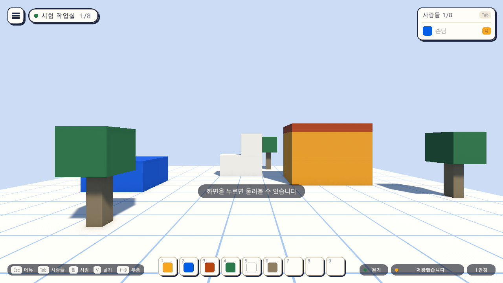

# 08일차 개발 일지 — Windows 빌드 확인

- **날짜**: 2026-10-08
- **단계**: 0단계 기반(빌드)
- **목표**: 명령줄 한 줄로 Windows 실행 파일을 만들고, 에디터 밖에서 실제로 도는지 확인한다
- **검사 기준**: 빌드가 오류 없이 끝나고, 실행 파일이 Sandbox 씬을 열어 맵 파일을 만들고, 스스로 끝낼 수 있다
- **결과**: ✅ 구성 완료 (빌드 104MB·61초, 실행 확인 통과, 자동 검사 139개 통과)

---

## 오늘 한 일 요약

지금까지 한 번도 빌드하지 않았다. 오늘 **빌드 스크립트**(`BuildPlayer`, `scripts/build-windows.mjs`)를 만들어 실제로 Windows 실행 파일을 만들고, 10초 동안 띄웠다가 스스로 끝내는 **자동 실행 확인**으로 에디터 밖에서도 도는 것을 확인했다. 메뉴에는 **버전**(v0.1.0)이 보인다.



그림은 에디터가 아니라 **빌드된 실행 파일**이 `-screenshotOut`으로 저장한 것이다. 오른쪽 아래 "저장했습니다"는 실행 파일이 이 기기의 맵 파일을 만들었다는 뜻이다.

## 작업 내역

### 1. 빌드 스크립트 (`Editor/BuildPlayer.cs`)

| 항목 | 내용 |
|---|---|
| 진입점 | `AtelierVerse.EditorTools.BuildPlayer.BuildWindows` (명령줄), 메뉴 `Atelier Verse/Windows 빌드 만들기` |
| 인자 | `-buildOut 폴더`(기본 `unity/Builds/Windows`), `-development` |
| 씬 | 빌드 설정에 켜진 씬(Boot → Sandbox) |
| 백엔드 | Mono. IL2CPP는 Visual Studio의 C++ 도구가 있어야 해서 지금은 쓰지 않는다 |
| 실패 | 예외를 던져 Unity가 0이 아닌 값으로 끝난다 |

### 2. 한 줄 빌드와 실행 확인 (`scripts/build-windows.mjs`)

```bash
node scripts/build-windows.mjs --run
```

- `ProjectVersion.txt`의 에디터 버전으로 Unity 경로를 찾아 배치 모드로 빌드하고, 로그에서 요약 줄을 보여 준다.
- `--run`: 실행 파일을 `-quitAfter 10 -screenshotOut … -logFile …`로 띄워 종료 코드, 로그의 예외, 맵 파일 생성, 화면 그림을 확인한다. 하나라도 틀리면 실패로 끝난다.
- `--skip-build --run`은 이미 만든 실행 파일만 다시 확인한다.

### 3. 실행 파일의 확인용 인자 (`Bootstrap`)

| 인자 | 동작 |
|---|---|
| `-quitAfter 초` | 그 시간이 지나면 `AppExit.Request()`로 끝낸다 |
| `-screenshotOut 경로` | 끝내기 1초 전에 화면을 PNG로 저장한다 |

Boot 씬의 `Bootstrap`이 인자를 읽고, 필요할 때만 씬이 바뀌어도 남아 있도록(`DontDestroyOnLoad`) 둔다. 인자가 없으면 전과 같다.

### 4. 플레이어 설정 (`Day8Setup`)

| 설정 | 전 | 후 |
|---|---|---|
| 창 모드 | 전체 화면 창 | 보통 창(크기 조절 가능) |
| 기본 크기 | 1024×768 | 1600×900 |
| 창이 뒤로 갈 때 | 멈춤 | 계속 실행(자동 저장과 뒤 단계의 접속 때문) |
| 스크립팅 백엔드 | 기본값 | Mono |

### 5. 메뉴의 버전 표시

- Esc 메뉴 오른쪽 위 "Atelier | Verse" 옆에 `v0.1.0`(프로젝트 설정의 `bundleVersion`)이 보인다. 어느 판에서 생긴 문제인지 알 수 있게 하기 위해서다.

## 검사

| 항목 | 방법 | 결과 |
|---|---|---|
| 스크립트 컴파일 | 명령줄 실행 로그 | 오류 없음 |
| 8일차 셋업 적용 | 명령줄에서 `ProjectSetupRunner` 실행, `ProjectSettings.asset` 확인 | 적용됨 |
| 빌드 인자와 씬 목록 | 편집 모드 테스트 `BuildPlayerTests` 4개 | 통과 |
| 확인용 인자 읽기 | 편집 모드 테스트 `BootstrapArgsTests` 3개 | 통과 |
| 1~7일차의 편집 모드 테스트 | 66개 | 통과 |
| 메뉴의 버전 | 플레이 모드 테스트 `VersionPlayTests` 1개 | 통과 |
| 1~7일차의 플레이 모드 테스트 | 59개 통과, 6개 건너뜀(그림 찍기) | 통과 |
| **Windows 빌드** | `node scripts/build-windows.mjs --run` | **성공: 104MB, 61초, 오류 0·경고 0** |
| **실행 파일 실행** | 10초 뒤 스스로 끝남 | **종료 코드 0, 로그에 예외 없음** |
| **맵 파일 생성** | `%USERPROFILE%\AppData\LocalLow\Palettra Games\Atelier Verse\maps\local.map.json` | **생성됨(형식 1판, 블록 19개)** |
| 화면 그림 | 실행 파일이 저장한 `smoke.png` | 위 그림 |
| 직접 조작 | 실행 파일에서 걷기·놓기·메뉴의 "게임 끝내기" | **아직 하지 않음** (자동 확인은 입력 없이 열고 끝내기까지) |
| Quest에서 실행 | - | **아직 하지 않음** |

검사에 대해 알아 둘 점이다.

- 실행 확인은 키·마우스 입력 없이 "열리고, 저장하고, 끝난다"까지다. 실행 파일에서 블록을 놓고 메뉴로 끝내는 것은 사람이 직접 해 봐야 한다.
- 실행 확인이 이 기기의 실제 맵 파일을 만들었다. 지워도 된다(다음 실행에서 씬의 블록 19개로 다시 만들어진다).
- 빌드 결과물(`unity/Builds/`)은 저장소에 들어가지 않는다.
- 빌드 과정에서 Unity가 `Assets/Settings`의 URP 설정 자산 세 개를 다시 저장했다. 내용은 판 번호와 기본값 항목이며 함께 커밋했다.

## 직접 확인하는 방법

1. 저장소 폴더에서 `node scripts/build-windows.mjs`를 실행한다(1~2분).
2. `unity/Builds/Windows/AtelierVerse.exe`를 연다. 1600×900 창으로 열리고 크기를 바꿀 수 있다.
3. 화면을 누르고 걷기, 블록 놓기, V 날기를 해 본 뒤 Esc 메뉴의 "게임 끝내기"를 두 번 누른다.
4. 다시 열면 놓은 블록이 그대로 있다.

## 알아 둘 점

- 버전은 프로젝트 설정의 `bundleVersion`(0.1.0)을 손으로 올린다. 자동으로 붙는 빌드 번호는 없다.
- 실행 파일의 아이콘과 시작 화면은 Unity 기본값이다.
- 공개 전에는 IL2CPP 빌드와 실행 파일 아이콘을 검토한다(`docs/BACKLOG.md` 3.11).

## 다음 일차

`docs/BACKLOG.md` 2절의 순서대로 9일차는 조작과 겉모습 나누기다.
