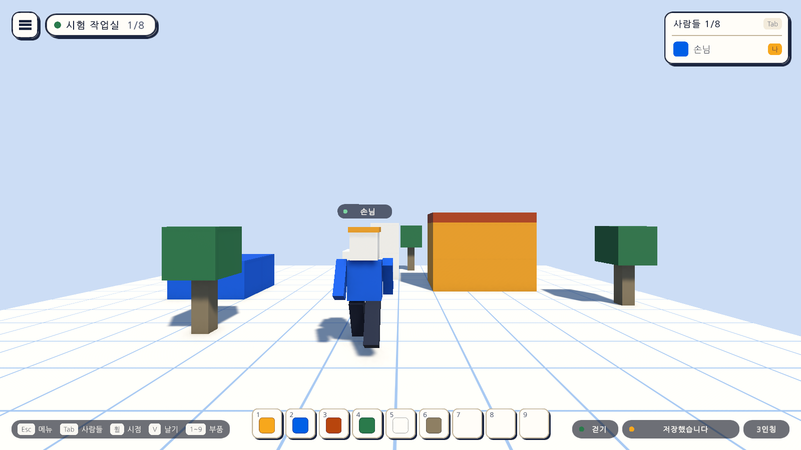

# 09일차 개발 일지 — 조작과 겉모습 나누기

- **날짜**: 2026-10-08
- **단계**: 0단계 기반(구조 정리)
- **목표**: 한 스크립트에 함께 있던 입력·걷기·날기·카메라를 나누어, 키보드 없이 움직이는 캐릭터(VR, 다른 사람)를 넣을 자리를 만든다
- **검사 기준**: 게임에서의 동작이 그대로이고 기존 테스트가 모두 통과한다. 조작 스크립트 없이 몸만 있는 캐릭터가 정해 준 방향으로 걷는다
- **결과**: ✅ 구성 완료 (자동 검사 146개 통과, Windows 빌드와 실행 확인 통과, 에디터에서 직접 해 보는 확인은 아직)

---

## 오늘 한 일 요약

눈에 보이는 새 기능은 없다. `DesktopPlayerController` 하나가 맡던 일을 **몸(모터)·카메라 리그·PC 조작** 셋으로 나눴다. 이제 몸은 누가 조작하는지 모르고 "어디로 가라"는 의도만 받아 움직이므로, 뒤에 올 VR 조작과 다른 사람의 캐릭터가 같은 몸과 겉모습을 쓸 수 있다.

그림은 테스트가 게임을 실행한 상태에서 찍은 것이다. 카메라 거리, 어깨 너머 시점, 이름표, 화면 요소가 나누기 전과 같다.

## 작업 내역

### 1. 셋으로 나누기

| 스크립트 | 맡는 일 | 누가 쓰나 |
|---|---|---|
| `CharacterMotor`(새로 만듦) | 걷기·달리기·점프·중력·날기, 몸의 좌우 방향, 시작 위치로 돌아가기, 팔다리 흔들기 알림 | PC, VR, 다른 사람의 캐릭터 |
| `ViewRig`(새로 만듦) | 위아래 시선, 1인칭·3인칭 거리, 어깨 너머로 비켜서기, 벽 앞에서 멈추기, 시야각 설정 | PC만 |
| `DesktopPlayerController`(줄어듦) | 키보드·마우스 읽기, 마우스 잡기, 조작 막기. 읽은 것을 몸과 리그에 전하기만 한다 | PC만 |

겉모습(`AvatarView`, `Nameplate`)은 2일차부터 따로 있어 그대로다.

### 2. 몸이 받는 의도

| 의도 | 내용 |
|---|---|
| `MoveDirection` | 가려는 방향(월드 기준 수평, 길이 1 이하). 바꿀 때까지 계속 간다 |
| `Sprint` | 걸을 때 달리기 속도로 |
| `Ascend`, `Descend` | 날 때 위·아래 |
| `Jump()` | 다음 걸음에 뛰어오르기. 공중이거나 날고 있으면 버려진다 |
| `Stop()` | 의도를 모두 지움. 걷던 몸은 서고, 날던 몸은 그 자리에 머문다 |
| `SetYaw`, `Turn` | 몸의 좌우 방향 |
| `SetFlying`, `Respawn` | 날기 켜고 끄기, 시작 위치로 |

- PC 조작은 매 프레임 키를 읽어 이 의도를 채운다. 메뉴가 열려 조작이 막히거나 조작 스크립트가 꺼지면 `Stop()`을 부른다.
- 몸은 다른 스크립트보다 늦게 움직인다(`DefaultExecutionOrder(50)`). 같은 프레임에 조작이 의도를 먼저 정한 뒤 움직이므로 한 프레임 늦는 일이 없다.

### 3. 쓰는 쪽을 옮김

- `GameUi`: 날기 상태와 시작 위치로는 `player.Motor`, 1인칭 여부와 시점 바꾸기는 `player.Rig`에서 읽는다.
- `BlockBuilder`: 조준에 쓰는 카메라와 머리 위치를 `ViewRig`에서 읽는다.
- 옮겨 간 것을 `DesktopPlayerController`에 그대로 남겨 두지 않았다. 같은 일을 하는 길이 둘이 되면 어느 쪽이 주인인지 흐려지기 때문이다.

### 4. 프리팹과 셋업

- `PlayerWiring`(편집기 도우미): 캐릭터 뿌리에 세 스크립트를 붙이고 서로 잇는다. 1·2·9일차 셋업이 함께 쓴다. 처음부터 다시 셋업해도 같은 구성이 나온다.
- `Day9Setup`(메뉴 `Atelier Verse/9일차 셋업 실행`): 이미 있는 `Player_Desktop` 프리팹에 몸과 리그를 붙이고 잇는다. 모양과 Sandbox 씬은 바꾸지 않는다.

## 검사

| 항목 | 방법 | 결과 |
|---|---|---|
| 스크립트 컴파일 | 명령줄 실행 로그 | 오류 없음 |
| 9일차 셋업 적용 | 명령줄에서 `ProjectSetupRunner` 실행, 프리팹의 스크립트와 연결 확인 | 적용됨 |
| 기존 테스트의 변경 범위 | 바뀐 접근 경로를 거꾸로 되돌려 8일차 파일과 비교 | **이름만 바뀜**(6개 파일, 내용 같음) |
| 1~8일차의 편집 모드 테스트 | 73개 | 통과 |
| 1~8일차의 플레이 모드 테스트 | 66개(그림 찍기 6개 포함) | 통과 |
| 몸만 있는 캐릭터 | 플레이 모드 테스트 `MotorPlayTests` 7개 | 통과 |
| 화면 모양 | 테스트가 찍은 그림을 눈으로 확인 | 위 그림 |
| Windows 빌드와 실행 | `node scripts/build-windows.mjs --run` | 성공(104MB), 종료 코드 0, 예외 없음 |
| 글꼴 자산 크기 | 커밋 전 확인 | 6KB |
| 직접 해 보기 | 에디터나 실행 파일에서 걷기·날기의 손맛이 같은지 | **아직 하지 않음** |
| Quest에서 실행 | - | **아직 하지 않음** |

`MotorPlayTests`가 확인하는 것은 다음과 같다. 시험용 캐릭터는 캐릭터 컨트롤러와 `CharacterMotor`만 붙인 것이다.

| 테스트 | 확인하는 것 |
|---|---|
| PC 캐릭터는 몸과 카메라 리그와 조작으로 나뉘어 있다 | 세 스크립트와 겉모습·카메라 연결 |
| 조작 없이 몸만 있는 캐릭터가 정해 준 방향으로 걷고 멈춘다 | 1초에 3.5m 안팎, 옆으로 새지 않음, 멈춘 뒤 움직이지 않음 |
| 몸만 있는 캐릭터도 달리고 뛰어오른다 | 1초에 6m 안팎, 0.25초 뒤 0.3m 넘게 오르고 다시 내려섬 |
| 방향의 길이가 1을 넘어도 더 빠르지 않다 | (3, 0, 3)을 줘도 걷는 속도 |
| 몸만 있는 캐릭터도 날고 끄면 떨어진다 | 오르기, 제자리 머물기, 끄면 바닥, 알림 두 번 |
| 몸의 방향을 정하고 돌릴 수 있다 | `SetYaw(90)`은 +x, `Turn(90)` 뒤는 -z |
| PC 조작을 끄면 몸이 멈춘다 | W를 누른 채 조작 스크립트를 꺼도 걷지 않고 바닥에 서 있음 |

검사에 대해 알아 둘 점이다.

- 기존 테스트 파일 6개는 옮겨 간 멤버의 접근 경로(`player.ViewCamera` → `player.Rig.ViewCamera` 등)만 바꿨다. 바꾼 것을 거꾸로 되돌리면 8일차 파일과 글자 하나 다르지 않음을 확인했다. 검사하는 내용과 기준 값은 그대로다.
- 그림을 찍지 않고 돌리면 플레이 모드 67개 통과, 6개 건너뜀으로 나온다.
- Unity 에디터가 이 프로젝트를 열고 있지 않아 실제 프로젝트에서 직접 검사했다.

## 직접 확인하는 방법

1. Unity 에디터로 돌아가면 새 파일을 불러온다.
2. `Assets/_Project/Prefabs/Player_Desktop`을 고르면 Character Motor, View Rig, Desktop Player Controller가 따로 보인다.
3. Sandbox 씬에서 재생해 걷기, 점프, 달리기, V 날기, 휠로 시점 바꾸기, 블록 놓기가 전과 같은지 본다.

## 알아 둘 점

- `GameUi`와 `BlockBuilder`는 아직 `DesktopPlayerController`를 직접 안다. VR 조작을 넣을 때 "지금 이 기기의 조작"을 가리키는 공통 길이 필요해진다(`docs/BACKLOG.md` 3.5).
- 다른 사람의 캐릭터용 프리팹(겉모습 + 몸, 카메라 없음)은 만들지 않았다. 여러 사람 접속(1-D)에서 만든다.
- `ViewRig`는 PC 전용이다. VR에서는 기기가 카메라를 움직인다.

## 다음 일차

`docs/BACKLOG.md` 2절의 순서대로 10일차는 VR 리그와 Quest 빌드다. Unity Hub에 Android Build Support가 설치되어 있지 않으면 모양이 다른 부품으로 넘어간다.
