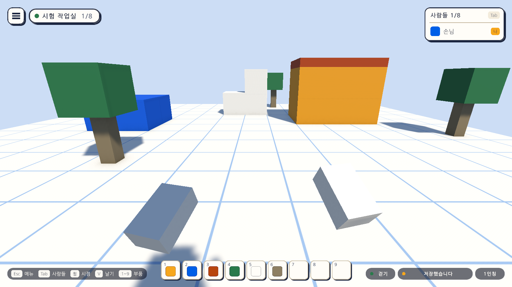

# 10일차 개발 일지 — VR 조작과 추적 리그

- **날짜**: 2026-10-08
- **단계**: 0단계 기반 → 1-B VR로 들어가기(준비)
- **목표**: 기본은 키보드·마우스로 쓰고, VR 기기가 있으면 머리·손의 추적과 컨트롤러로 같은 캐릭터를 움직이게 한다
- **검사 기준**: 평소에는 PC 조작으로 시작한다. VR 조작으로 시작하면 머리와 손이 기기를 따르고 스틱으로 걷고 돈다. 두 조작은 같은 몸을 쓴다
- **결과**: ⚠️ 조작과 리그는 완성(자동 검사 160개 통과). **실제 헤드셋에 화면을 띄우는 연결은 아직 없음**(패키지 내려받기 허락 대기)

---

## 오늘 한 일 요약

사용자 결정(2026-10-08): **PC에서 키보드·마우스로 쓰는 것이 기본이고, VRChat처럼 VR 기기가 있는 사람은 추적과 장비로 할 수 있는 기능이 되게 한다.**

9일차에 나눠 둔 몸(`CharacterMotor`) 위에 **VR 조작**과 **추적 리그**를 얹었다. 평소에는 키보드·마우스로 시작하고, VR 화면이 켜져 있으면 VR 조작으로 시작한다. 두 조작은 같은 몸을 쓰므로 걷기·점프·날기의 규칙이 같다.

그림은 테스트가 **가상의 VR 기기**(입력 시스템에 붙인 가짜 머리 기기와 컨트롤러 두 개)로 값을 넣어 찍은 것이다. 실제 헤드셋의 화면이 아니다. 아래쪽의 화면 요소는 PC 창에만 보이고 헤드셋 안에는 아직 보이지 않는다.

## 작업 내역

### 1. 조작 방식 고르기 (`PlayerModeSwitch`)

| 때 | 조작 |
|---|---|
| 평소(VR 화면이 꺼져 있음) | 키보드·마우스(`DesktopPlayerController` + `ViewRig` + `BlockBuilder`) |
| VR 화면이 켜져 있음(`XRSettings.isDeviceActive`) | VR(`XrPlayerController` + `XrRig`) |
| 실행 중 | `SetMode`로 서로 바꿀 수 있다. 카메라는 원래 자리로 돌아온다 |

- VR 기기가 연결되어 있기만 해서는 VR로 넘어가지 않는다. VR 화면이 실제로 켜져야 한다.
- VR에서는 PC용 카메라 리그와 블록 놓기를 끈다. VR에서 만들기는 뒤 일차다.

### 2. 추적 리그 (`XrRig`)

- 켜지면 PC용 카메라를 추적 기준점(`XrOrigin`, 발밑 가운데) 아래로 옮겨 **머리**로 쓰고, 기기의 머리 위치·방향을 매 프레임과 그리기 직전에 옮긴다.
- **두 손**은 컨트롤러의 위치·방향을 따르는 작은 블록이다. 컨트롤러가 연결되어 있지 않은 손은 보이지 않는다.
- 자기 몸은 숨긴다(그림자만 남음). 기기가 아직 머리 위치를 주지 않으면 선 키의 눈높이(1.55m)를 쓴다.
- 꺼지면 카메라와 추적 기준점을 원래대로 돌려놓는다.

### 3. VR 조작 (`XrPlayerController`)

| 조작 | 입력 |
|---|---|
| 걷기 | 왼쪽 스틱. **머리가 보는 쪽**이 앞이다 |
| 달리기 | 왼쪽 스틱을 누른 채 밀기 |
| 돌기 | 오른쪽 스틱 좌우. 밀 때마다 45도씩 **끊어서** 돈다(멀미가 덜함) |
| 점프 | 오른손 첫째 단추(Quest의 A) |
| 날기 켜고 끄기 | 오른손 둘째 단추(Quest의 B) |
| 날 때 위·아래 | 오른쪽 스틱 위아래 |
| 실제로 걷기 | 머리가 몸에서 벗어나면 **몸이 머리 밑으로 따라온다.** 벽에 막히면 몸만 멈춘다 |

키보드·마우스와 마찬가지로 입력을 읽어 몸의 의도만 채운다. 그래서 속도, 점프 높이, 중력, 충돌이 PC와 같다.

### 4. 입력 (`AtelierInput.inputactions`의 `XR` 묶음)

머리 위치·방향, 두 손 위치·방향, Move, Turn, Jump, Fly, Sprint의 11개 동작을 더했다. 특정 회사의 컨트롤러 이름이 아니라 **공통 쓰임새**(`{Primary2DAxis}`, `{PrimaryButton}` 등)로 묶어, Quest·Index·Vive 컨트롤러가 같은 길로 들어온다.

### 5. 몸 (`CharacterMotor`)

- `Shift`: 의도와 상관없이 몸을 수평으로 옮긴다(몸이 머리를 따라올 때 씀).
- 바닥에 닿았는지를 자신의 마지막 걸음으로 따로 기억한다. `Shift`가 끼어도 점프와 중력의 판단이 흔들리지 않는다.

### 6. 자동 셋업

- `Day10Setup`(메뉴 `Atelier Verse/10일차 셋업 실행`): 캐릭터 프리팹에 `XrOrigin`과 두 손, `XrRig`, `XrPlayerController`, `PlayerModeSwitch`를 더한다. VR 쪽은 꺼 둔 채로 저장한다.

## 검사

| 항목 | 방법 | 결과 |
|---|---|---|
| 스크립트 컴파일 | 명령줄 실행 로그 | 오류 없음 |
| 10일차 셋업 적용 | 명령줄에서 `ProjectSetupRunner` 실행 | 적용됨 |
| 조작 방식 고르기 | 편집 모드 테스트 `ControlModeTests` 2개 | 통과 |
| 1~9일차의 편집 모드 테스트 | 73개 | 통과 |
| VR 조작과 추적 | 플레이 모드 테스트 `XrPlayTests` 12개(가상 기기) | 통과 |
| 1~9일차의 플레이 모드 테스트 | 73개(키보드·마우스 조작 전부) | 통과 |
| Windows 빌드와 실행 | `node scripts/build-windows.mjs --run` | 성공, 키보드·마우스로 시작, 예외 없음 |
| 화면 모양 | 테스트가 찍은 그림을 눈으로 확인 | 위 그림 |
| **실제 헤드셋에서의 화면** | - | **하지 못함.** OpenXR 패키지가 없어 화면이 헤드셋에 나가지 않는다 |
| **실제 컨트롤러의 입력** | - | **하지 못함.** 같은 까닭 |
| Quest 단독 빌드 | - | **하지 못함.** Android Build Support가 설치되어 있지 않다 |

`XrPlayTests`가 확인하는 것은 다음과 같다.

| 테스트 | 확인하는 것 |
|---|---|
| 기본은 키보드와 마우스 조작이다 | VR 기기가 붙어 있어도 PC 조작으로 시작하고 W로 걷는다 |
| VR로 시작하면 VR 조작이 켜지고 PC 조작과 블록 놓기는 꺼진다 | 카메라가 추적 기준점 아래로, 몸은 숨김, 같은 몸을 씀 |
| 머리의 위치와 방향이 카메라에 옮겨진다 | 눈높이 1.72m, 오른쪽 90도 |
| 손은 컨트롤러를 따르고 기기가 없으면 보이지 않는다 | 위치·방향, 컨트롤러를 빼면 그 손이 사라짐 |
| 왼쪽 스틱을 밀면 머리가 보는 쪽으로 걷는다 | 머리가 +x를 볼 때 1초에 3.5m 안팎, 몸은 돌지 않음 |
| 왼쪽 스틱을 누른 채 밀면 달린다 | 1초에 6m 안팎 |
| 오른쪽 스틱을 밀 때마다 한 번씩 끊어서 돈다 | 45도, 민 채로는 더 돌지 않음, 반대쪽 |
| 오른손 단추로 뛰고 날며 날 때는 스틱으로 오르내린다 | 점프, 날기, 오르기, 제자리, 끄면 바닥 |
| 실제로 걸어 머리가 움직이면 몸이 머리 밑으로 따라온다 | 머리를 (1, 0.5) 옮기면 몸도 그만큼, 머리는 더 밀려나지 않음 |
| VR에서는 키보드로 걷지 않는다 | |
| 실행 중에 PC 조작으로 바꾸면 카메라가 돌아오고 다시 VR로 바꿀 수 있다 | 카메라 자리, 손 숨김, W로 걷기 |
| 화면 그림을 찍는다 | `-captureDir`가 있을 때만 |

검사에 대해 알아 둘 점이다.

- VR 검사는 모두 **가상 기기**로 했다. 입력 시스템에 머리 기기 하나와 컨트롤러 둘을 붙이고 값을 넣는 방식이라, 조작 규칙과 추적의 계산은 확인되지만 헤드셋의 화면·착용감·멀미·실제 컨트롤러의 단추 배치는 확인되지 않는다.
- 이 컴퓨터에는 OpenXR 런타임(Quest Link, SteamVR)이 설치되어 있지 않아, 패키지를 넣더라도 이 컴퓨터에서는 실제 기기 확인을 할 수 없다.
- 그림을 찍지 않고 돌리면 플레이 모드 78개 통과, 7개 건너뜀으로 나온다.

### 검사에서 찾은 문제와 수정

- **증상**: VR 테스트 다음에 오는 테스트에서 키보드와 가상 기기의 입력이 모두 닿지 않았다(9개 실패).
- **원인**: `XrRig`가 손이 연결됐는지 알려고 매 프레임 "이 동작에 연결된 기기"를 물었다. 테스트와 테스트 사이의 한 프레임에는 입력 묶음이 꺼져 있는데, 꺼진 묶음에 이것을 물으면 입력 시스템이 연결을 새로 계산해 상태를 만들어 둔다. 그 상태가 다음 테스트의 가상 입력 시스템이 아니라 바깥의 실제 입력 시스템에 묶여, 다음 테스트의 입력이 엉뚱한 곳을 봤다.
- **수정**: 묶음이 켜져 있을 때만 연결된 기기를 묻는다. 진단용 테스트로 테스트마다 켜진 동작과 연결된 기기를 찍어 원인을 찾았고, 진단 테스트는 지웠다.

## 직접 확인하는 방법

지금은 실제 헤드셋으로 확인할 수 없다. PC에서는 다음을 볼 수 있다.

1. Unity 에디터에서 Sandbox 씬을 재생한다. 전과 같이 키보드·마우스로 움직인다.
2. `Player_Desktop` 프리팹을 고르면 Xr Rig, Xr Player Controller가 꺼진 채로, Player Mode Switch가 켜진 채로 보인다.
3. 재생 중에 캐릭터의 Player Mode Switch에서 `SetMode`를 부르면(테스트가 하는 방식) 손이 나타나지만, 기기가 없으니 머리는 눈높이에 고정된다.

## 실제 헤드셋으로 가려면

| 필요한 것 | 누가 | 내용 |
|---|---|---|
| OpenXR 패키지 | 허락이 있으면 Claude | XR Plugin Management 4.5.4(0.2MB), OpenXR Plugin 1.16.1(39.4MB)과 그 의존 패키지 XR Core Utilities(약 1.6MB)·XR Legacy Input Helpers. 출처는 Unity 공식 패키지 저장소(`download.packages.unity.com`) |
| PC VR 런타임 | 사용자 | Quest를 PC에 잇는 Meta Quest Link 또는 SteamVR. 이 컴퓨터에는 없다 |
| Quest 단독 빌드 | 사용자 | Unity Hub에서 `6000.3.21f1`에 Android Build Support(OpenJDK, Android SDK & NDK 포함) 설치, Meta 개발자 계정과 Quest의 개발자 모드 |

패키지를 넣으면 실행 파일을 `-vr`로 시작했을 때만 VR 화면을 켜고, 그 밖에는 지금처럼 키보드·마우스로 시작하게 만든다. 실수로 헤드셋 프로그램이 뜨지 않게 하기 위해서다.

## 알아 둘 점

- **헤드셋 안에는 화면 요소(메뉴, 부품 칸, 알림)가 보이지 않는다.** 지금의 화면은 PC 창에 겹쳐 그리는 방식이다. VR 메뉴는 뒤 일차다.
- **VR에서는 블록을 놓을 수 없다.** 컨트롤러로 가리켜 놓는 것은 VR 메뉴 다음 일차다.
- 몸의 겉모습은 VR에서 숨긴다. 다른 사람에게 보이는 머리·손의 움직임은 여러 사람 접속 단계에서 만든다.
- 키 높이 맞추기, 앉은 자세, 부드럽게 돌기, 이동할 때 시야 좁히기, 진동은 아직 없다.
- 캐릭터 프리팹의 이름은 `Player_Desktop` 그대로다. 이제 두 조작을 함께 가진다.

## 다음 일차

사용자가 패키지 내려받기를 허락하면 11일차는 OpenXR 연결(실행 파일의 `-vr` 시작, 추적 기준을 바닥으로, Windows 빌드 확인)이다. 허락 전이면 `docs/BACKLOG.md` 2절의 순서대로 모양이 다른 부품을 먼저 한다.
