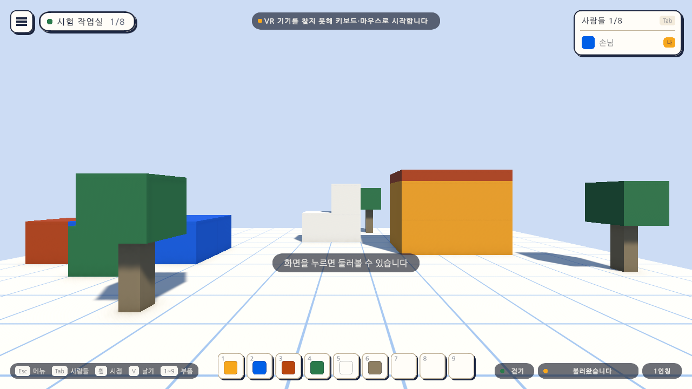

# 11일차 개발 일지 — OpenXR 연결

- **날짜**: 2026-10-08
- **단계**: 0단계 기반 → 1-B VR로 들어가기(준비)
- **목표**: 10일차의 VR 조작을 실제 헤드셋에 잇는다. 기본은 그대로 키보드·마우스이고, VR로 시작하겠다고 했을 때만 VR 화면을 켠다
- **검사 기준**: 그냥 실행하면 키보드·마우스로 시작하고 VR 프로그램을 한 번도 찾지 않는다. VR로 시작했는데 기기가 없으면 키보드·마우스로 돌아오고 까닭을 알린다
- **결과**: ⚠️ 연결은 완성(자동 검사 169개 통과, Windows 빌드와 실행 확인 통과). **실제 헤드셋과 컨트롤러로는 확인하지 못함**(이 컴퓨터에 VR 프로그램이 없음)

---

## 오늘 한 일 요약

사용자가 XR 패키지 내려받기를 허락했다(2026-10-08). OpenXR을 넣고, **VR 화면을 켜는 곳을 한곳(`XrSession`)에 모았다.** 평소에는 켜지 않고, 실행할 때 `-vr`을 주었을 때만 첫 씬이 열리기 전에 켠다. 켜지 못하면 키보드·마우스로 시작하고 화면 위에 까닭을 알린다.

그림은 이 컴퓨터에서 실행 파일을 `-vr`로 켠 화면이다. VR 프로그램이 없어 위쪽 알림 띠에 "VR 기기를 찾지 못해 키보드·마우스로 시작합니다"가 뜨고 평소처럼 쓸 수 있다. 헤드셋 안의 화면은 아니다.

실행 방법은 둘이다.

| 실행 | 결과 |
|---|---|
| `AtelierVerse.exe` | 키보드·마우스. VR 프로그램을 찾지 않는다 |
| `AtelierVerse-VR.bat`(또는 `AtelierVerse.exe -vr`) | VR 화면으로 시작. 기기가 없으면 키보드·마우스로 돌아온다 |

## 작업 내역

### 1. 패키지

Unity 공식 패키지 저장소에서 받았다.

| 패키지 | 판 | 비고 |
|---|---|---|
| XR Plugin Management `com.unity.xr.management` | 4.5.4 | 직접 넣음 |
| OpenXR Plugin `com.unity.xr.openxr` | 1.16.1 | 직접 넣음 |
| XR Core Utilities `com.unity.xr.core-utils` | 2.6.0 | 따라옴 |
| XR Legacy Input Helpers `com.unity.xr.legacyinputhelpers` | 2.1.13 | 따라옴 |

### 2. XR 설정 (`Day11Setup`, 메뉴 `Atelier Verse/11일차 셋업 실행`)

- PC(Standalone)의 XR 설정에 OpenXR 로더를 넣는다. 설정 자산은 `Assets/XR`에 생긴다.
- **"시작할 때 XR 켜기"를 끈다.** 켜 두면 VR 프로그램이 깔린 PC에서 실행할 때마다 헤드셋 프로그램이 뜬다.
- 컨트롤러 프로파일 여섯 개를 켠다: Oculus Touch, Meta Quest Touch Plus, Meta Quest Touch Pro, Valve Index, HTC Vive, Microsoft Motion. 프로파일이 켜져 있어야 그 컨트롤러의 단추가 들어온다.

### 3. VR 화면 켜고 끄기 (`XrSession`)

| 하는 일 | 내용 |
|---|---|
| 켤지 정하기 | 실행 인자에 `-vr`이 있을 때(대소문자 무시). 에디터에서는 메뉴 `Atelier Verse/재생할 때 VR 켜기`(창 없는 명령줄 실행에서는 보지 않음) |
| 켜기 | 첫 씬이 열리기 전에 OpenXR 로더를 직접 켠다. 그래서 `PlayerModeSwitch`가 처음부터 VR 조작을 고른다 |
| 추적 기준 | 바닥으로 맞춘다. 기기가 바닥 기준을 주지 않으면 추적 공간을 선 키의 눈높이(1.55m)만큼 올린다 |
| 켜지 못했을 때 | 키보드·마우스로 시작하고 알림 띠에 까닭을 한 번 알린다 |
| 끄기 | 앱을 끝낼 때 |

- `XrRig`는 추적 기준이 바닥이면 추적 공간을 발밑에 두고, 아니면 눈높이만큼 올린다.
- `PlayerModeSwitch`는 화면이 준비된 뒤 `XrSession`이 남긴 안내를 알림 띠에 올린다.

### 4. 빌드 뒤 다듬기 (`XrBootConfig`)

빌드가 끝나면 자동으로 두 가지를 한다. 에디터의 빌드 창으로 만들어도 똑같이 적용된다.

- 실행 파일의 시작 설정(`AtelierVerse_Data/boot.config`)에서 **XR 사전 초기화 줄(`xrsdk-pre-init-library`)을 뺀다.** 까닭은 아래 "검사에서 찾은 문제"에 있다.
- 실행 파일 옆에 `AtelierVerse-VR.bat`을 쓴다. 같은 폴더의 실행 파일에 `-vr`을 붙여 켠다.

### 5. 빌드 스크립트 (`scripts/build-windows.mjs`)

- `--vr`: 실행 확인을 `-vr`로 한다(그림은 `smoke-vr.png`).
- 시작 설정에 사전 초기화 줄이 남아 있거나 `AtelierVerse-VR.bat`이 없으면 실패로 끝낸다.
- 평소 실행(`--run`)의 로그에 VR 프로그램을 찾은 흔적이 한 줄이라도 있으면 실패로 끝낸다.

### 6. 함께 바뀐 설정

- URP 설정(`Assets/Settings/PC_RPAsset.asset`)의 "XR 셰이더 변형 걸러 내기"가 꺼졌다. XR을 쓰는 프로젝트가 되면서 Unity가 바꾼 값이다.

## 검사

| 항목 | 방법 | 결과 |
|---|---|---|
| 스크립트 컴파일 | 명령줄 실행 로그 | 오류 없음 |
| 11일차 셋업 적용 | 명령줄에서 `ProjectSetupRunner` 실행 | 적용됨 |
| VR로 시작하는 조건과 XR 설정 | 편집 모드 테스트 `XrSessionTests` 5개 | 통과 |
| 시작 설정 다듬기 | 편집 모드 테스트 `XrBootConfigTests` 4개 | 통과 |
| 1~10일차의 편집 모드 테스트 | 75개 | 통과 |
| 1~10일차의 플레이 모드 테스트 | 85개(`-captureDir`로 그림 찍기 7개 포함) | 통과 |
| Windows 빌드 | `node scripts/build-windows.mjs --run` | 성공(폴더 전체 110MB, 오류 0개). 빌드 로그에 "XR 사전 초기화 뺌" |
| 평소 실행 | 위 명령의 실행 확인 | 종료 코드 0, 예외 없음, 맵 파일 있음, **VR 프로그램을 찾은 흔적 0줄** |
| `-vr` 실행(VR 프로그램 없는 PC) | `node scripts/build-windows.mjs --skip-build --run --vr` | 종료 코드 0, 예외 없음, 키보드·마우스로 돌아옴, 알림 띠에 안내(위 그림) |
| `AtelierVerse-VR.bat` | 배치 파일을 직접 실행하고 로그 확인 | `-vr`이 전달되어 위와 같은 결과 |
| **실제 헤드셋의 화면** | - | **하지 못함.** 이 컴퓨터에 OpenXR 런타임(Quest Link, SteamVR)이 없다 |
| **실제 컨트롤러의 입력, 바닥 기준 눈높이** | - | **하지 못함.** 같은 까닭 |
| Quest 단독 빌드 | - | **하지 못함.** Android Build Support가 설치되어 있지 않다 |

편집 모드 테스트는 모두 84개, 플레이 모드 테스트는 85개다. 그림을 찍지 않고 돌리면 플레이 모드는 78개 통과, 7개 건너뜀으로 나온다. 테스트와 빌드는 마지막 코드 상태에서 한 번 더 돌려 같은 결과를 확인했다.

### 검사에서 찾은 문제와 수정

**평소 실행이 VR 프로그램을 찾아갔다.**

- **증상**: "시작할 때 XR 켜기"를 꺼 두었는데도 `-vr` 없이 켠 실행 파일의 로그에 OpenXR 런타임을 찾는 줄이 25개 있었다. 이 컴퓨터에는 VR 프로그램이 없어 실패하고 넘어갔지만, SteamVR이나 Quest Link가 깔린 PC에서는 실행할 때마다 그 프로그램이 깨어날 수 있다. "키보드·마우스가 기본"과 맞지 않는다.
- **원인**: XR Plugin Management가 빌드의 시작 설정(`boot.config`)에 XR 사전 초기화 줄을 넣는다. 이 줄이 있으면 화면이 뜨기 전에, XR을 켤지와 상관없이 OpenXR이 먼저 불린다.
- **수정**: 빌드가 끝난 뒤 그 줄을 뺀다(`XrBootConfig`). 다시 빌드해 평소 실행의 흔적이 0줄인 것을 확인했고, 빌드 스크립트가 매번 이것을 검사한다.

**사전 초기화를 실행 인자로 되살리는 방법은 쓸 수 없다.**

- VR로 시작할 때만 사전 초기화를 실행 인자로 다시 주는 방법을 시험하려 했다. 그런데 그 인자가 든 명령은 **Microsoft Defender가 실행 자체를 막았다.** 진단 이름은 `Exploit:Win32/CVE-2025-59489`이다. 이 인자가 Unity 게임에 임의의 라이브러리를 끼워 넣는 보안 문제에 쓰였기 때문이다.
- 이 시험 때문에 2026-10-08 22:31~22:35에 Defender의 경보 기록이 13건 남았다. 대상은 모두 시험 명령의 명령줄이고, 격리되거나 지워진 파일은 없다. 악성 코드가 있었던 것이 아니다.
- 그래서 이 인자는 쓰지 않는다. `AtelierVerse-VR.bat`은 `-vr`만 넘긴다. 다른 PC에서도 백신이 막을 수 있는 실행 방법을 배포하지 않기 위해서다.

## 직접 확인하는 방법

PC에서(헤드셋 없이):

1. `node scripts/build-windows.mjs`로 빌드한다.
2. `unity/Builds/Windows/AtelierVerse.exe`를 연다. 전과 같이 키보드·마우스로 움직인다.
3. `AtelierVerse-VR.bat`을 연다. 위쪽에 "VR 기기를 찾지 못해 키보드·마우스로 시작합니다"가 잠깐 뜨고 평소처럼 쓸 수 있다.

헤드셋으로(사용자가 준비해야 함):

1. Meta Quest Link 또는 SteamVR을 설치하고 헤드셋을 PC에 잇는다. 그 프로그램을 OpenXR 런타임으로 정한다.
2. `AtelierVerse-VR.bat`을 연다.
3. 헤드셋 안에 시험 장면이 보이는지, 머리를 돌리면 화면이 따라오는지, 두 손 자리에 작은 블록이 보이는지, 왼쪽 스틱으로 걷고 오른쪽 스틱으로 45도씩 도는지 본다.
4. 눈높이가 실제 키와 맞는지 본다(바닥 기준).

에디터에서는 메뉴 `Atelier Verse/재생할 때 VR 켜기`를 켜고 재생하면 같은 일을 한다.

## 알아 둘 점

- **실제 기기로 확인한 것이 하나도 없다.** OpenXR 로더가 켜지는 길, 컨트롤러 프로파일, 바닥 기준은 코드와 설정으로만 맞춰 두었다. 처음 헤드셋으로 켰을 때 고칠 것이 나올 수 있다.
- **사전 초기화 없이 VR을 켠다.** 사전 초기화는 화면을 만들기 전에 VR 프로그램이 쓸 그래픽 장치를 알아 두는 단계다. 그래픽 장치가 둘인 PC(내장 그래픽과 외장 그래픽이 함께 있는 노트북 등)에서 헤드셋이 다른 장치에 붙어 있으면 VR 화면이 켜지지 않을 수 있다. 그때는 키보드·마우스로 돌아온다. 확인하지 못했고, 문제가 되면 사전 초기화를 남긴 VR 전용 빌드를 따로 만드는 방법이 있다(`docs/BACKLOG.md` 3.4).
- **헤드셋 안에는 화면 요소(메뉴, 부품 칸, 알림)가 보이지 않는다.** "VR 기기로 시작했습니다" 알림도 PC 창에만 보인다. VR 메뉴는 뒤 일차다.
- **VR에서는 블록을 놓을 수 없다.** 10일차와 같다.
- 에디터의 "재생할 때 VR 켜기"는 이 컴퓨터의 에디터 설정에만 저장된다. 창 없이 돌리는 명령줄 테스트는 이 설정을 보지 않는다. 에디터 창에서 플레이 모드 테스트를 돌릴 때는 꺼 둔다(켜 두면 VR로 시작하려 한다).
- 빌드 크기가 8일차의 104MB에서 108MB로 늘었다(OpenXR 라이브러리). 출력 폴더 전체는 110MB다.
- Unity의 OpenXR 프로젝트 검사(Project Validation) 창은 열어 보지 않았다.

## 다음 일차

- 사용자가 헤드셋으로 켜 본 결과가 있으면 그것부터 고친다.
- 결과가 없으면 `docs/BACKLOG.md` 2절의 순서대로 한다. 첫째는 VR 메뉴와 "이 기기의 조작"을 가리키는 공통 길이다(가상 기기로 만들고 검사할 수 있음). 둘째는 모양이 다른 부품이다.
- Quest 단독 빌드는 Android Build Support가 설치된 뒤에 한다.
