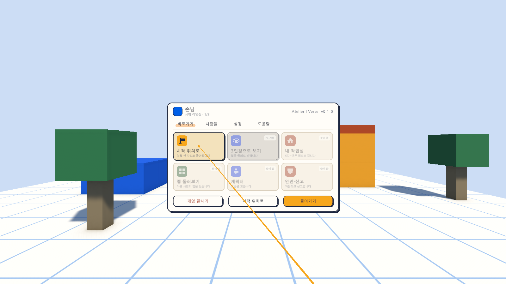
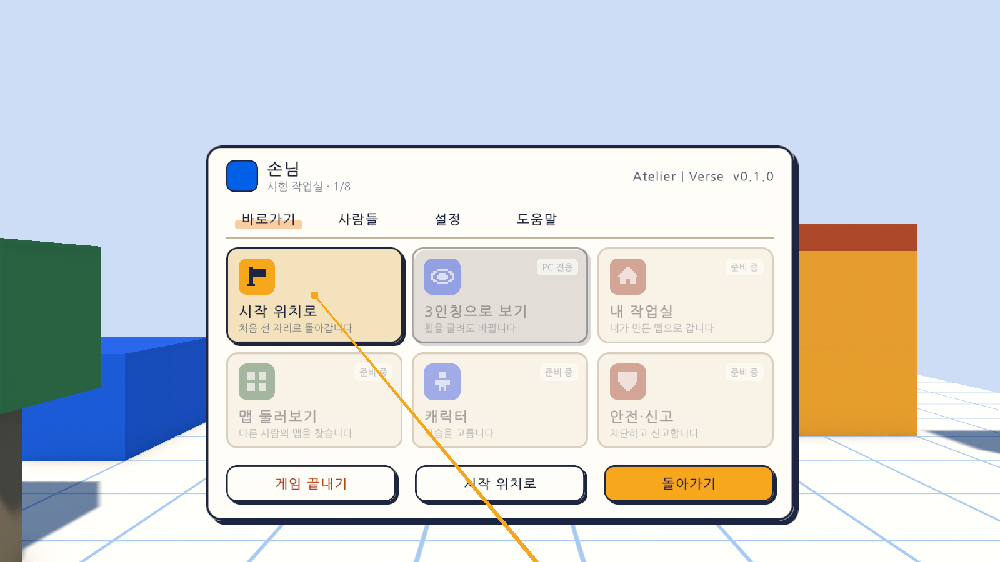
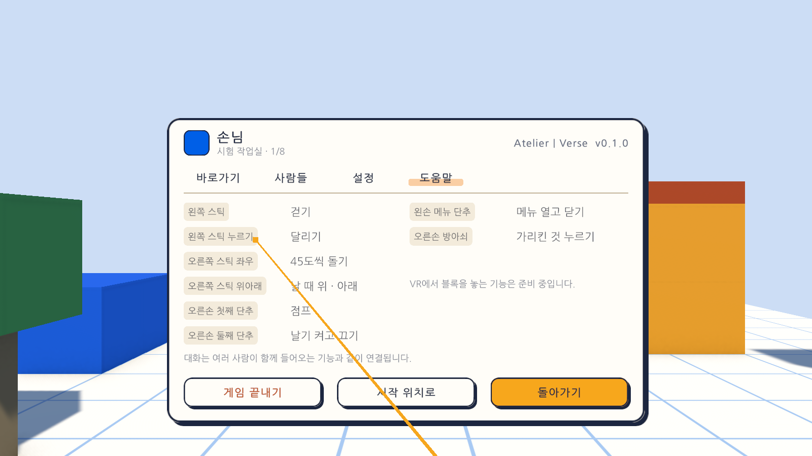

# 12일차 개발 일지 — VR 메뉴

- **날짜**: 2026-10-08
- **단계**: 0단계 기반 → 1-B VR로 들어가기(준비)
- **목표**: VR에서 메뉴와 알림이 헤드셋 안에 보이고, 컨트롤러로 메뉴를 열어 가리켜 누를 수 있게 한다. 그 바탕으로 화면과 도구가 조작 방식을 직접 알지 않게 한다
- **검사 기준**: PC에서는 전과 똑같이 동작한다. VR에서는 왼손 단추로 메뉴가 눈앞에 뜨고, 오른손으로 가리켜 방아쇠로 누르면 단추가 눌린다
- **결과**: ⚠️ 가상 기기로는 완성(자동 검사 189개 통과, Windows 빌드와 실행 확인 통과). **실제 헤드셋으로는 확인하지 못함**(이 컴퓨터에 VR 프로그램이 없음)

---

## 오늘 한 일 요약

11일차까지는 VR로 켜도 메뉴와 알림이 PC 창에만 보였다. 오늘은 **VR에서 화면을 눈앞에 떠 있는 판으로 띄우고, 오른손에서 나가는 광선으로 누르게** 했다. VRChat처럼 평소에는 알림만 보이고, 왼손의 메뉴 단추를 누르면 메뉴 판이 눈앞에 뜬다.

그림은 테스트가 **가상의 VR 기기**로 값을 넣어 찍은 것이다. 실제 헤드셋의 화면이 아니다. 아래는 글자를 확인하려고 판만 가까이 당겨 찍은 그림이다(헤드셋에서 보이는 크기가 아님).

| 바로가기 | 도움말 |
|---|---|
|  |  |

순서는 기반부터였다.

1. 화면과 블록 놓기가 키보드·마우스 조작을 직접 알던 것을 **이 기기의 캐릭터(`LocalPlayer`)** 한곳을 거치게 바꿨다.
2. 화면을 누르는 입력을 이 프로젝트의 입력 자산으로 옮겼다.
3. 그 위에 눈앞의 판과 손 광선을 얹었다.

## 작업 내역

### 1. 이 기기의 캐릭터 (`LocalPlayer`)

화면(`GameUi`)과 도구(`BlockBuilder`)는 이제 `DesktopPlayerController`를 모른다. 캐릭터의 뿌리에 붙은 `LocalPlayer`에게 묻는다.

| 묻는 것 | PC | VR |
|---|---|---|
| 지금의 조작 방식(`Mode`, `IsVr`) | 키보드·마우스 | VR |
| 조작 막기(`SetInputBlocked`) | 두 조작에 함께 알림. 막힌 채로 조작 방식이 바뀌어도 그대로 막혀 있음 | 같음 |
| 조준하고 있는지(`IsAiming`) | 마우스를 잡았을 때 | 조작이 막혀 있지 않을 때 |
| 조준 광선(`TryGetAim`) | 화면 가운데 | 오른손이 가리키는 쪽 |
| 막은 조작 풀기(`ResumeControl`) | 풀고 마우스를 다시 잡음 | 풀기만 함 |
| 시점(`IsFirstPerson`, `ToggleView`) | 1인칭·3인칭 | 늘 1인칭, 바꿀 수 없음 |

PC에서의 동작은 그대로다. 1~11일차의 테스트가 모두 그대로 통과한다.

### 2. 입력 (`AtelierInput.inputactions`)

| 더한 것 | 내용 |
|---|---|
| `UI` 묶음 | 화면을 누르는 입력. 마우스 쪽(위치, 왼쪽·오른쪽·가운데 누르기, 휠)은 입력 시스템의 기본 정의와 같다. VR은 **오른손만** 가리키고(조준 자세) 방아쇠로 누른다 |
| `Game` 묶음의 `Menu` | 왼손의 메뉴 단추, 그리고 왼손의 둘째 단추(Quest의 Y). 메뉴 단추를 앱이 쓸 수 없는 컨트롤러(Valve Index)를 위해서다 |
| `XR` 묶음 | 오른손이 가리키는 자세(`RightPointerPosition`, `RightPointerRotation`). 보이는 광선이 읽는다 |

전에는 화면 입력이 입력 시스템 패키지의 기본 자산에 이어져 있었다. 기본 자산을 그대로 쓰면 두 손 모두로 누르게 되어, 광선이 보이지 않는 왼손으로도 단추가 눌린다. 그래서 오른손만 쓰는 정의를 이 프로젝트의 입력 자산에 따로 두었다.

### 3. 눈앞의 판 (`XrUiPanel`)

| 때 | 판이 놓이는 곳 |
|---|---|
| PC | 전처럼 화면에 겹쳐 그린다 |
| VR, 메뉴가 닫혀 있음 | 머리를 따라온다(1m 앞). 늘 보이는 화면은 감추고 **알림 띠만** 시야의 위쪽에 보인다 |
| VR, 메뉴가 열림 | 그 순간의 눈앞 1.6m에 놓여 **그 자리에 머문다.** 머리를 돌려도 따라오지 않아 가리켜 누르기 쉽다 |
| 앞이 벽으로 막혀 있음 | 벽 앞으로 당겨 놓는다(가장 가까워도 0.7m). 판의 크기를 거리에 비례해 줄여 보이는 크기는 같다 |

- 판의 크기는 1.6m 앞에서 메뉴가 가로 약 1.35m(시야각으로 약 46도)다.
- VR에서는 메뉴 뒤의 어두운 막을 감춘다(허공에 큰 검은 막이 뜨기 때문).
- 조작 방식을 실행 중에 바꾸면 화면도 따라 바뀐다.

### 4. 손 광선 (`XrRig`)

- 오른손이 가리키는 자세에서 가는 골드색 선이 나가고 끝에 작은 블록이 붙는다. **메뉴가 열려 있을 때만** 보인다.
- 광선이 단추나 판에 닿으면 닿은 자리에서 끝나고, 아무것도 없으면 2.5m 길이다.
- 누르는 일은 입력 시스템의 추적 기기용 광선(`TrackedDeviceRaycaster`)이 맡는다. 새로 받은 패키지는 없다. 가리키면 단추가 밝아지고, 설정의 막대도 가리켜 눌러 옮길 수 있다.

### 5. 메뉴의 VR용 안내 (`QuickMenuView`, `GameUiBuilder`)

| 곳 | VR에서 |
|---|---|
| 도움말 | 키보드·마우스 키 대신 VR 조작 여덟 줄을 보인다. "VR에서 블록을 놓는 기능은 준비 중입니다"를 적어 둔다 |
| 바로가기의 "3인칭으로 보기" | 누를 수 없게 흐리게 하고 "PC 전용" 딱지를 붙인다(VR은 늘 1인칭) |
| 설정 | "마우스 감도와 시야각은 키보드·마우스로 할 때 적용됩니다"를 보인다 |
| 단추의 키 딱지(R, Esc), "Tab 키로도 켜고 끕니다" | 감춘다 |

### 6. 그 밖

- 알림 띠를 늘 보이는 화면(`Hud`) 밖으로 옮겼다(`Canvas/Notice`). VR에서 `Hud`를 감춰도 알림은 남는다.
- VR로 시작했을 때의 알림에 메뉴 여는 법을 더했다("VR 기기로 시작했습니다 · 왼손의 메뉴 단추로 메뉴를 엽니다").
- 날기를 켰을 때의 알림이 VR에서는 스틱 조작으로 나온다.
- `Day12Setup`(메뉴 `Atelier Verse/12일차 셋업 실행`): 캐릭터 프리팹에 `LocalPlayer`와 오른손 광선을 더하고, 게임 화면 프리팹을 다시 조립해 Sandbox 씬에 넣는다.

## 검사

| 항목 | 방법 | 결과 |
|---|---|---|
| 스크립트 컴파일 | 명령줄 실행 로그 | 오류 없음 |
| 12일차 셋업 적용 | 명령줄에서 `ProjectSetupRunner` 실행, 값을 고친 뒤 `Day12Setup.Apply` 다시 실행 | 적용됨 |
| 판을 놓는 계산 | 편집 모드 테스트 `XrUiPanelTests` 4개 | 통과 |
| 화면 입력의 연결 | 편집 모드 테스트 `UiInputTests` 4개 | 통과 |
| 1~11일차의 편집 모드 테스트 | 84개 | 통과 |
| VR 메뉴 | 플레이 모드 테스트 `XrMenuPlayTests` 11개(가상 기기) | 통과 |
| PC에서 마우스로 단추 누르기 | 플레이 모드 테스트 1개(`GameUiPlayTests`) | 통과 |
| 1~11일차의 플레이 모드 테스트 | 85개(키보드·마우스 조작과 10일차의 VR 조작 전부) | 통과 |
| Windows 빌드와 평소 실행 | `node scripts/build-windows.mjs --run` | 성공, 예외 없음, 화면은 전과 같음, VR 프로그램을 찾은 흔적 0줄 |
| `-vr` 실행(VR 프로그램 없는 PC) | `node scripts/build-windows.mjs --skip-build --run --vr` | 키보드·마우스로 돌아옴, 예외 없음 |
| 화면 모양 | 테스트가 찍은 그림 21장을 눈으로 확인 | 위 그림. PC의 화면은 전과 같음 |
| **헤드셋 안에서의 모습** | - | **하지 못함.** 글자가 읽히는지, 판의 거리와 크기가 편한지 모른다 |
| **실제 컨트롤러** | - | **하지 못함.** 가리키는 방향, 방아쇠, 메뉴 단추가 실제 기기에서 맞는지 모른다 |

편집 모드 테스트는 모두 92개, 플레이 모드 테스트는 97개다. 플레이 모드 97개는 그림 찍기 8개를 포함한 수이고, `-captureDir` 없이 돌리면 그 8개는 건너뛴다. 테스트와 빌드는 마지막 코드 상태에서 돌렸다.

`XrMenuPlayTests`가 확인하는 것은 다음과 같다.

| 테스트 | 확인하는 것 |
|---|---|
| PC에서는 화면에 겹쳐 그리고 손 광선 부품은 꺼져 있다 | 캔버스 방식, 늘 보이는 화면, 메뉴의 PC용 안내와 키 딱지 |
| VR에서는 화면이 눈앞의 판으로 뜨고 늘 보이는 화면은 숨는다 | 판의 방식과 자리(머리 앞 1m), 알림 띠는 살아 있음, 광선은 보이지 않음 |
| 왼손 메뉴 단추로 메뉴를 열면 눈앞에 놓이고 조작이 막힌다 | 판의 자리·방향·크기, 스틱으로 걷지 않음, 머리를 돌려도 판은 그 자리, 왼손 둘째 단추로 닫힘 |
| 오른손으로 가리키고 방아쇠를 당기면 단추가 눌린다 | 광선이 가리킨 단추에서 끝남, 탭이 바뀜, **왼손 방아쇠로는 눌리지 않음**, "돌아가기"로 닫힘 |
| 메뉴에서 시작 위치로를 가리켜 누르면 돌아가고 메뉴가 닫힌다 | 걸어 나갔다가 돌아옴, 조작이 풀림 |
| VR 메뉴에는 VR 조작 안내가 보이고 시점 타일은 누를 수 없다 | 안내 바뀜, 어두운 막 감춤, 눌러도 아무 일 없음 |
| 설정의 막대를 가리켜 누르면 그 자리의 값이 된다 | 막대가 가리킨 자리로 옮겨짐 |
| 알림은 VR에서도 눈앞에 보이고 머리를 따라온다 | 시야 가운데에서 20도 안, 머리를 120도 돌린 뒤에도 |
| 앞이 막혀 있으면 판을 벽 앞으로 당겨 놓는다 | 블록을 세우고 열면 판이 벽 앞, 크기는 줄어듦 |
| 실행 중에 조작 방식을 바꾸면 화면도 따라 바뀐다 | 메뉴가 열린 채 PC로 바꾸면 PC 조작이 막혀 있음, Esc로 닫으면 마우스를 잡음, 다시 VR로 |
| 화면 그림을 찍는다 | `-captureDir`가 있을 때만 |

검사에 대해 알아 둘 점이다.

- VR 검사는 모두 **가상 기기**로 했다. 가리켜 누르는 계산과 메뉴의 흐름은 확인되지만, 헤드셋에서 보이는 모습과 실제 컨트롤러의 느낌은 확인되지 않는다.
- PC에서 마우스로 화면의 단추를 누르는 길을 오늘 처음 자동으로 검사했다(가상 마우스를 메뉴 단추 위로 옮겨 누름). 화면 입력의 연결을 바꿨기 때문이다. 실행 파일에서 진짜 마우스로 눌러 보는 확인은 여전히 하지 않았다.
- 처음 찍은 그림에서 판이 작아 보여, 판을 30% 키웠다(1픽셀을 1mm에서 1.3mm로). 헤드셋에서 보고 다시 맞춰야 하는 값이다.

## 직접 확인하는 방법

PC에서(헤드셋 없이):

1. Unity 에디터에서 Sandbox 씬을 재생한다. 메뉴 단추, Esc, 메뉴 안의 단추와 설정 막대가 전과 같이 마우스로 눌리는지 본다.

헤드셋으로(사용자가 준비해야 함. 방법은 11일차 일지와 같음):

1. `AtelierVerse-VR.bat`으로 켠다. 위쪽에 "VR 기기로 시작했습니다 · 왼손의 메뉴 단추로 메뉴를 엽니다"가 잠깐 보이는지 본다.
2. 왼손의 메뉴 단추(Quest는 ≡ 단추, 또는 Y)를 누른다. 눈앞에 메뉴 판이 뜨고 오른손에서 골드색 선이 나가는지 본다.
3. 탭과 단추를 가리켜 방아쇠로 누른다. "시작 위치로", "돌아가기", 설정의 막대를 눌러 본다.
4. 글자가 읽히는지, 판이 너무 가깝거나 멀지 않은지, 광선이 손이 가리키는 쪽과 맞는지 알려 주면 값을 고친다.

## 알아 둘 점

- **실제 기기로 확인한 것이 없다.** 10~12일차의 VR 기능 전부가 가상 기기로만 확인됐다.
- **판이 블록에 가릴 수 있다.** 판은 보통 물체처럼 그려져, 판과 눈 사이에 블록이 있으면 가린다. 앞이 막혔을 때 당겨 놓는 것으로 줄였지만, 판의 가장자리가 옆의 블록에 묻힐 수 있다. 늘 위에 그리는 방식은 뒤 일차로 미뤘다(`docs/BACKLOG.md` 3.4).
- **VR에서는 여전히 블록을 놓을 수 없다.** 부품 칸, 걷기·날기 표시, 저장 표시도 VR에서는 보이지 않는다(알림은 보인다). VR에서 만들기와 함께 넣는다.
- **오른손으로만 가리킨다.** 왼손잡이용 설정은 없다.
- 메뉴가 열려 있는 동안 판은 놓인 자리에 머문다. 몸을 돌려 등지면 보이지 않으므로 메뉴를 닫았다 다시 연다.
- VR의 설정 탭에 있는 마우스 감도와 시야각은 VR에 쓰이지 않는다. VR용 설정(도는 각도, 판의 크기)은 아직 없다.
- 화면 입력이 패키지의 기본 자산이 아니라 `AtelierInput.inputactions`의 `UI` 묶음에 이어져 있다. 게임패드로 화면을 누르는 길은 전에도 꺼져 있었고 지금도 없다.

## 다음 일차

- 사용자가 헤드셋으로 켜 본 결과가 있으면 그것부터 고친다.
- 결과가 없으면 `docs/BACKLOG.md` 2절의 순서대로 **VR에서 만들기**를 한다. 오른손 광선으로 가리켜 블록을 놓고 지우고 칠하며, 부품 칸을 VR에서 고를 수 있게 한다. 오늘 만든 `LocalPlayer.TryGetAim`과 손 광선을 그대로 쓴다.
- 그다음은 모양이 다른 부품이다.
