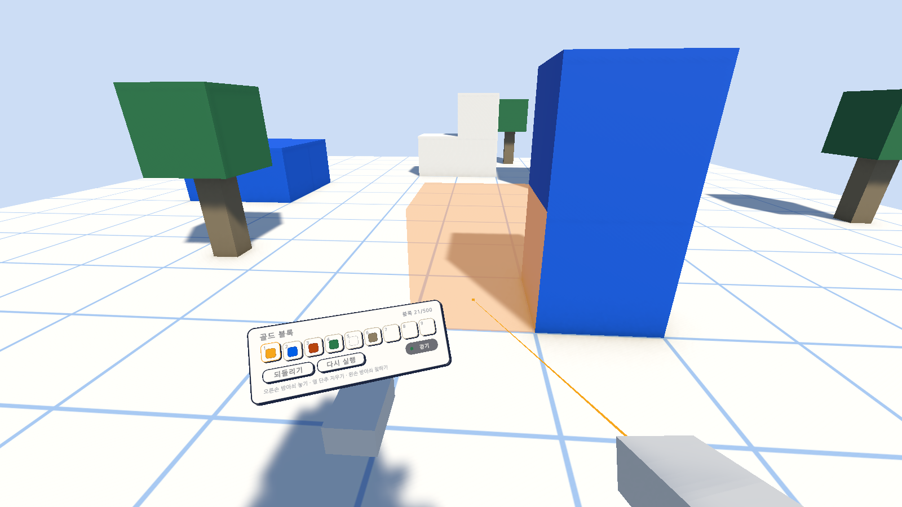
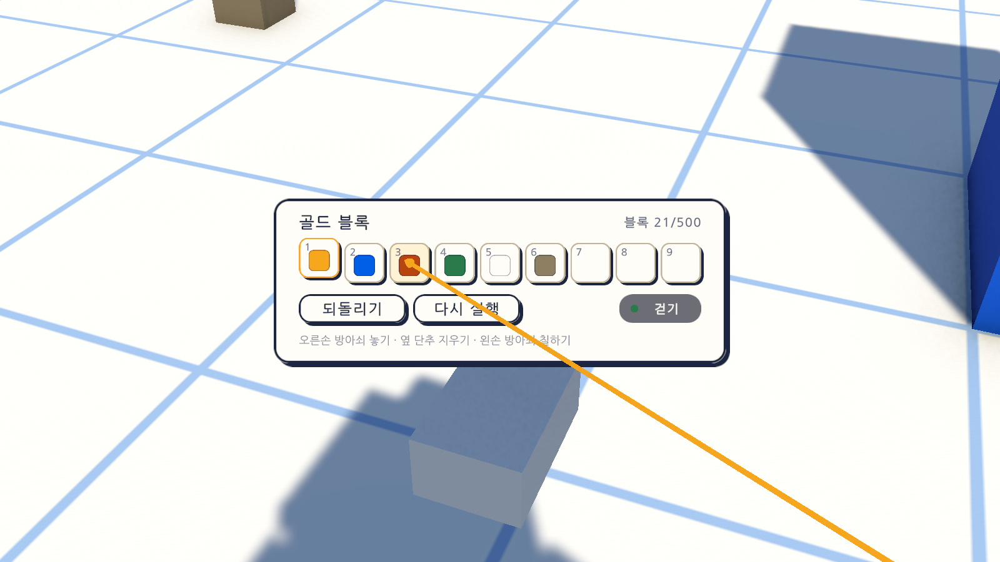

# 13일차 개발 일지 — VR에서 만들기

- **날짜**: 2026-10-08
- **단계**: 0단계 기반 → 1-B VR로 들어가기(준비)
- **목표**: VR에서도 블록을 놓고 지우고 칠할 수 있게 한다. 부품을 고르는 방법과 만들 때 봐야 하는 정보를 VR 안에 둔다
- **검사 기준**: PC에서는 전과 똑같이 동작한다. VR에서는 왼손 위의 부품 판에서 부품을 고르고, 오른손으로 가리켜 방아쇠로 놓는다. 부품 판이나 메뉴를 누르는 방아쇠로는 블록이 놓이지 않는다
- **결과**: ⚠️ 가상 기기로는 완성(자동 검사 204개 통과, Windows 빌드와 실행 확인 통과). **실제 헤드셋으로는 확인하지 못함**(이 컴퓨터에 VR 프로그램이 없음)

---

## 오늘 한 일 요약

12일차까지는 VR에서 걷고 메뉴를 누르는 것까지만 됐다. 오늘은 **VR에서 블록을 놓고 지우고 칠하게** 했다. 화가가 팔레트를 들듯 **왼손 위에 부품 판**이 뜨고, 오른손 광선으로 부품을 고른 뒤 놓을 자리를 가리켜 방아쇠를 당긴다.

그림은 테스트가 **가상의 VR 기기**로 값을 넣어 찍은 것이다. 실제 헤드셋의 화면이 아니다. 가리킨 바닥에 놓일 자리가 반투명 블록으로 보이고, 광선이 그 자리에서 끝난다. 아래는 글자를 확인하려고 부품 판만 가까이 당겨 찍은 그림이다(헤드셋에서 보이는 크기가 아님).

| 하는 일 | 컨트롤러 |
|---|---|
| 부품 고르기 | 왼손 위의 부품 판에서 칸을 오른손으로 가리키고 방아쇠. 같은 칸을 다시 누르면 풂 |
| 블록 놓기 | 부품을 고른 뒤 놓을 자리를 오른손으로 가리키고 방아쇠 |
| 블록 지우기 | 블록을 가리키고 오른손의 옆 단추 |
| 블록 칠하기 | 블록을 가리키고 왼손의 방아쇠 |
| 되돌리기, 다시 실행 | 부품 판의 단추 |

## 작업 내역

### 1. 블록 놓기를 두 조작에서 함께 쓰기 (`BlockBuilder`, `LocalPlayer`, `PlayerModeSwitch`)

- 전에는 VR로 시작하면 블록 놓기를 꺼 두었다. 이제 두 조작에서 모두 켜 둔다.
- 블록 놓기는 어느 조작인지 모른다. 놓기·지우기·칠하기 입력을 **`LocalPlayer.InputMapName`이 알려 주는 입력 묶음**에서 찾는다(PC는 `Player`, VR은 `XR`). 두 묶음에 같은 이름의 동작을 두었다. 조작 방식이 실행 중에 바뀌면 다시 찾는다.
- 조준 광선은 12일차에 만든 `LocalPlayer.TryGetAim`이 준다. VR에서는 오른손이 가리키는 쪽이다.
- 놓일 자리의 반투명 블록, 놓을 수 없는 까닭의 알림, 되돌리기 기록은 PC와 같은 코드가 한다.

### 2. 방아쇠 하나로 누르기와 놓기를 가르기

오른손 방아쇠는 화면(메뉴, 부품 판)을 누르는 데도 쓰인다. 그래서 다음과 같이 갈랐다.

| 때 | 방아쇠가 하는 일 |
|---|---|
| 광선이 부품 판이나 메뉴에 닿아 있음 | 화면을 누른다. 블록은 놓이지 않는다 |
| 메뉴가 열려 있음 | 화면만 누른다. 조작이 막혀 있어 블록을 놓을 수 없다 |
| 그 밖 | 고른 부품을 가리킨 자리에 놓는다 |

`LocalPlayer.IsAiming`이 VR에서 "조작이 막혀 있지 않고 광선이 화면을 가리키고 있지 않을 때"로 바뀌었다. 광선이 화면에 닿아 있는지는 `XrRig.IsPointerOverUi`가 화면 입력에 묻는다.

### 3. 왼손 위의 부품 판 (`XrHandPalette`)

- 왼손에서 14cm 위에 뜨고 **늘 머리 쪽을 본다.** 컨트롤러마다 손의 각도가 달라도 읽을 수 있게, 손의 각도를 따르지 않게 했다. 가로 약 32cm다.
- 위에 고른 부품의 이름과 블록 수, 가운데에 부품 칸 아홉 개, 아래에 되돌리기·다시 실행 단추와 걷기·날기 표시, 맨 아래에 단추 안내가 있다.
- 부품 칸은 화면 아래의 부품 칸과 **같은 선택 상태**를 쓴다(`HotbarView.Bind`). 어느 쪽에서 골라도 함께 바뀐다.
- VR이고 메뉴가 닫혀 있고 왼손 컨트롤러가 연결되어 있을 때만 보인다. PC에서는 보이지 않는다.

### 4. 오른손 광선 (`XrRig`, `GameUi`)

- 12일차에는 메뉴가 열려 있을 때만 보였다. 이제 VR에서는 늘 보인다. 부품 판을 가리키려면 광선이 있어야 하기 때문이다.
- 길이는 하는 일에 따라 달라진다.

| 때 | 광선 |
|---|---|
| 화면(메뉴, 부품 판)에 닿음 | 닿은 자리에서 끝남 |
| 메뉴가 열려 있고 아무것도 가리키지 않음 | 2.5m |
| 부품을 고르고 블록이나 바닥을 가리킴 | 가리킨 자리에서 끝남 |
| 부품을 고르고 닿는 것이 없음 | 2.5m |
| 메뉴가 닫혀 있고 부품도 고르지 않음 | 30cm. 가리키는 방향만 알려 줌 |

- 광선 끝의 작은 블록은 멀수록 크게 해, 가까운 부품 판에서도 먼 메뉴에서도 비슷한 크기로 보인다. 선은 4mm에서 3mm로 줄였다.

### 5. 입력 (`AtelierInput.inputactions`)

`XR` 묶음에 `Place`(오른손 방아쇠), `Remove`(오른손 옆 단추), `Paint`(왼손 방아쇠)를 더했다. 11일차에 켠 컨트롤러 프로파일 여섯 개가 모두 이 쓰임새를 준다.

### 6. 그 밖

- 메뉴 도움말의 VR 안내에 부품 판, 놓기, 지우기, 칠하기를 더하고 "VR에서 블록을 놓는 기능은 준비 중입니다"를 지웠다.
- 되돌리기와 다시 실행을 `GameUi.Undo`·`Redo`로 모았다. Ctrl+Z·Ctrl+Y와 부품 판의 단추가 같은 것을 부른다.
- `Day13Setup`(메뉴 `Atelier Verse/13일차 셋업 실행`): 게임 화면 프리팹을 다시 조립해 Sandbox 씬에 넣고, 캐릭터 프리팹을 다시 잇는다.

## 검사

| 항목 | 방법 | 결과 |
|---|---|---|
| 스크립트 컴파일 | 명령줄 실행 로그 | 오류 없음 |
| 13일차 셋업 적용 | 명령줄에서 `ProjectSetupRunner` 실행, 고친 뒤 `Day13Setup.Apply` 다시 실행 | 적용됨 |
| 부품 판을 놓는 계산 | 편집 모드 테스트 `XrHandPaletteTests` 3개 | 통과 |
| VR 만들기 입력의 연결 | 편집 모드 테스트 `UiInputTests`에 2개 추가 | 통과 |
| 1~12일차의 편집 모드 테스트 | 92개 | 통과 |
| VR에서 만들기 | 플레이 모드 테스트 `XrBuildPlayTests` 10개(가상 기기) | 통과 |
| 1~12일차의 플레이 모드 테스트 | 97개. 바뀐 동작에 맞춰 3개를 고침(아래) | 통과 |
| Windows 빌드와 평소 실행 | `node scripts/build-windows.mjs --run` | 성공, 예외 없음, 화면은 전과 같음, VR 프로그램을 찾은 흔적 0줄 |
| `-vr` 실행(VR 프로그램 없는 PC) | `node scripts/build-windows.mjs --skip-build --run --vr` | 키보드·마우스로 돌아옴, 예외 없음 |
| 화면 모양 | 테스트가 찍은 그림 23장을 눈으로 확인 | 위 그림. PC의 화면은 전과 같음 |
| **헤드셋 안에서의 모습과 손의 느낌** | - | **하지 못함.** 부품 판이 손 위에서 편한 자리인지, 가리켜 놓는 것이 자연스러운지 모른다 |
| **실제 컨트롤러** | - | **하지 못함.** 옆 단추와 방아쇠가 실제 기기에서 맞게 들어오는지 모른다 |

편집 모드 테스트는 모두 97개, 플레이 모드 테스트는 107개다. 플레이 모드 107개는 그림 찍기 9개를 포함한 수이고, `-captureDir` 없이 돌리면 그 9개는 건너뛴다. 테스트와 빌드는 마지막 코드 상태에서 돌렸다.

`XrBuildPlayTests`가 확인하는 것은 다음과 같다.

| 테스트 | 확인하는 것 |
|---|---|
| PC에서는 부품 판이 보이지 않는다 | 숫자 키로 고르면 부품 판의 선택도 같이 바뀜 |
| VR에서도 블록 놓기가 켜져 있고 왼손 위에 부품 판이 뜬다 | 판의 자리(손 위 14cm)와 방향(머리 쪽), 이름·블록 수·걷기 표시, 광선은 짧게 |
| 부품 판의 칸을 가리켜 누르면 부품이 골라지고 블록은 놓이지 않는다 | 광선이 칸에서 끝남, 고른 부품이 블록 놓기에 전해짐, **블록 수는 그대로**, 다시 누르면 풀림 |
| 오른손으로 바닥을 가리켜 방아쇠를 당기면 블록이 놓인다 | 놓일 칸, 미리 보기 블록의 자리, 광선이 그 자리에서 끝남, 부품 판의 블록 수가 늘어남 |
| 왼손 방아쇠로 칠하고 오른손 옆 단추로 지운다 | 부품이 바뀜, 블록이 사라짐 |
| 부품 판의 되돌리기와 다시 실행 단추가 동작한다 | 놓은 블록이 사라졌다가 돌아옴 |
| 메뉴가 열려 있으면 방아쇠로 블록이 놓이지 않고 부품 판은 숨는다 | 메뉴를 닫으면 다시 보이고 놓을 수 있음 |
| 부품 판은 왼손을 따라오고 컨트롤러가 없으면 보이지 않는다 | 손을 옮기면 따라옴, 날기를 켜면 표시가 바뀜 |
| 실행 중에 PC 조작으로 바꾸면 마우스로 놓고 부품 판은 사라진다 | 화면 가운데 조준과 마우스로 놓기, 다시 VR로 바꾸면 부품 판이 보임 |
| 화면 그림을 찍는다 | `-captureDir`가 있을 때만 |

바뀐 동작에 맞춰 고친 앞 일차의 테스트는 셋이다. "VR에서 블록 놓기는 꺼 둔다"를 "켜져 있다"로, "메뉴가 닫혀 있으면 광선이 보이지 않는다" 두 곳을 "광선은 짧다(30cm)"로 고쳤다.

### 검사에서 찾은 문제와 수정

- **광선 끝의 블록이 부품 판의 칸을 가렸다.** 끝의 블록은 1.6m 앞의 메뉴에 맞춘 크기(1.4cm)였는데, 손 가까이에 있는 부품 판에서는 칸의 색 네모만큼 커서 가리킨 칸이 보이지 않았다(그림으로 발견). 끝의 블록을 거리에 비례하게 바꿨다.
- **테스트 하나가 "입력 상태가 없다"는 예외로 실패했다.** 물리 갱신을 기다린(`WaitForFixedUpdate`) 바로 그 시점에 가상 기기에 값을 넣었기 때문이다. 게임 코드의 문제가 아니다. 프레임을 넘긴 뒤에 넣도록 테스트를 고쳤다.
- **방향 검사 하나가 0.03도 차이로 실패했다.** `Vector3.Angle`은 0도 근처에서 그 정도의 오차가 난다. 허용치를 0.01도에서 0.1도로 넓혔다.

## 직접 확인하는 방법

PC에서(헤드셋 없이):

1. Unity 에디터에서 Sandbox 씬을 재생한다. 숫자 키로 고르고 마우스로 놓고 지우고 칠하는 것, Ctrl+Z·Ctrl+Y가 전과 같은지 본다.

헤드셋으로(사용자가 준비해야 함. 방법은 11일차 일지와 같음):

1. `AtelierVerse-VR.bat`으로 켠다. 왼손을 들면 손 위에 부품 판이 보이는지 본다.
2. 오른손으로 부품 판의 칸을 가리켜 방아쇠로 고른다. 이름이 바뀌고 칸이 올라오는지 본다.
3. 바닥이나 블록을 가리키면 반투명 블록이 보이는지, 방아쇠로 놓이는지 본다. 오른손 옆 단추로 지우고 왼손 방아쇠로 칠해 본다.
4. 부품 판의 되돌리기를 눌러 본다.
5. 부품 판이 너무 크거나 시야를 가리지 않는지, 손 위의 높이가 편한지, 가리킨 자리와 놓이는 자리가 맞는지 알려 주면 값을 고친다.

## 알아 둘 점

- **실제 기기로 확인한 것이 없다.** 10~13일차의 VR 기능 전부가 가상 기기로만 확인됐다.
- **부품 판의 크기와 자리는 그림만 보고 정했다.** 가로 32cm, 손 위 14cm다. 손을 들고 있어야 보이므로 오래 들면 팔이 아플 수 있다. 실제 기기에서 본 뒤 손목에 붙이거나 놓아두는 방식을 정한다.
- **오른손으로 가리키고 왼손에 부품 판을 든다.** 왼손잡이용 설정은 없다.
- **부품 판과 메뉴는 블록에 가릴 수 있다.** 12일차와 같다.
- 광선이 부품 판에 닿아 있는 동안에는 블록을 놓을 수 없다. 부품 판을 놓을 자리 앞에 들고 있으면 판이 먼저 눌린다.
- 알림이 떠 있는 동안 광선이 그 알림을 지나가면 블록이 놓이지 않는다. 알림도 화면이라 누르는 쪽이 먼저이기 때문이다. 알림은 2.5초 뒤 사라진다. 코드로 본 것이며 따로 검사하지는 않았다.
- VR에서는 저장 표시, 방 이름, 사람들 목록이 늘 보이지는 않는다. 방 이름과 사람들 목록은 메뉴에서 볼 수 있다.
- 놓을 때의 진동과 소리는 없다.

## 다음 일차

- 사용자가 헤드셋으로 켜 본 결과가 있으면 그것부터 고친다.
- 결과가 없으면 `docs/BACKLOG.md` 2절의 순서대로 **모양이 다른 부품과 부품 고르는 창**을 한다. 정육면체 여섯 색만으로는 만들 수 있는 것이 적다. 부품이 아홉 칸을 넘으면 PC의 화면과 VR의 부품 판 양쪽에서 고르는 창이 필요하다.
