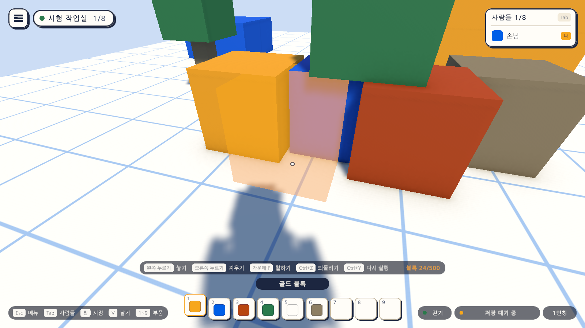

# 14일차 개발 일지 — 자유 배치의 기반

- **날짜**: 2026-10-09
- **단계**: 1-A 혼자 만들기
- **목표**: 맵의 요소를 칸에 맞추지 않고 자유롭게 놓게 한다. 길이의 표준은 블록 하나의 1×1×1로 둔다
- **검사 기준**: 가리킨 바로 그 자리에 블록이 놓인다. 블록끼리 겹쳐도 놓인다. 되돌리기, 지우기, 칠하기, 저장이 전과 같이 동작한다. 지금까지 저장한 맵이 그대로 열린다
- **결과**: ✅ 완료(자동 검사 222개 통과, Windows 빌드와 실행 확인 통과, 실제 저장 파일이 새 형식으로 올라간 것 확인). VR 쪽은 가상 기기로만 확인

---

## 오늘 한 일 요약

사용자 결정(2026-10-09): **맵의 요소는 블록(칸)에 맞출 필요 없이 자유롭게 배치한다. 대신 블록 하나의 1×1×1 길이를 표준으로 둔다.**

13일차까지는 마인크래프트처럼 "칸 하나에 블록 하나"였다. 블록의 기록, 저장 파일, 되돌리기, 놓을 자리 계산이 모두 칸 번호로 블록을 가리켰다. 오늘은 그 바탕을 바꿨다. **블록은 이제 고유 번호와 자리(소수 좌표)로 기록되고, 가리킨 면 위의 바로 그 자리에 놓인다.**



그림에서 블록들은 모눈의 선에 걸쳐 있고 서로 겹쳐 있다. 가운데의 반투명 블록은 지금 가리킨 자리이며, 놓여 있는 블록과 겹치는 자리인데도 놓을 수 있다.

| 구분 | 13일차까지 | 14일차부터 |
|---|---|---|
| 블록을 가리키는 것 | 칸 번호 `(x, y, z)` | 고유 번호(`id`) |
| 놓이는 자리 | 가리킨 곳이 속한 칸의 가운데 | 가리킨 면 위의 바로 그 자리 |
| 겹치기 | 칸 하나에 블록 하나 | 블록끼리 겹쳐도 됨 |
| 길이의 표준 | 모눈 한 칸 = 1 | 그대로. 표준 블록 한 변 = 1(Unity의 1m) |
| 저장 파일 | 1판(`cell`, `facing`) | 2판(`id`, `position`, `rotation`) |

## 작업 내역

### 1. 블록의 기록 (`BlockMap`, `BlockRecord`)

- 블록 하나의 기록은 번호, 부품, 가운데의 자리, 방향이다.
- 번호는 1부터 붙고, 지운 블록의 번호는 다시 쓰지 않는다.
- 자리는 1mm 단위로 다듬어 기록한다. 계산의 아주 작은 차이로 같은 자리가 다르게 저장되지 않게 하기 위해서다.
- 블록끼리 겹쳐도 되지만, **가운데가 정확히 같은 자리**에는 둘을 두지 않는다. 겹쳐서 보이지 않는 블록이 쌓이는 것을 막는다.
- 범위는 상자의 두 모서리이고, 블록은 그 안에 다 들어와야 한다.
- 고치는 동작 하나(`Set`)로 부품 바꾸기, 옮기기, 돌리기를 모두 한다.

### 2. 놓는 자리 (`BlockBuilder`)

| 가리킨 곳 | 놓이는 자리 |
|---|---|
| 바닥 | 가리킨 점 바로 위. 블록의 가운데 높이는 0.5 |
| 블록의 윗면 | 가리킨 점 위에 얹힘 |
| 블록의 옆면 | 그 면에 붙음. 면 위에서는 가리킨 그 자리 |
| 옆면의 낮은 곳 | 바닥에 묻히지 않게 높이만 바닥 위로 올림 |

- 캐릭터나 블록이 아닌 물체(나무 등)와 겹치는 자리에는 전처럼 놓이지 않는다. 블록끼리의 겹침은 이제 막지 않는다.
- 지우기와 칠하기는 가리킨 블록의 번호로 한다. PC의 마우스와 VR의 오른손 광선이 같은 코드를 쓴다.

### 3. 되돌리기 (`EditHistory`)

- 기록은 "몇 번 블록이 어떤 상태에서 어떤 상태로"다. 지운 블록을 되돌리면 **같은 번호**로 돌아와, 그 블록을 가리키는 뒤의 기록(칠하기 등)이 계속 맞는다.
- 옮기기와 돌리기의 기록(`Move`)도 넣어 두었다. 화면의 도구는 다음 일차에 만든다.

### 4. 맵 파일 2판 (`MapDocument`, `docs/MAP-FORMAT.md`)

```json
{ "id": 2, "part": "block.blue", "position": { "x": -4.37, "y": 0.5, "z": 1.82 }, "rotation": { "x": 0.0, "y": 30.0, "z": 0.0 } }
```

- 블록을 번호, 부품의 저장용 이름, 가운데의 자리, 방향으로 적는다.
- **1판의 파일은 읽을 때 2판으로 올린다.** 칸의 가운데가 자리가 되고, 방향(0~3)은 90도씩의 각도가 되고, 번호는 적힌 순서대로 붙는다.
- 옛 판의 파일을 읽으면 원래 파일을 옆에 남기고(`local.map.json.v1.bak`) 곧 새 판으로 다시 저장한다(`MapAutoSave`, `MapStorage.Backup`).
- 번호가 없거나 겹치는 블록은 버리지 않고 새 번호를 붙여 읽는다.

### 5. 그 밖

- `BlockWorld`는 블록을 번호로 다루고, 씬에 미리 놓인 블록 19개를 그 자리 그대로 기록에 올린다.
- `PlacedBlock`에서 칸 번호를 지웠다. 자리는 트랜스폼이 가진다.
- `Day14Setup`(메뉴 `Atelier Verse/14일차 셋업 실행`): 블록 프리팹과 씬의 블록을 다시 저장해 쓰이지 않는 칸 번호를 지운다. 블록의 자리와 부품은 그대로다.
- 알림 문구 "이미 블록이 있는 칸입니다"를 "이미 같은 자리에 블록이 있습니다"로 바꿨다.

## 검사

| 항목 | 방법 | 결과 |
|---|---|---|
| 스크립트 컴파일 | 명령줄 실행 로그 | 오류 없음 |
| 14일차 셋업 적용 | 명령줄에서 `ProjectSetupRunner` 실행 | 적용됨. 씬의 블록 19개를 다시 저장 |
| 블록의 기록 | 편집 모드 테스트 `BlockMapTests` 15개(다시 씀) | 통과 |
| 되돌리기 | 편집 모드 테스트 `EditHistoryTests` 17개(다시 씀) | 통과 |
| 맵 파일 형식 | 편집 모드 테스트 `MapDocumentTests` 13개(다시 씀) | 통과 |
| 그 밖의 편집 모드 테스트 | 63개 | 통과 |
| PC에서 놓기·지우기·칠하기·되돌리기·저장 | 플레이 모드 테스트(`Build`·`Paint`·`Undo`·`Save` 4개 파일, 고침) | 통과 |
| 자유 배치 | 플레이 모드 테스트 새로 6개(아래) | 통과 |
| VR에서 만들기 | 플레이 모드 테스트 `XrBuildPlayTests` 11개(가상 기기) | 통과 |
| 그 밖의 플레이 모드 테스트 | 메뉴, 날기, VR 조작과 메뉴 등 | 통과 |
| Windows 빌드와 평소 실행 | `node scripts/build-windows.mjs --run` | 성공, 예외 없음, 화면은 전과 같음 |
| **실제 저장 파일** | 이 컴퓨터의 `local.map.json`(1판, 블록 22개)을 빌드한 실행 파일로 엶 | 사본 `local.map.json.v1.bak`이 남고 2판으로 다시 저장됨. 블록 22개 그대로 |
| `-vr` 실행(VR 프로그램 없는 PC) | `node scripts/build-windows.mjs --skip-build --run --vr` | 키보드·마우스로 돌아옴, 예외 없음 |
| 화면 모양 | 테스트가 찍은 그림 24장을 눈으로 확인 | 위 그림. 전의 그림들도 같음 |
| **헤드셋에서 놓는 느낌** | - | **하지 못함.** 이 컴퓨터에 VR 프로그램이 없다 |
| **사람이 직접 놓아 보기** | - | **하지 못함.** 자유 배치가 손에 맞는지는 직접 써 봐야 안다 |

편집 모드 테스트는 모두 108개, 플레이 모드 테스트는 114개다. 플레이 모드 114개는 그림 찍기 10개를 포함한 수이고, `-captureDir` 없이 돌리면 그 10개는 건너뛴다. 테스트와 빌드는 마지막 코드 상태에서 돌렸다.

새로 넣은 플레이 모드 테스트는 다음과 같다.

| 테스트 | 확인하는 것 |
|---|---|
| 칸에 맞지 않는 자리를 가리켜도 그 자리에 놓인다 | 비스듬히 본 바닥의 자리가 칸의 가운데로 당겨지지 않음 |
| 블록끼리는 겹쳐 놓을 수 있다 | 놓인 블록과 겹치는 자리가 막히지 않고 놓임 |
| 블록의 옆면 아래쪽을 가리켜도 바닥에 묻히지 않는다 | 높이가 바닥 위(0.5)로 올라감 |
| 칸에 맞지 않는 자리의 블록도 저장되고 다시 열면 같은 자리에 있다 | 번호, 자리, 방향이 그대로 |
| 블록을 칸으로 적은 옛 판의 파일도 읽고 사본을 남긴 뒤 새 판으로 저장한다 | 1판 파일의 블록이 칸의 가운데에, 사본의 내용은 원본과 같음, 다시 저장된 파일은 2판 |
| (VR) 칸에 맞지 않는 바닥을 가리키면 그 자리에 놓인다 | 오른손 광선으로 가리킨 자리 |

칸을 쓰던 테스트는 "그 자리 근처(반경 0.3)에 블록이 있는가"로 고쳤다. 테스트의 도우미(`CellCenter`, `BlockNear`, `FindViewNear`)는 `PlayTestBase`에 있다.

### 검사에서 찾은 문제와 수정

- **블록을 고치는 동작의 이름을 `Update`로 지었다가 바꿨다.** Unity는 `Update`라는 이름의 메서드를 매 프레임 부르는 것으로 여기므로, 인자가 있는 메서드에 그 이름을 쓰면 안 된다. 실행하기 전에 알아채고 `Set`으로 바꿨다.
- **테스트를 한꺼번에 고치는 과정에서 인자 순서가 뒤섞인 줄이 넷 나왔다.** 컴파일 오류로 드러나 바로잡았다. 게임 코드와는 관계없다.

## 직접 확인하는 방법

1. Unity 에디터에서 Sandbox 씬을 재생한다(또는 `unity/Builds/Windows/AtelierVerse.exe`).
2. 숫자 키로 부품을 고르고 바닥을 가리킨다. 반투명 블록이 모눈의 칸에 붙지 않고 **가리키는 대로 미끄러지듯** 따라오는지 본다.
3. 놓인 블록의 옆을 가리켜 겹치게 놓아 본다. 윗면을 가리켜 어긋나게 쌓아 본다.
4. 지우기(오른쪽), 칠하기(가운데·F), 되돌리기(Ctrl+Z)가 전과 같은지 본다.
5. 껐다 켜서 블록이 같은 자리에 남아 있는지 본다.

전에 만든 맵은 그대로 열린다. 원래 파일은 `%USERPROFILE%\AppData\LocalLow\Palettra Games\Atelier Verse\maps\local.map.json.v1.bak`에 남아 있다.

## 알아 둘 점

- **반듯하게 맞춰 놓기가 어려워졌다.** 벽을 한 줄로 세우려면 손으로 맞춰야 한다. 격자에 맞추는 도우미(켜면 1칸, 반 칸, 1/4칸)는 다음 일차에 넣는다.
- **돌리기와 옮기기 도구가 아직 없다.** 블록은 똑바로 선 채로만 놓인다. 기록과 파일 형식에는 방향의 자리가 있고, 되돌리기 기록에는 옮기기가 들어 있다.
- **겹쳐 놓은 블록의 면이 같은 자리에 오면 깜박여 보일 수 있다.** 두 면이 정확히 겹칠 때 생기는 현상이다. 가운데가 같은 자리는 막았지만 면만 겹치는 경우는 막지 않았다.
- **블록 수의 상한(500)과 성능은 그대로 임시다.** 자유 배치에서는 칸 단위로 합쳐 그리는 방법을 쓸 수 없어, 같은 모양을 한꺼번에 그리는 방식으로 풀어야 한다. Quest에서 재 본 뒤에 정한다.
- 범위(가로세로 16, 높이 12)는 그대로다. 블록이 범위 밖으로 조금이라도 나가면 놓이지 않는다.
- 씬과 `BlockWorld`의 범위 값은 지금도 칸 번호로 적혀 있다(`minCell`, `maxCell`). 코드가 상자의 모서리로 바꿔 쓴다.
- 13일차까지의 앱은 2판 파일을 읽지 못한다. 새 판의 파일이라고 알리고 옆으로 옮겨 둔다.

## 다음 일차

`docs/BACKLOG.md` 2절의 순서대로 **돌리기·옮기기와 맞추기 도우미**를 한다. 놓을 때 돌리기, 놓인 블록 옮기기, 격자에 맞추는 도우미다. PC와 VR 양쪽에 넣는다. 그다음이 모양이 다른 부품과 부품 고르는 창이다. 사용자가 헤드셋으로 켜 본 결과가 있으면 그것부터 고친다.
