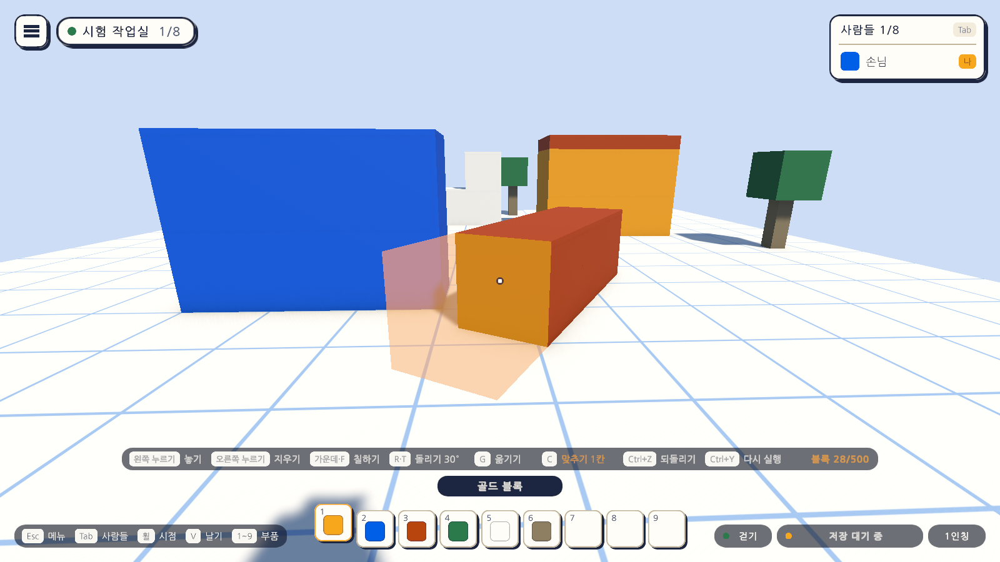
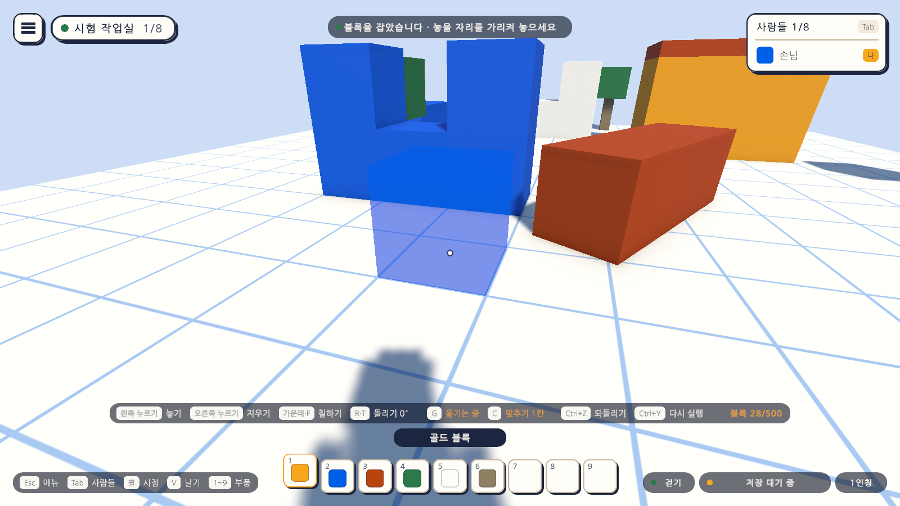
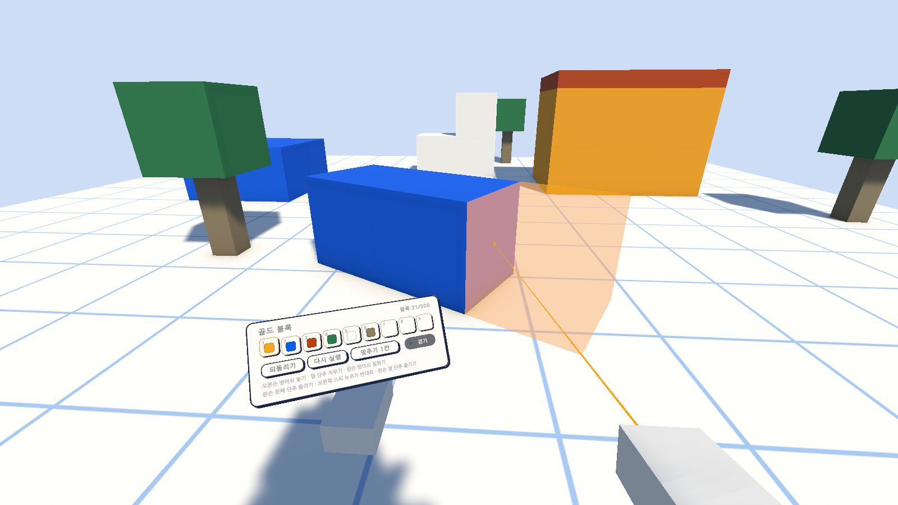
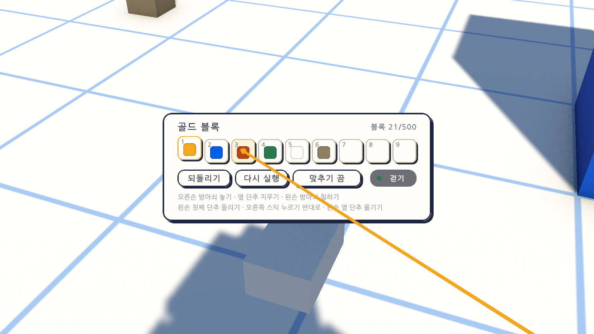

# 15일차 개발 일지 — 돌리기·옮기기와 맞추기 도우미

- **날짜**: 2026-10-09
- **단계**: 1-A 혼자 만들기
- **목표**: 자유 배치(14일차) 위에서 블록을 돌려 놓고, 놓인 블록을 옮기고, 원할 때 반듯하게 맞춰 놓을 수 있게 한다. PC와 VR 양쪽에 넣는다
- **검사 기준**: 놓기 전에 돌린 방향 그대로 놓인다. 놓인 블록을 잡아 다른 자리에 놓으면 옮겨지고 한 번에 되돌려진다. 맞추기 도우미를 켜면 모눈과 가리킨 블록에 맞춰 놓이고, 끄면 14일차처럼 가리킨 그 자리에 놓인다
- **결과**: ✅ 완료(자동 검사 267개 통과, Windows 빌드와 실행 확인 통과). VR 쪽은 가상 기기로만 확인

---

## 오늘 한 일 요약

14일차에 블록을 칸에 맞추지 않고 놓게 바꾸면서 두 가지가 남았다. 블록이 똑바로 선 채로만 놓였고, 반듯한 벽을 세우려면 손으로 맞춰야 했다. 오늘은 그 둘을 채웠다.

| 기능 | PC | VR | 하는 일 |
|---|---|---|---|
| 돌리기 | `R`(시계 방향), `T`(반대) | 왼손 첫째 단추, 오른쪽 스틱 누르기(반대) | 놓을 블록을 좌우로 15도씩 돌림. 누르고 있으면 이어서 돎 |
| 옮기기 | `G`로 잡고 왼쪽 누르기로 놓음 | 왼손 옆 단추로 잡고 오른손 방아쇠로 놓음 | 놓인 블록을 잡아 다른 자리에 놓음. 잡은 채 돌릴 수 있음 |
| 맞추기 도우미 | `C` | 부품 판의 "맞추기" 단추 | 누를 때마다 끔 → 1칸 → 1/2칸 → 1/4칸. **끈 것이 기본** |

그림에서 붉은 흙색 블록 줄은 30도 돌려 놓은 것이다. 맞추기를 "1칸"으로 켜고 줄의 끝을 가리키자, 미리 보기 블록(반투명)이 그 줄에 **나란히, 정확히 한 변 떨어진 자리**에 붙었다. 부품 칸 위의 안내에는 지금 상태("돌리기 30°", "맞추기 1칸")가 적힌다.

## 정한 것

`docs/BACKLOG.md` 5절에 "15일차에 정할 것"으로 적어 둔 두 가지를 Claude의 가안대로 만들었다. 사용자가 바꾸자고 하면 바꾼다.

| 정할 것 | 만든 대로 | 까닭 |
|---|---|---|
| 돌리기의 범위 | 좌우로만, 15도씩 | 기울이기까지 넣으면 조작이 셋(세 축)으로 늘어난다. 벽과 지붕의 방향은 좌우 돌리기로 대부분 된다. 기울이기는 경사 부품(다음 일차)을 본 뒤에 정한다 |
| 맞추기 도우미 | 두되, 끈 것이 기본. 단계는 이 기기에 저장 | 사용자의 결정은 "칸에 맞출 필요 없이 자유롭게"다. 맞추기는 원할 때 켜는 도우미로 둔다 |

## 작업 내역

### 1. 돌리기

- 놓을 블록의 각도(`BlockBuilder.Yaw`)를 15도씩 바꾼다. 0도에서 반대로 돌리면 345도가 되고, 스물네 번이면 한 바퀴다.
- 미리 보기 블록이 함께 돌아, 놓기 전에 방향을 본다.
- **놓은 뒤에도 각도가 남는다.** 30도 돌려 하나를 놓으면 다음 블록도 30도로 놓여, 같은 방향의 블록을 이어 놓을 수 있다.
- 키를 누르고 있으면 0.4초 뒤부터 이어서 돈다.
- 캐릭터나 다른 물체와 겹치는지는 돌린 상자로 검사한다.

### 2. 옮기기

- 블록을 가리키고 잡으면, 그 블록은 화면에서 잠시 사라지고 미리 보기가 **그 블록의 색과 방향으로** 대신 보인다(새로 놓는 블록보다 조금 진하게).
- 새 자리를 가리켜 놓으면 옮겨진다. 블록의 번호와 부품은 그대로다.
- **한 번의 편집으로 기록된다.** 되돌리기 한 번에 원래 자리로 돌아온다(`EditHistory.Move`, 14일차에 만들어 둔 것).
- 잡은 채 `G`를 다시 누르거나 지우기(오른쪽 누르기, VR은 오른손 옆 단추)를 누르면 그만둔다. **블록은 지워지지 않고 제자리로 돌아온다.**
- 메뉴를 열거나 부품 선택을 풀면 잡은 블록은 제자리로 돌아온다. 잡고 있던 블록이 되돌리기로 사라져도 잡은 것이 풀린다.
- 기록은 놓을 때까지 바뀌지 않는다. 잡고 있는 동안 꺼져도 블록은 원래 자리에 저장되어 있다.
- 블록이 상한(500개)에 닿아 있어도 옮길 수는 있다. 옮기기는 블록 수가 늘지 않기 때문이다(`BlockMap.CheckMove`).
- 블록을 잡으면 돌리기의 각도가 **그 블록의 각도**가 된다. 잡았다가 바로 놓으면 "이 블록의 방향 따오기"로 쓸 수 있다.

### 3. 맞추기 도우미 (`PlacementMath`)

| 가리킨 곳 | 맞추기 끔 | 맞추기 켬 |
|---|---|---|
| 바닥 | 가리킨 그 자리 | 모눈에 맞춤. 1칸이면 칸의 가운데, 1/2칸이면 칸의 경계에도, 1/4칸이면 그 사이에도 |
| 나무 같은 물체의 옆면 | 면 위의 그 자리 | 면에 붙은 채로 나머지 두 쪽만 모눈에 맞춤 |
| 놓인 블록의 면 | 면 위의 그 자리 | **그 블록을 기준으로** 맞춤. 가리킨 면 쪽으로 정확히 한 변 떨어진 자리. 면 위에서는 간격의 배수만큼 어긋남 |

- 놓인 블록을 가리켰을 때는 세계의 모눈이 아니라 그 블록에 맞춘다. 그래서 칸에 맞지 않게 놓인 블록 위에도 반듯하게 쌓이고, **돌아간 블록에는 돌아간 방향을 따라** 붙는다.
- 맞추는 것은 자리뿐이다. 방향은 돌리기로 정한 그대로다.
- 단계를 바꾸면 알림 띠에 "맞추기 1칸 · 모눈과 가리킨 블록에 맞춰 놓입니다"처럼 뜬다.
- 단계는 개인 설정(`GameSettings.SnapLevel`)에 저장되어 껐다 켜도 남는다.

### 4. 입력

입력 자산(`AtelierInput.inputactions`)에 동작 셋을 더했다. 돌리기와 옮기기는 PC의 묶음(`Player`)과 VR의 묶음(`XR`)에 같은 이름으로 있어, 블록 놓기 코드가 조작 방식을 모른 채 읽는다.

| 동작 | PC(`Player`) | VR(`XR`) | 게임패드 |
|---|---|---|---|
| `Rotate`(축) | `R` +, `T` − | 왼손 첫째 단추 +, 오른쪽 스틱 누르기 − | 방향 패드 좌우 |
| `Grab` | `G` | 왼손 옆 단추 | 오른쪽 단추(B) |
| `Snap` | `C` | 없음(부품 판의 단추) | 오른쪽 스틱 누르기 |

VR에서 오른쪽 스틱의 위아래는 날 때의 오르내리기에 이미 쓰고 있어, 돌리기에 쓰지 않았다.

### 5. 화면

- **놓기 안내**(부품 칸 위): `R·T 돌리기 0°`, `G 옮기기`, `C 맞추기 끔`을 더했다. 글자는 지금 상태로 바뀐다. 잡고 있으면 "옮기는 중", 맞추기를 켜면 "맞추기 1칸"이 골드색으로 보인다.
- **도움말**(Esc 메뉴): 돌리기·옮기기·맞추기 줄을 더했다. 줄이 늘어 한 줄의 높이를 줄이고 일곱 줄씩 두 단으로 했다. 되돌리기와 다시 실행은 한 줄로 합쳤다.
- **VR의 부품 판**: 단추 줄에 "맞추기" 단추를 더했다(누를 때마다 다음 단계, 글자가 지금 단계). 아래에 돌리기와 옮기기의 단추 안내를 한 줄 더했다. 판의 높이가 12cm에서 13cm로 늘었다.

두 번째 그림은 글자를 확인하려고 부품 판만 가까이 당겨 찍은 것이며, 헤드셋에서 보이는 크기가 아니다.

### 6. 그 밖

- `BlockWorld.SetShown`·`IsShown`: 화면의 블록을 잠시 감추고 다시 보인다. 기록은 바뀌지 않는다. 감춘 블록은 조준에도 걸리지 않는다.
- `Day15Setup`(메뉴 `Atelier Verse/15일차 셋업 실행`): 입력 동작이 있는지 확인하고 게임 화면 프리팹을 다시 조립한다.

## 검사

| 항목 | 방법 | 결과 |
|---|---|---|
| 스크립트 컴파일 | 명령줄 실행 로그 | 오류 없음 |
| 15일차 셋업 적용 | 명령줄에서 `ProjectSetupRunner` 실행 | 적용됨 |
| 돌리는 각도와 맞추기 계산 | 편집 모드 테스트 `PlacementMathTests` 15개(새로) | 통과 |
| 옮길 수 있는지의 확인 | 편집 모드 테스트 `BlockMapTests`에 1개 더함 | 통과 |
| 입력 자산 | 편집 모드 테스트 `UiInputTests`에 3개 더함(같은 이름으로 있는지, 키, 다른 동작의 단추와 겹치지 않는지) | 통과 |
| 그 밖의 편집 모드 테스트 | 108개 | 통과 |
| PC에서 돌리기·옮기기·맞추기 | 플레이 모드 테스트 `ArrangePlayTests` 20개(새로) | 통과 |
| VR에서 돌리기·옮기기·맞추기 | 플레이 모드 테스트 `XrArrangePlayTests` 6개(새로, 가상 기기) | 통과 |
| 그 밖의 플레이 모드 테스트 | 114개(놓기, 칠하기, 되돌리기, 저장, 메뉴, 날기, VR 등) | 통과 |
| Windows 빌드와 평소 실행 | `node scripts/build-windows.mjs --run` | 성공(108MB), 예외 없음, VR 프로그램을 찾은 흔적 0줄 |
| `-vr` 실행(VR 프로그램 없는 PC) | `node scripts/build-windows.mjs --skip-build --run --vr` | 키보드·마우스로 돌아옴, 예외 없음 |
| 화면 모양 | 테스트가 찍은 그림 27장을 눈으로 확인 | 위 그림. 놓기 안내가 화면 너비 안에 들어오고, 도움말의 글자가 겹치지 않음 |
| **헤드셋에서의 단추와 느낌** | - | **하지 못함.** 이 컴퓨터에 VR 프로그램이 없다 |
| **사람이 직접 해 보기** | - | **하지 못함.** 돌리고 옮기는 느낌, 맞추기가 쓸 만한지는 직접 써 봐야 안다 |
| 게임패드의 키 | - | **하지 못함.** 넣기만 하고 확인하지 않았다 |

편집 모드 테스트는 모두 127개, 플레이 모드 테스트는 140개다. 플레이 모드 140개는 그림 찍기 12개를 포함한 수이고, `-captureDir` 없이 돌리면 그 12개는 건너뛴다. 테스트와 빌드는 마지막 코드 상태에서 돌렸다.

새로 넣은 플레이 모드 테스트가 확인하는 것은 다음과 같다.

| 묶음 | 확인하는 것 |
|---|---|
| 돌리기 | `R`로 15도씩 돌고 미리 보기·기록·화면의 블록이 같은 방향. `T`는 반대(0도에서 345도). 누르고 있으면 이어서 돌고 떼면 멈춤. 부품을 고르지 않았으면 키가 듣지 않음. 돌린 블록을 맵 문서로 내보냈다 다시 읽어도 방향이 같음 |
| 옮기기 | 잡으면 블록이 숨고 기록은 그대로. 다른 자리에 놓으면 번호와 부품은 그대로 자리만 바뀌고, 되돌리기 한 번에 돌아옴. 잡은 채 돌리면 방향이 바뀜. 돌아간 블록을 잡으면 그 각도를 이어받음. 잡은 채 `G`나 오른쪽을 누르면 지워지지 않고 제자리. 블록이 없는 곳에서는 알림. 메뉴를 열면 제자리. 잡은 블록이 되돌리기로 사라지면 풀림. 상한에 닿아도 옮겨짐 |
| 맞추기 | `C`로 네 단계가 돌고 알림·표시·저장이 따라옴. 켜면 바닥에서 칸의 가운데(1칸)와 0.5의 배수(1/2칸). 블록의 앞면을 가리키면 정확히 한 변 떨어진 옆. 돌아간 블록에는 그 블록의 축을 따라. 끄면 다시 가리킨 그 자리 |
| VR | 왼손 첫째 단추와 오른쪽 스틱 누르기로 돌림(날기가 켜지지 않음). 왼손 옆 단추로 잡아 오른손 방아쇠로 옮기고 부품 판의 단추로 되돌림. 잡은 채 오른손 옆 단추를 쥐면 지워지지 않음. 부품 판의 맞추기 단추를 가리켜 누르면 단계가 바뀌고 블록은 놓이지 않음. 블록의 윗면을 가리키면 바로 위에 쌓임 |

### 검사에서 찾은 문제와 수정

- **입력 자산에 넣을 번호가 이미 쓰이고 있었다.** 화면 입력(UI 묶음)이 같은 범위의 번호를 쓰고 있어, 넣기 전에 겹치는지 확인하고 다른 범위로 바꿨다.
- **도움말의 되돌리기 줄을 찾는 테스트가 실패했다.** 줄을 합쳐 글자가 "되돌리기 · 다시 실행"이 되었기 때문이다. 테스트를 새 글자에 맞췄다. 게임 코드의 문제는 아니다.
- **처음 찍은 그림이 알아보기 어려웠다.** 블록이 카메라에 너무 가까워 미리 보기가 어디에 붙었는지 보이지 않았다. 두 걸음 물러서서 다시 찍었다.
- **VR 도움말의 한 줄이 판의 가장자리에 닿았다.** "부품 · 되돌리기 · 맞추기"의 띄어쓰기를 줄였다.

## 직접 확인하는 방법

1. Unity 에디터에서 Sandbox 씬을 재생한다(또는 `unity/Builds/Windows/AtelierVerse.exe`).
2. 숫자 키로 부품을 고르고 바닥을 가리킨다. `R`을 몇 번 눌러 미리 보기 블록이 도는지 보고, 놓아 본다. `T`로 반대로 돌려 본다.
3. `C`를 눌러 "맞추기 1칸"으로 바꾼다. 미리 보기가 칸의 가운데로 딱딱 옮겨 가는지 본다. 블록을 한 줄로 놓아 벽을 세워 본다.
4. 놓인 블록의 옆면과 윗면을 가리켜, 그 블록에 나란히 붙는지 본다. 돌려 놓은 블록에도 해 본다.
5. 블록을 가리키고 `G`를 누른다. 블록이 사라지고 미리 보기로 따라오는지 본다. 다른 자리를 가리켜 왼쪽을 눌러 놓는다. `Ctrl+Z`로 원래 자리에 돌아오는지 본다.
6. 잡은 채 `G`를 다시 눌러 그만둬 본다.
7. `C`를 눌러 "맞추기 끔"으로 돌아가면 14일차처럼 가리킨 그 자리에 놓이는지 본다.

## 알아 둘 점

- **돌리기는 좌우뿐이다.** 블록을 눕히거나 기울일 수 없다. 저장 형식에는 세 축의 각도가 다 있다.
- **맞추기는 자리만 맞춘다.** 돌아간 블록에 반듯하게 붙이려면 놓을 블록도 같은 각도여야 한다. 그 블록을 `G`로 잡았다 바로 놓으면 각도를 이어받는다.
- **블록을 잡으면 돌리기의 각도가 바뀐다.** 30도로 돌려 두고 0도짜리 블록을 잡으면 각도가 0도가 된다. 헷갈리면 방식을 바꾼다.
- **옮기기는 한 번에 하나다.** 여러 블록을 한꺼번에 옮기는 것은 영역 고르기(뒤 일차)에서 한다.
- **범위 검사는 블록의 가운데로 한다.** 돌린 블록의 모서리는 맵의 범위 밖으로 조금 나갈 수 있다(45도일 때 한 변의 0.2배쯤).
- **VR의 단추 자리는 가상 기기로만 확인했다.** 오른쪽 스틱을 누르다가 옆으로 밀려 몸이 돌 수 있고, 왼손 옆 단추를 쥔 채 부품 판을 들고 있기가 불편할 수 있다. 헤드셋에서 써 본 뒤에 바꾼다.
- 맞추기를 켜도 블록끼리 겹쳐 놓을 수 있다. 캐릭터와 다른 물체와 겹치는 자리만 막는다.
- 14일차에 적은 것은 그대로다: 겹친 면의 깜박임, 블록 수 상한(500)과 성능은 임시.

## 다음 일차

`docs/BACKLOG.md` 2절의 순서대로 **모양이 다른 부품과 부품 고르는 창**을 한다. 반 블록, 경사, 기둥, 계단처럼 정육면체가 아닌 부품을 넣고(크기는 블록 한 변 1을 기준으로 정함), 부품이 아홉 칸을 넘을 때 고르는 창을 만든다. 부품마다 크기가 달라지면 얹는 높이, 범위 검사, 겹침 검사, 맞추기 도우미가 부품의 크기를 보도록 바꿔야 한다. 사용자가 헤드셋으로 켜 본 결과가 있으면 그것부터 고친다.
