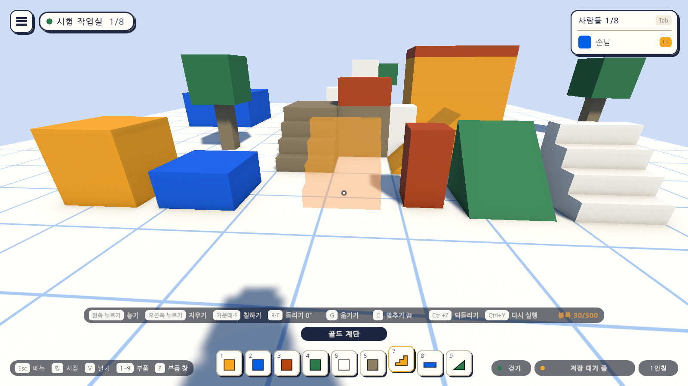
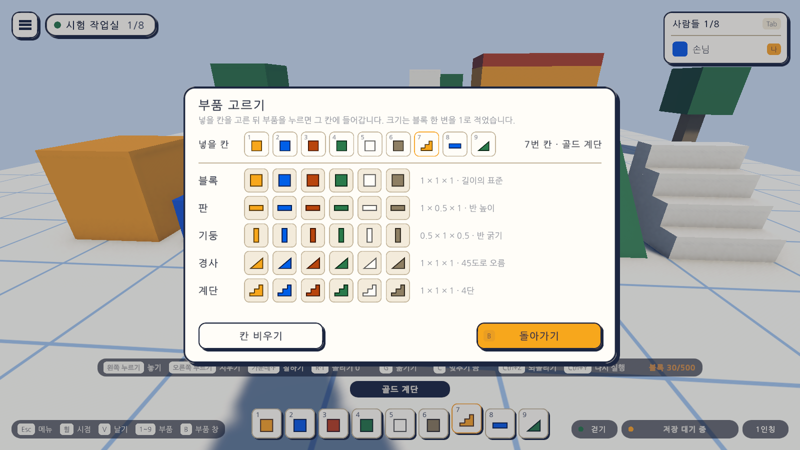
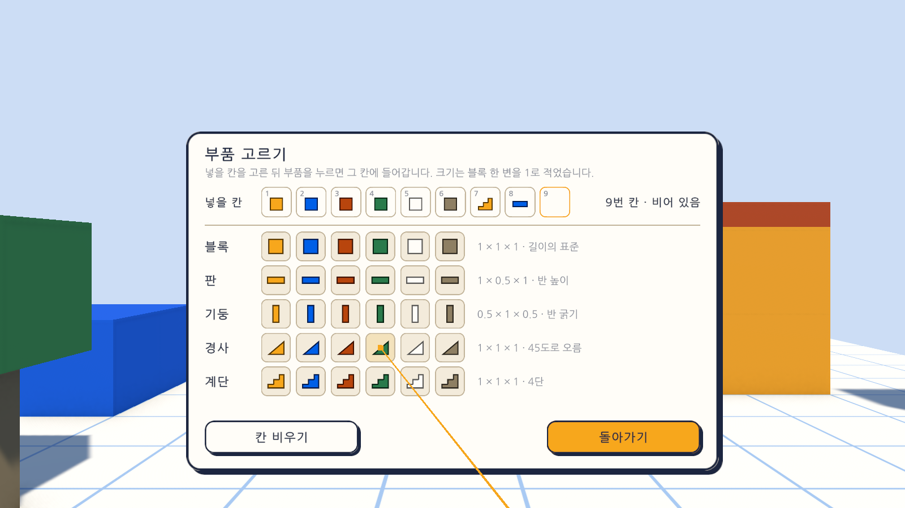
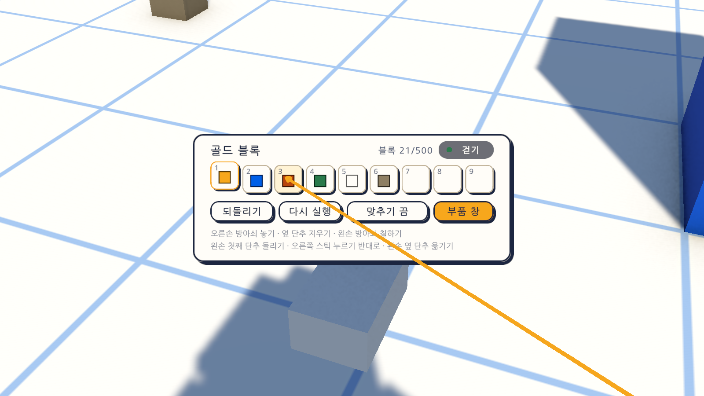

# 16일차 개발 일지 — 모양이 다른 부품과 부품 고르는 창

- **날짜**: 2026-10-09
- **단계**: 1-A 혼자 만들기
- **목표**: 정육면체가 아닌 부품(판, 기둥, 경사, 계단)을 넣고, 부품이 아홉 칸을 넘으므로 부품 칸에 넣을 부품을 고르는 창을 만든다. PC와 VR 양쪽에 넣는다
- **검사 기준**: 부품마다 제 크기대로 놓인다(판은 바닥에 반 높이로). 경사와 계단을 걸어 오를 수 있다. 창에서 고른 부품이 부품 칸에 들어가 바로 놓을 수 있다. 칠하기·옮기기·되돌리기·저장이 새 부품에도 전과 같이 동작한다
- **결과**: ✅ 완료(자동 검사 319개 통과, Windows 빌드와 실행 확인 통과). VR 쪽은 가상 기기로만 확인

---

## 오늘 한 일 요약

15일차까지는 놓을 수 있는 것이 정육면체 여섯 색뿐이었다. 오늘 모양 넷을 더해 부품이 서른 개가 되었고, 아홉 칸인 부품 칸에 다 들어가지 않으므로 **부품 고르는 창**을 만들었다.

그림의 앞줄이 왼쪽부터 블록, 판, 기둥, 경사, 계단이다. 가운데의 반투명한 것은 지금 놓으려는 계단의 미리 보기이고, 아래 부품 칸의 일곱째부터 아홉째 칸에 계단, 판, 경사가 들어 있다.

| 모양 | 크기(가로 × 높이 × 세로) | 쓰임 |
|---|---|---|
| 블록 | 1 × 1 × 1 | 길이의 표준. 전과 같다 |
| 판 | 1 × 0.5 × 1 | 바닥, 지붕, 낮은 단 |
| 기둥 | 0.5 × 1 × 0.5 | 기둥, 울타리, 가는 벽 |
| 경사 | 1 × 1 × 1 | 45도로 오르는 비탈. 지붕과 오르막 |
| 계단 | 1 × 1 × 1 | 네 단. 걸어서 오른다 |

크기는 모두 **블록 한 변을 1로** 보고 정했다(사용자 결정, 2026-10-09). 색은 모양마다 전과 같은 여섯 가지다.

## 정한 것

여쭙지 않고 Claude가 정해서 만든 것이다. 바꾸자고 하시면 바꾼다.

| 정한 것 | 만든 대로 | 까닭 |
|---|---|---|
| 부품의 크기 | 부품마다 정해진 크기. 늘이거나 줄일 수 없음 | `docs/BACKLOG.md` 5절에 적어 둔 가안. 1단계에서는 조작을 늘리지 않는다 |
| 부품을 적는 방법 | 모양과 색의 짝마다 부품 하나(`slab.gold`, `wedge.blue` …) | 맵 파일의 형식을 바꾸지 않고 이름만 늘면 된다. 색을 자유롭게 고르게 하려면 그때 색을 따로 떼어 낸다 |
| 칠하기 | **색만 바꾼다. 모양은 그대로** | 판을 블록 색으로 칠했더니 블록이 되면 곤란하다 |
| 처음의 부품 칸 | 앞 여섯 칸에 블록 여섯 색, 나머지 세 칸은 빈 칸 | 전과 같게 시작한다. 다른 모양은 창에서 넣는다 |
| 경사의 기울기 | 45도. 캐릭터가 오를 수 있는 기울기를 50도로 넓힘 | Unity의 기본값(45도)으로는 꼭 45도인 면을 오르지 못했다(검사에서 찾음) |
| 계단의 단 수 | 네 단(한 단 0.25) | 캐릭터가 걸어 오를 수 있는 턱은 0.35까지다 |

## 작업 내역

### 1. 부품 고르는 창 (`PartPickerView`)

- **`B`로 열고 닫는다.** `Esc`도 닫는다(메뉴는 열리지 않는다). 열려 있는 동안에는 메뉴처럼 캐릭터 조작이 멈추고 마우스가 풀린다.
- 위의 "넣을 칸"은 아래쪽 부품 칸과 같은 아홉 칸이다. **칸을 고른 뒤 부품을 누르면 그 칸에 들어가고**, 창이 닫히며 그 부품이 바로 골라진다.
- 넣을 칸은 창을 열 때 고른 칸이고, 고른 칸이 없으면 가장 앞의 빈 칸이다. 창이 열려 있을 때 숫자 키나 칸 단추로 바꾼다.
- "칸 비우기"로 칸에서 부품을 뺀다.
- 부품은 모양마다 한 줄이고, 줄 끝에 크기를 적었다.
- **부품 칸의 배치는 이 기기에 저장된다**(`GameSettings.HotbarParts`). 껐다 켜도 남는다.

### 2. VR

- 왼손 위의 부품 판에 **"부품 창" 단추**를 더했다. 누르면 창이 메뉴처럼 눈앞의 판에 뜨고, 오른손 광선으로 가리켜 방아쇠로 누른다.
- 부품 판의 **빈 칸을 누르면** 그 칸에 넣도록 창이 열린다.
- 왼손의 메뉴 단추로 창을 닫는다.
- 부품 판의 윗줄을 고쳐 걷기·날기 표시를 블록 수 옆으로 옮겼다.

두 그림은 글자를 확인하려고 가까이 당겨 찍은 것이며, 헤드셋에서 보이는 크기가 아니다.

### 3. 부품의 모양 (`PartMeshes`, `PartCatalog`)

- 모양마다 메시를 코드로 만든다(`PartMeshes.Build`). 셋업이 그것을 자산으로 저장하고 부품 목록이 가리킨다.
- 부품 목록의 부품 하나에 모양, 메시, 크기, 상자 충돌체를 쓰는지가 더해졌다. **앞 여섯(블록 여섯 색)의 순서와 저장용 이름은 그대로**이고 그 뒤에 스물넷을 더했다.
- 블록·판·기둥은 상자 충돌체의 크기만 맞추고, **경사와 계단은 메시 충돌체**를 쓴다. 그래서 비스듬한 면과 계단의 단을 가리키고 밟을 수 있다.
- 부품 칸과 창에 쓰는 모양 그림 다섯 장도 셋업이 그린다(흰 바탕에 회색 테두리. 화면에서 부품의 색을 입힌다).

### 4. 놓는 자리가 부품의 크기를 본다

| 무엇 | 15일차까지 | 16일차부터 |
|---|---|---|
| 면에 얹는 거리 | 늘 반 변(0.5) | 부품의 크기와 방향에 맞는 거리. 판은 바닥에서 0.25 |
| 범위 검사 | 가운데에서 0.5씩 | 부품의 반 크기. 판은 바닥에 붙은 높이(0.25)에 놓인다 |
| 겹침 검사(캐릭터, 나무 등) | 한 변 1인 상자 | 부품을 둘러싸는 상자 |
| 맞추기 도우미로 블록에 붙이기 | 한 변(1) 떨어짐 | 두 부품의 반 크기를 더한 만큼. 블록 위의 판은 0.75 위 |
| 미리 보기 | 정육면체 | 놓을 부품의 모양 |

- 블록의 기록(`BlockMap`)은 부품의 반 크기를 알려 주는 함수를 받아 범위를 본다. 주지 않으면 전처럼 모두 표준 블록이다.
- 돌린 부품을 벽에 댈 때는 **파고들지 않고 닿는 만큼** 띄운다(`PlacementMath.RestOffset`). 15일차에는 비스듬히 돌린 블록의 모서리가 벽에 조금 묻혔다.
- 옮기려고 잡은 부품은 고른 부품이 아니라 **잡은 부품의 크기와 모양**으로 자리를 잡는다.

### 5. 부품 칸 (`HotbarModel`, `HotbarView`)

- 부품 칸은 "칸마다 든 부품"을 가진다. 전에는 칸의 번호가 곧 부품의 번호였다.
- 칸의 그림은 부품 목록에서 그때그때 그린다. 화면 아래의 부품 칸, VR의 부품 판, 창의 "넣을 칸"이 같은 상태를 본다.
- 화면 왼쪽 아래의 키 안내에 `B 부품 창`을 더했다. 줄이 부품 칸에 닿아서 `Tab 사람들`을 뺐다(사람들 목록의 머리말에 `Tab` 딱지가 있다).

### 6. 맵 파일

**형식의 판은 2판 그대로다.** 부품의 저장용 이름만 늘었다(`slab.*`, `pillar.*`, `wedge.*`, `stairs.*`). 부품 이름과 크기는 `docs/MAP-FORMAT.md` 2.3절에 적었다.

### 7. 그 밖

- `Day16Setup`(메뉴 `Atelier Verse/16일차 셋업 실행`): 메시 자산, 부품 목록, 모양 그림, 캐릭터가 오를 수 있는 기울기, 게임 화면 프리팹.
- 입력 자산의 `Game` 묶음에 `Parts`(`B`)를 더했다.
- 칠할 수 없을 때의 알림을 "이미 같은 부품입니다"에서 "이미 같은 색입니다"로 바꿨다.

## 검사

| 항목 | 방법 | 결과 |
|---|---|---|
| 스크립트 컴파일 | 명령줄 실행 로그 | 오류 없음 |
| 16일차 셋업 적용 | 명령줄에서 `ProjectSetupRunner` 실행 | 적용됨. 부품 30개, 메시 5개, 모양 그림 5장 |
| 부품의 모양 | 편집 모드 테스트 `PartShapeTests` 17개(새로): 메시의 크기와 가운데, 빈틈없이 닫혔는지(부피), 면의 방향, 부품 목록의 내용, 칠하기 | 통과 |
| 부품의 크기와 범위 | 편집 모드 테스트 `BlockMapTests`에 4개 더함 | 통과 |
| 크기에 맞는 자리 계산 | 편집 모드 테스트 `PlacementMathTests`에 5개 더함 | 통과 |
| 부품 칸의 규칙 | 편집 모드 테스트 `HotbarModelTests`에 5개 더함 | 통과 |
| 그 밖의 편집 모드 테스트 | 127개 | 통과 |
| PC에서 부품 고르는 창과 새 부품 | 플레이 모드 테스트 `PartsPlayTests` 16개(새로) | 통과 |
| VR에서 부품 고르는 창과 새 부품 | 플레이 모드 테스트 `XrPartsPlayTests` 5개(새로, 가상 기기) | 통과 |
| 그 밖의 플레이 모드 테스트 | 140개(놓기, 돌리기·옮기기·맞추기, 칠하기, 되돌리기, 저장, 메뉴, VR 등) | 통과 |
| Windows 빌드와 평소 실행 | `node scripts/build-windows.mjs --run` | 성공(108MB), 예외 없음, 이 컴퓨터의 저장 파일이 그대로 열림 |
| `-vr` 실행(VR 프로그램 없는 PC) | `node scripts/build-windows.mjs --skip-build --run --vr` | 키보드·마우스로 돌아옴, 예외 없음 |
| 화면 모양 | 테스트가 찍은 그림 31장과 실행 파일의 화면을 눈으로 확인 | 위 그림. 전의 그림들도 같음 |
| **헤드셋에서의 창과 글자** | - | **하지 못함.** 이 컴퓨터에 VR 프로그램이 없다 |
| **사람이 직접 해 보기** | - | **하지 못함.** 창을 마우스로 눌러 보는 것, 새 부품으로 지어 보는 느낌 |

편집 모드 테스트는 모두 158개, 플레이 모드 테스트는 161개다. 플레이 모드 161개는 그림 찍기 14개를 포함한 수이고, `-captureDir` 없이 돌리면 그 14개는 건너뛴다. 테스트와 빌드는 마지막 코드 상태에서 돌렸다.

새로 넣은 플레이 모드 테스트가 확인하는 것은 다음과 같다.

| 묶음 | 확인하는 것 |
|---|---|
| 창 | `B`로 열고 닫히며 열려 있는 동안 조작이 막힘. `Esc`는 창만 닫고 메뉴를 열지 않음. 메뉴가 열려 있으면 창이 열리지 않음. 창에 부품 목록의 부품이 모두 있음 |
| 칸에 넣기 | 부품을 누르면 가장 앞의 빈 칸에 들어가고 바로 골라짐. 고른 칸이 있으면 그 칸의 부품이 바뀜. 숫자 키와 칸 단추로 넣을 칸을 바꿈. 칸 비우기. 배치가 저장되어 다시 열어도 남음 |
| 새 부품 | 판이 바닥에 반 높이(0.25)로 놓이고 메시·재질·충돌체가 맞음. 블록 위의 판이 딱 붙어 얹힘. 경사와 계단이 메시 충돌체를 쓰고 비스듬한 면(45도)과 단(0.25, 1.0)이 걸림. **계단과 경사를 걸어 오름** |
| 전의 기능 | 칠하면 색만 바뀌고 모양이 남으며 되돌려짐. 판을 잡아 옮겨도 판이고 미리 보기도 판. 맵 문서로 내보냈다 다시 읽어도 부품과 방향이 같음 |
| VR | 부품 판의 "부품 창" 단추로 창이 열리고(부품 판은 숨음), 부품을 가리켜 누르면 칸에 들어가며 블록은 놓이지 않음. 빈 칸을 누르면 그 칸에 넣도록 열림. 왼손 메뉴 단추로 닫힘. 판이 반 높이로 놓이고 판 위에 판이 딱 붙음 |

### 검사에서 찾은 문제와 수정

- **경사를 걸어 오르지 못했다.** 캐릭터가 오를 수 있는 기울기가 Unity의 기본값(45도)이어서, 꼭 45도인 경사면에서 멈췄다. 셋업이 캐릭터 프리팹의 값을 50도로 넓히게 했다. 계단은 처음부터 올랐다.
- **키 안내 줄이 부품 칸의 첫 칸에 겹쳤다.** `B 부품 창`을 더해 줄이 길어졌기 때문이다. `Tab 사람들`을 빼서 맞췄다.
- **처음 찍은 그림에서 미리 보기가 기둥에 겹쳐 무엇인지 알아보기 어려웠다.** 줄의 가운데를 비우고 다시 찍었다.

## 직접 확인하는 방법

1. Unity 에디터에서 Sandbox 씬을 재생한다(또는 `unity/Builds/Windows/AtelierVerse.exe`).
2. `B`를 누른다. 창에서 판, 기둥, 경사, 계단 가운데 하나를 누른다. 일곱째 칸에 들어가고 바로 골라지는지 본다.
3. 바닥을 가리켜 놓아 본다. 판이 바닥에 낮게 깔리는지, 기둥이 가늘게 서는지 본다.
4. 경사나 계단을 놓고 `R`·`T`로 방향을 돌려 본다. 놓은 뒤 걸어서 올라가 본다.
5. 블록 위를 가리켜 판을 얹어 본다. `C`로 맞추기를 켜면 딱 붙는지 본다.
6. 블록을 고르고 놓인 판을 가리켜 칠한다(가운데 단추·`F`). 색만 바뀌고 판으로 남는지 본다.
7. 껐다 켜서 부품 칸의 배치와 놓은 부품이 남아 있는지 본다.

## 알아 둘 점

- **경사와 계단은 +z 쪽(처음 보는 방향의 앞쪽)으로 오른다.** 방향은 미리 보기를 보며 `R`·`T`로 돌린다. 화면에 "어느 쪽이 높은지"를 따로 알려 주는 표시는 없다.
- **크기는 바꿀 수 없다.** 넓은 바닥은 판을 여러 장 놓아야 한다. 끌어서 한 번에 놓는 도구는 아직 없다.
- **겹침 검사와 범위 검사는 부품을 둘러싸는 상자로 본다.** 경사 위의 빈 곳에 캐릭터가 서 있어도 그 자리에는 경사를 놓지 못한다.
- **크기가 다른 부품을 옆면에 맞춰 붙이면 높이는 가운데끼리 맞는다.** 블록의 옆에 판을 붙이면 판이 블록의 가운데 높이에 뜬다. 맞추기를 1/4칸으로 두면 바닥이나 윗면에 맞출 수 있다. 윗면에 얹는 것은 늘 딱 붙는다.
- **색마다 부품이 따로다.** 색을 자유롭게 고르는 기능은 없다. 넣게 되면 색을 부품에서 떼어 맵 파일의 판을 올린다.
- **15일차까지의 앱은 새 부품을 모른다.** 새 부품이 든 맵을 옛 앱으로 열면 그 부품을 건너뛰고, 그대로 저장하면 사라진다.
- 창을 여는 게임패드 키는 없다.
- 경사와 계단은 메시 충돌체라 상자보다 무겁다. 블록 수 상한(500)과 성능은 Quest에서 잰 뒤에 정한다.
- 씬에 미리 놓인 블록 19개는 전의 정육면체 메시 그대로다. 모양은 같다.

## 다음 일차

`docs/BACKLOG.md` 2절의 순서대로 **여러 맵 다루기**를 한다. 지금은 이 기기에 맵 파일이 하나뿐이다. 새 맵, 맵 목록, 이름 바꾸기, 확인을 거친 지우기를 넣는다. 사용자가 헤드셋으로 켜 본 결과나 직접 써 본 느낌(자유 배치, 돌리기·옮기기, 새 부품)이 있으면 그것부터 고친다.
