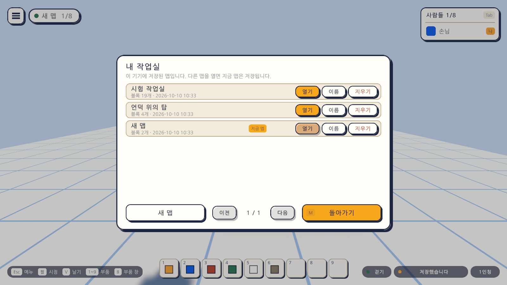
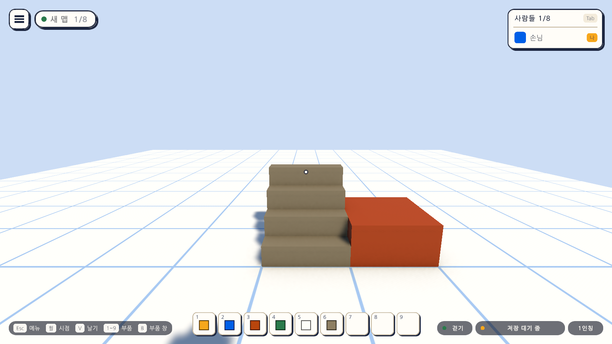
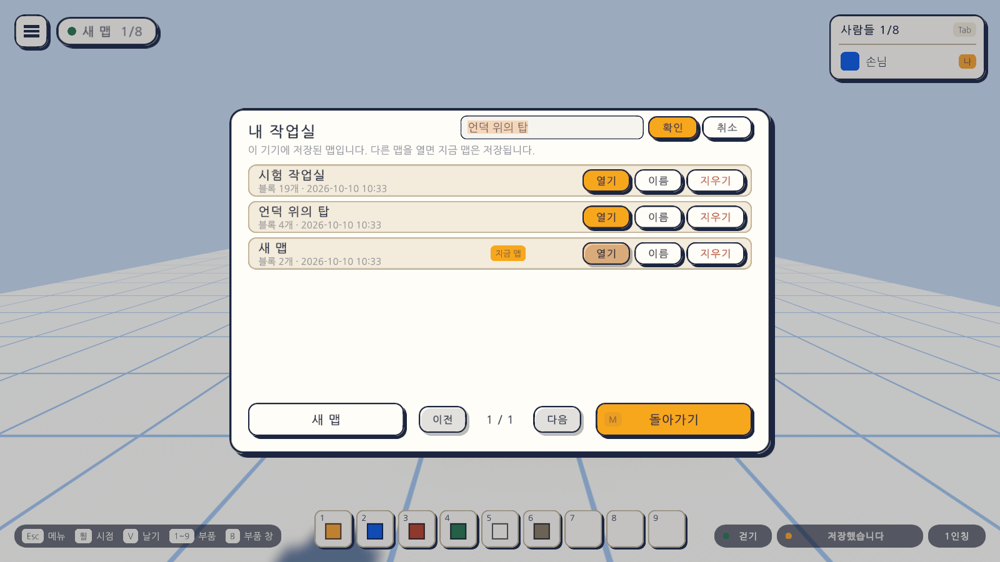
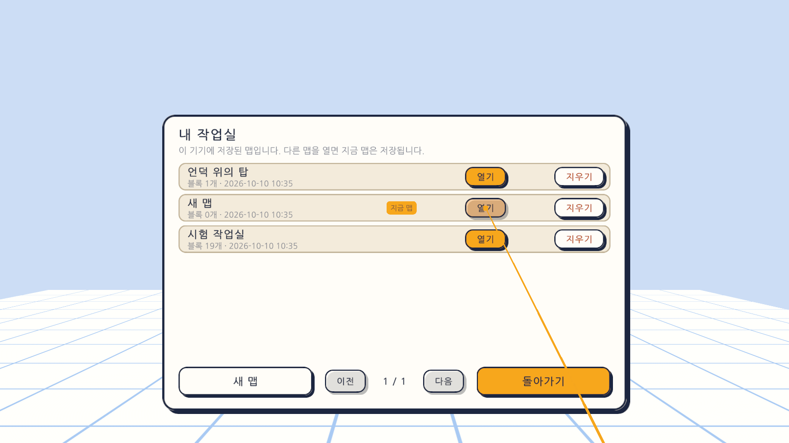

# 17일차 개발 일지 — 여러 맵 다루기

- **날짜**: 2026-10-10
- **단계**: 1-A 혼자 만들기
- **목표**: 이 기기에 맵을 여러 개 두고 골라 열 수 있게 한다. 새 맵, 맵 목록, 이름 바꾸기, 확인을 거친 지우기
- **검사 기준**: 새 맵이 빈 바닥으로 시작한다. 맵을 오가도 각자의 블록이 남는다. 이름을 바꾸고 지울 수 있다. 다시 켜면 마지막으로 연 맵이 열린다. 지금까지 만든 맵은 그대로 열린다
- **결과**: ✅ 완료(자동 검사 351개 통과, Windows 빌드와 실행 확인 통과, 이 컴퓨터의 실제 저장 폴더가 그대로인 것 확인). VR 쪽은 가상 기기로만 확인

---

## 오늘 한 일 요약

16일차까지는 이 기기에 맵이 하나뿐이었고, 켜면 늘 그 맵이 열렸다. 오늘부터는 맵을 여러 개 만들고 **맵 목록 창("내 작업실")** 에서 골라 연다.

| 하는 일 | 방법 |
|---|---|
| 맵 목록 열기 | `M`, 또는 `Esc` 메뉴의 "내 작업실" 타일(전에는 "준비 중"이었다). VR은 메뉴의 타일 |
| 새 맵 | 창 아래의 "새 맵". 빈 바닥으로 시작하고 이름은 "새 맵", "새 맵 2" …로 붙는다 |
| 다른 맵 열기 | 줄의 "열기". 지금 맵은 저장되고, 캐릭터는 시작 위치로 간다 |
| 이름 바꾸기 | 줄의 "이름" → 글자 칸에 쓰고 "확인"(또는 Enter). PC에서만 |
| 지우기 | 줄의 "지우기"를 **두 번**. 한 번 누르면 "한 번 더"로 바뀌고 3초 뒤 되돌아간다 |

화면 위쪽의 방 이름 자리에는 지금 열려 있는 맵의 이름이 나온다.

## 정한 것

시작 전에 말씀드린 가안대로 만들었다. 바꾸자고 하시면 바꾼다.

| 정한 것 | 만든 대로 |
|---|---|
| 새 맵의 처음 모습 | 빈 바닥. 처음 장면의 집·계단·나무는 처음부터 있던 맵에만 남는다 |
| 맵 목록의 자리 | `Esc` 메뉴의 "내 작업실" 타일(과 `M` 키). 계정의 맵은 계정을 붙일 때 같은 창에 더한다 |
| 지운 맵 | 없애지 않고 `maps/trash` 폴더로 옮긴다 |
| VR에서의 이름 | 글자판이 없어 자동으로 붙이고, 이름 단추는 감춘다 |

더 정한 작은 것: 목록은 최근에 저장한 맵이 위에 오고, 한 쪽에 여섯 줄이며, 맵은 50개까지, 이름은 24자까지다.

## 작업 내역

### 1. 맵의 파일 (`MapLibrary`)

- 맵 하나가 파일 하나다(`번호표.map.json`). **번호표**는 파일 이름의 앞부분이고 한 번 정하면 바뀌지 않는다. 이름을 바꿔도 번호표는 그대로다.
- 지금까지의 맵은 번호표가 `local`인 맵으로 **그대로 이어받는다**(`local.map.json`). 옮기거나 바꾸는 것이 없다.
- 새 맵의 번호표는 만든 시각으로 짓는다(`map-20261010-103000`).
- 번호표는 영문 소문자, 숫자, 줄표만 받는다. 번호표가 파일 이름이 되므로 폴더를 벗어나는 글자를 막는다.
- 목록을 만들 때 폴더의 맵 파일을 읽어 이름, 블록 수, 저장한 때를 안다. 사본(`.bak`), 임시 파일, 옮겨 둔 파일, 휴지통의 파일은 맵으로 세지 않는다. **읽을 수 없는 파일**은 목록에 보이되 열 수 없다고 표시한다.
- 마지막으로 연 맵은 맵 폴더의 `current.txt`에 적는다. 처음부터 있던 맵뿐일 때는 적지 않는다(그래서 맵을 더 만들기 전에는 폴더에 새 파일이 생기지 않는다).

### 2. 맵 바꾸기 (`MapAutoSave`)

- 다른 맵을 열 때의 순서: 그 맵의 파일을 먼저 읽어 본다 → 지금 맵의 남은 변경을 저장한다 → 블록을 통째로 바꾼다 → 되돌리기 기록을 비운다.
- **읽을 수 없는 맵이나, 지금 맵을 저장하지 못한 때에는 바꾸지 않는다.** 블록이 엉뚱한 맵의 파일에 저장되는 일을 막는다.
- 지금 열려 있는 맵을 지우면 가장 최근에 저장한 다른 맵이 열리고, 남은 맵이 없으면 빈 맵으로 이어 간다. 휴지통의 파일에는 지우기 직전의 상태가 들어간다.
- 처음 장면의 나무와 지붕은 블록이 아니어서 맵 파일에 들어가지 않는다. 처음부터 있던 맵에서만 보이고 다른 맵에서는 감춘다.

### 3. 맵 목록 창 (`MapListView`)

- 줄마다 이름, 블록 수, 저장한 때가 보이고 "지금 맵" 표시가 붙는다. 지금 맵의 "열기"는 누를 수 없다.
- 이름을 고치는 동안에는 **글자를 치는 키가 게임의 키로 듣지 않는다.** `M`을 쳐도 창이 닫히지 않고 `B`를 쳐도 부품 고르는 창이 열리지 않는다. `Esc`는 고치기만 그만둔다.
- 이름은 앞뒤와 이어진 빈칸을 다듬어 넣는다. 빈 이름으로는 바뀌지 않는다.
- 맵이 여섯을 넘으면 "이전"·"다음"으로 쪽을 넘긴다.
- 창이 열려 있는 동안에는 메뉴나 부품 고르는 창처럼 캐릭터 조작이 멈춘다.

### 4. VR

메뉴의 "내 작업실" 타일을 오른손 광선으로 누르면 같은 창이 눈앞의 판에 뜬다. 새 맵, 열기, 지우기를 누를 수 있고 이름 단추는 없다. 그림은 글자를 확인하려고 가까이 당겨 찍은 것이며, 헤드셋에서 보이는 크기가 아니다.

### 5. 그 밖

- 화면 위쪽의 이름 칸은 맵 이름의 길이에 맞게 넓어진다. 아주 긴 이름은 줄여 보인다.
- 입력 자산의 `Game` 묶음에 `Maps`(`M`)를 더했다.
- 메뉴 도움말에 `M 내 작업실`을 더했다. 줄을 맞추려고 놓기와 지우기를 한 줄로 합쳤다.
- `Day17Setup`(메뉴 `Atelier Verse/17일차 셋업 실행`): 게임 화면 프리팹을 다시 조립하고, 씬의 자동 저장에 처음 장면의 꾸밈을 알려 준다.
- 맵 파일의 형식은 2판 그대로다. 폴더에 두는 파일만 늘었다(`docs/MAP-FORMAT.md` 4절).

## 검사

| 항목 | 방법 | 결과 |
|---|---|---|
| 스크립트 컴파일 | 명령줄 실행 로그 | 오류 없음 |
| 17일차 셋업 적용 | 명령줄에서 `ProjectSetupRunner` 실행 | 적용됨 |
| 맵의 파일 다루기 | 편집 모드 테스트 `MapLibraryTests` 15개(새로): 번호표, 이름 다듬기, 목록과 순서, 맵이 아닌 파일 거르기, 읽을 수 없는 파일, 새 맵, 상한, 이름 바꾸기, 휴지통, 마지막으로 연 맵 | 통과 |
| 그 밖의 편집 모드 테스트 | 158개 | 통과 |
| PC에서 여러 맵 다루기 | 플레이 모드 테스트 `MapsPlayTests` 14개(새로) | 통과 |
| VR에서 여러 맵 다루기 | 플레이 모드 테스트 `XrMapsPlayTests` 3개(새로, 가상 기기) | 통과 |
| 그 밖의 플레이 모드 테스트 | 161개(놓기, 저장, 되돌리기, 새 부품, 메뉴, VR 등) | 통과 |
| Windows 빌드와 평소 실행 | `node scripts/build-windows.mjs --run` | 성공, 예외 없음 |
| **이 컴퓨터의 실제 저장 폴더** | 빌드한 실행 파일을 켜기 전과 뒤의 폴더를 견줌 | 그대로. 파일은 전과 같은 둘(`local.map.json`, `.v1.bak`)이고 맵은 블록 22개 그대로 열림 |
| `-vr` 실행(VR 프로그램 없는 PC) | `node scripts/build-windows.mjs --skip-build --run --vr` | 키보드·마우스로 돌아옴, 예외 없음 |
| 화면 모양 | 테스트가 찍은 그림 35장을 눈으로 확인 | 위 그림. 전의 그림들도 같음 |
| **글자판으로 한글 이름 치기** | - | **하지 못함.** 테스트는 글자 칸에 글자를 직접 넣는다. 실행 파일에서 한글이 제대로 쳐지는지는 직접 해 봐야 안다 |
| **헤드셋에서의 창** | - | **하지 못함.** 이 컴퓨터에 VR 프로그램이 없다 |
| **사람이 직접 해 보기** | - | **하지 못함.** 창을 마우스로 눌러 보는 것 |

편집 모드 테스트는 모두 173개, 플레이 모드 테스트는 178개다. 플레이 모드 178개는 그림 찍기 16개를 포함한 수이고, `-captureDir` 없이 돌리면 그 16개는 건너뛴다. 테스트와 빌드는 마지막 코드 상태에서 돌렸다.

새로 넣은 플레이 모드 테스트가 확인하는 것은 다음과 같다.

| 묶음 | 확인하는 것 |
|---|---|
| 창 | `M`으로 열고 닫히며 조작이 막힘. `Esc`는 창만 닫음. 메뉴의 "내 작업실" 타일과 메뉴에서의 `M`으로 넘어옴. 처음에는 맵 하나가 "지금 맵"으로 보이고 열기는 누를 수 없음 |
| 새 맵 | 빈 맵으로 시작, 되돌리기 기록 비움, 나무와 지붕 감춤, 캐릭터가 시작 위치로, 화면의 이름과 블록 수가 바뀜. **저장되기 전의 변경도 앞 맵의 파일에 들어감** |
| 오가기 | 맵을 오가도 각자의 블록이 자리와 방향까지 남고, 다른 맵의 블록이 따라오지 않음 |
| 이름 | 지금 맵과 열려 있지 않은 맵의 이름 바꾸기. 번호표는 그대로. 고치는 동안 `M`·`B`가 게임에 듣지 않고 `Esc`는 고치기만 그만둠. 빈 이름은 받지 않음. 이름 칸의 너비 |
| 지우기 | 두 번 눌러야 지워짐. 한 번만 누르면 3초 뒤 되돌아감. 파일이 휴지통 폴더에 남고 그대로 읽힘. 지금 맵을 지우면 다른 맵이 열림. 마지막 맵을 지우면 빈 맵으로 이어짐 |
| 그 밖 | 다시 켜면 마지막으로 연 맵이 열림. 맵 여덟을 두 쪽으로 넘겨 봄(같은 맵이 두 번 보이지 않음). 읽을 수 없는 맵은 열 수 없고 파일을 건드리지 않음 |
| VR | 메뉴의 타일을 가리켜 눌러 창이 열림(부품 판은 숨고 이름 단추는 없음). 새 맵 단추를 눌러 만듦(블록이 놓이지 않음). 줄의 열기로 맵을 바꿈. 왼손 메뉴 단추로 닫음 |

### 검사에서 찾은 문제와 수정

- **이름을 고치는 글자 칸이 그 아래의 안내 문장에 조금 겹쳤다.** 칸의 높이와 자리를 줄였다.
- **화면 위쪽의 이름 칸이 처음 이름("시험 작업실")의 너비로 고정되어 있었다.** 맵의 이름이 제각각이 되었으므로, 이름에 맞춰 넓어지고 아주 긴 이름은 줄여 보이게 했다.

## 직접 확인하는 방법

1. `unity/Builds/Windows/AtelierVerse.exe`를 켠다(또는 에디터에서 Sandbox 씬을 재생한다). 전에 만든 맵이 그대로 보이는지 본다.
2. `M`을 누른다. "새 맵"을 누른다. 나무와 집이 없는 빈 바닥에 서는지 본다. 블록을 몇 개 놓는다.
3. `M`을 눌러 처음의 맵("시험 작업실")의 "열기"를 누른다. 전의 맵이 그대로인지 본다. 다시 새 맵을 열어 놓은 블록이 남았는지 본다.
4. 줄의 "이름"을 눌러 **한글로 이름을 쳐 본다.** Enter나 "확인"을 누른다. 화면 위쪽의 이름이 바뀌는지 본다.
5. 맵을 하나 더 만들고 "지우기"를 두 번 눌러 지운다.
6. 껐다 켜서 마지막에 열어 둔 맵이 열리는지 본다.

맵 파일은 `%USERPROFILE%\AppData\LocalLow\Palettra Games\Atelier Verse\maps\`에 있고, 지운 맵은 그 안의 `trash` 폴더에 있다.

## 알아 둘 점

- **글자판으로 한글 이름을 치는 것은 확인하지 못했다.** 글자가 깨지거나 받침이 풀려 들어가면 알려 주시면 고친다.
- **지운 맵을 되살리는 화면은 없다.** `trash` 폴더의 파일을 `maps` 폴더로 옮기면 목록에 다시 나온다. 휴지통은 저절로 비워지지 않는다.
- **처음 장면의 나무와 지붕은 처음부터 있던 맵(`local`)에서만 보이고 지울 수 없다.** 그 맵을 지웠다가 되살릴 때는 파일 이름을 `local.map.json`으로 되돌려야 나무와 지붕이 다시 보인다.
- **맵의 사본 만들기는 없다.**
- 맵을 바꾸면 되돌리기 기록이 비워진다. 앞 맵에서 한 일은 다른 맵에 다녀온 뒤에는 되돌릴 수 없다.
- 맵의 크기는 모두 같다(가로세로 16, 높이 12). 캐릭터의 시작 위치도 모든 맵이 같다. 맵마다 정하는 것은 다음 일차에 한다.
- 부품 칸의 배치는 맵마다가 아니라 이 기기에 하나다.
- 이름이 같은 맵이 둘 있을 수 있다(이름을 바꿀 때는 겹치는지 보지 않는다).
- 맵은 이 기기에만 저장된다. 계정에 저장하는 것은 1-C 단계다.

## 다음 일차

`docs/BACKLOG.md` 2절의 순서대로 **시작 위치 정하기와 맵 정보**를 한다. 맵마다 캐릭터가 처음 서는 자리와 방향을 정하고, 맵의 설명과 대표 그림을 넣어 맵 목록에 보인다. 맵 파일에 항목이 늘어나므로 형식의 판을 올리게 된다. 사용자가 헤드셋으로 켜 본 결과나 직접 써 본 느낌이 있으면 그것부터 고친다.
