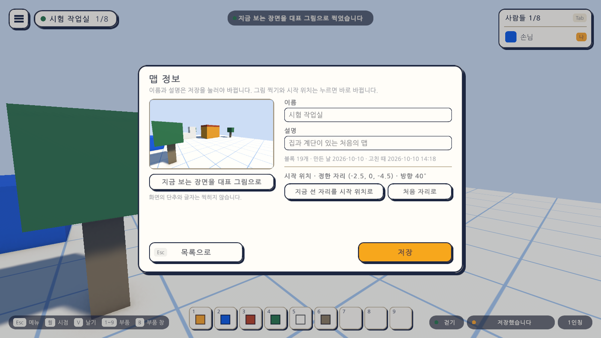
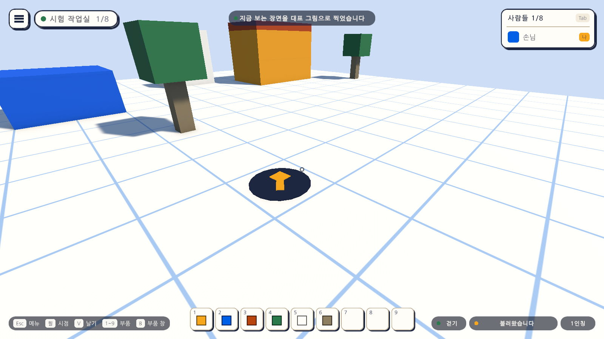
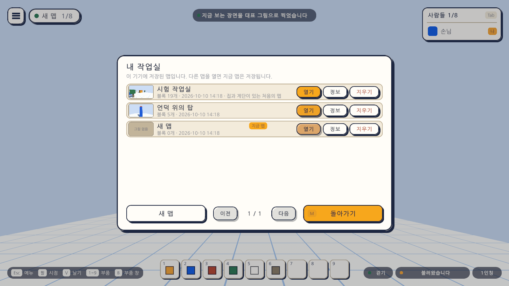
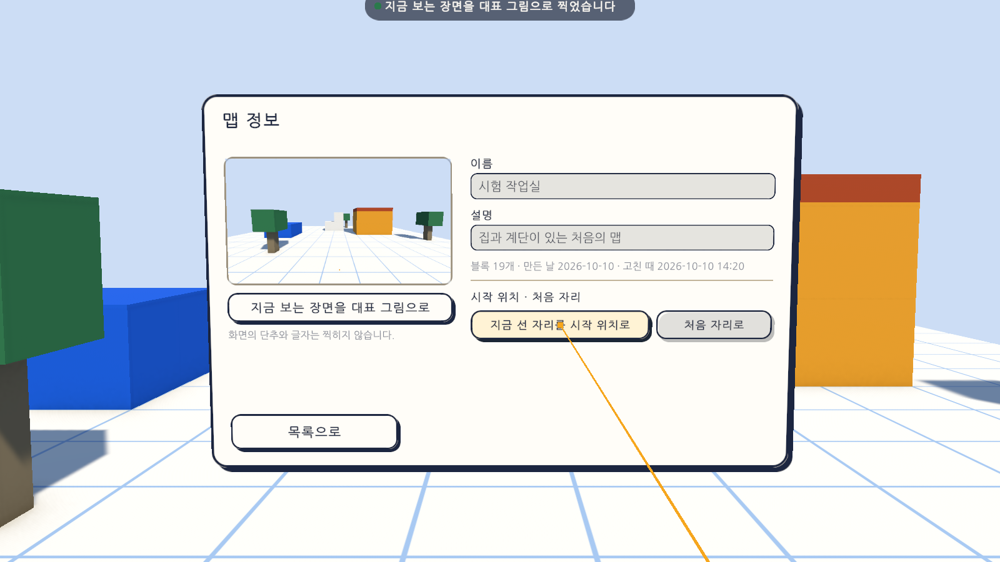

# 18일차 개발 일지 — 시작 위치 정하기와 맵 정보

- **날짜**: 2026-10-10
- **단계**: 1-A 혼자 만들기
- **목표**: 맵마다 캐릭터가 처음 서는 자리를 정하고, 맵을 알아볼 수 있게 설명과 대표 그림을 붙인다
- **검사 기준**: 정한 자리와 방향으로 시작하고 "시작 위치로"도 그 자리로 간다. 맵마다 시작 위치가 따로다. 설명과 대표 그림이 맵 목록에 보인다. 지금까지 만든 맵은 그대로 열린다
- **결과**: ✅ 완료(자동 검사 375개 통과, Windows 빌드와 실행 확인 통과, 이 컴퓨터의 실제 저장 파일이 새 판으로 올라간 것 확인). VR 쪽은 가상 기기로만 확인

---

## 오늘 한 일 요약

17일차까지는 어느 맵을 열어도 같은 자리에서 시작했고, 맵 목록에는 이름과 블록 수만 보였다. 오늘은 맵 목록의 줄에 있는 **"정보"** 단추로 여는 **맵 정보 창**을 만들고, 거기서 이름·설명·대표 그림·시작 위치를 다루게 했다.



| 하는 일 | 방법 |
|---|---|
| 맵 정보 창 열기 | 맵 목록(`M`)에서 줄의 "정보". 17일차의 "이름" 단추가 "정보"로 바뀌었다 |
| 이름과 설명 고치기 | 글자 칸에 쓰고 "저장"(또는 Enter). PC에서만 |
| 대표 그림 찍기 | "지금 보는 장면을 대표 그림으로". 창을 열기 전에 보고 있던 장면이 찍힌다 |
| 시작 위치 정하기 | "지금 선 자리를 시작 위치로". 선 자리와 바라보는 쪽이 저장된다 |
| 시작 위치 되돌리기 | "처음 자리로" |

대표 그림 찍기와 시작 위치 정하기는 **지금 열려 있는 맵**에서만 된다. 그 맵 안에 서 있어야 할 수 있는 일이기 때문이다. 열려 있지 않은 맵은 이름과 설명만 고친다.

## 정한 것

시작 전에 말씀드린 가안대로 만들었다. 바꾸자고 하시면 바꾼다.

| 정한 것 | 만든 대로 |
|---|---|
| 시작 위치를 정하는 방법 | 지금 선 자리와 바라보는 쪽을 단추 하나로 |
| 대표 그림 | 직접 찍을 때만 바뀜. 한 번도 안 찍은 맵은 "그림 없음" |
| 맵 정보 창을 여는 곳 | 맵 목록의 줄에 있는 "정보". 이름 바꾸기도 이 창으로 옮김 |
| 설명 | 80자까지, 한 줄 |
| VR | 시작 위치 정하기와 그림 찍기만. 글자 칸은 잠기고 저장 단추는 없음 |

만들면서 더 정한 것:

- **공중에서 정하면 아래의 바닥이나 블록 위가 시작 위치가 된다.** 날다가 정해도 공중에서 떨어지며 시작하지 않는다.
- **맵의 범위(가로세로 16) 밖에서는 정할 수 없다.**
- **이름과 설명은 "저장"을 눌러야 바뀐다.** 저장하지 않고 목록으로 돌아가면 쓴 글자는 버린다. 그림 찍기와 시작 위치는 누르면 바로 바뀐다.

## 작업 내역

### 1. 시작 위치 (`PlayerSpawn`, `CharacterMotor`, `SpawnMarker`)



- 맵이 열리면 그 맵의 시작 위치를 캐릭터에 알리고 그 자리로 보낸다. 정한 것이 없는 맵은 전처럼 씬의 처음 자리에서 시작한다.
- 메뉴의 "시작 위치로"(`R`), 바닥 밖으로 떨어졌을 때, 다른 맵을 열었을 때 모두 같은 자리로 간다.
- 바닥의 **표식**(둥근 판 위의 화살표)이 시작 위치와 바라보는 쪽을 보여 준다. 충돌체가 없어 걷기와 블록 놓기를 막지 않는다.
- **시작 위치가 블록에 막혀 있으면 그 위의 빈 자리에 선다.** 시작 위치에 블록을 쌓아도 블록 속에서 시작하지 않는다. 전에는 처음 자리에 블록을 놓으면 그 속에 갇혔다.

### 2. 맵 정보 창 (`MapInfoView`)

- 왼쪽에 대표 그림과 그림 찍기, 오른쪽에 이름·설명의 글자 칸, 블록 수와 만든 날·고친 때, 시작 위치와 그것을 정하는 단추가 있다.
- 글자를 쓰는 동안에는 **글자를 치는 키가 게임의 키로 듣지 않는다**(17일차와 같음). `Esc`는 쓰기만 그만두고, 한 번 더 누르면 목록으로 돌아간다. `M`은 창을 모두 닫는다.
- 이름과 설명은 앞뒤와 이어진 빈칸을 다듬어 넣는다. 빈 이름으로는 저장되지 않는다.

### 3. 대표 그림 (`SceneSnapshot`)

- 캐릭터의 카메라가 보는 장면을 480×270의 PNG로 찍는다. **화면의 단추와 글자, VR의 판, 시작 위치 표식은 찍히지 않는다.**
- 그림은 맵 파일 안이 아니라 옆에 둔다(`번호표.png`). 맵 파일이 커지지 않고, 그림이 없어도 맵은 열린다.
- 맵을 지우면 그림도 휴지통 폴더의 맵 파일 옆으로 함께 옮긴다.



맵 목록의 줄에는 작은 대표 그림이 붙고, 설명이 있으면 블록 수와 저장한 때 뒤에 이어 보인다.

### 4. 맵 파일 3판 (`MapDocument`, `docs/MAP-FORMAT.md`)

```json
"description": "집과 계단이 있는 처음의 맵",
"spawn": { "custom": true, "position": { "x": -2.5, "y": 0.0, "z": -4.5 }, "yaw": 40.0 }
```

- 맵의 설명(`description`)과 시작 위치(`spawn`)가 더해졌다. 블록을 적는 방법은 2판과 같다.
- **2판의 파일은 읽을 때 3판으로 올린다.** 설명은 빈 글자, 시작 위치는 "정하지 않음"이 된다. 원래 파일은 `local.map.json.v2.bak`처럼 옆에 남긴다(14일차에 1판을 2판으로 올린 것과 같은 방식).
- 시작 위치의 값이 바르지 않으면(숫자가 아닌 값) 정하지 않은 것으로 읽는다.

### 5. VR



맵 목록의 "정보"를 오른손 광선으로 누르면 같은 창이 눈앞의 판에 뜬다. 이름과 설명의 칸은 잠겨 있고 저장 단추는 없다. 시작 위치 정하기와 그림 찍기는 가리켜 누른다. 그림은 글자를 확인하려고 가까이 당겨 찍은 것이며, 헤드셋에서 보이는 크기가 아니다.

### 6. 그 밖

- `Day18Setup`(메뉴 `Atelier Verse/18일차 셋업 실행`): 캐릭터 프리팹에 `PlayerSpawn`을 붙이고, 씬에 시작 위치 표식을 놓고, 게임 화면 프리팹을 다시 조립한다.
- 맵 목록 창에서 이름을 고치던 글자 칸은 없앴다(맵 정보 창으로 옮김).

## 검사

| 항목 | 방법 | 결과 |
|---|---|---|
| 스크립트 컴파일 | 명령줄 실행 로그 | 오류 없음 |
| 18일차 셋업 적용 | 명령줄에서 `ProjectSetupRunner` 실행 | 적용됨 |
| 맵 파일 3판 | 편집 모드 테스트 `MapDocumentTests`에 4개 더함(2판 올려 읽기, 설명과 시작 위치의 저장, 값 다듬기) | 통과 |
| 맵 정보와 대표 그림 파일 | 편집 모드 테스트 `MapLibraryTests`에 6개 더함 | 통과 |
| 그 밖의 편집 모드 테스트 | 173개 | 통과 |
| PC에서 맵 정보와 시작 위치 | 플레이 모드 테스트 `MapInfoPlayTests` 14개(새로) | 통과 |
| VR에서 맵 정보 창 | 플레이 모드 테스트 `XrMapInfoPlayTests` 2개(새로, 가상 기기) | 통과 |
| 그 밖의 플레이 모드 테스트 | 176개(17일차의 이름 바꾸기 테스트 둘은 맵 정보 창의 테스트로 옮김) | 통과 |
| Windows 빌드와 평소 실행 | `node scripts/build-windows.mjs --run` | 성공, 예외 없음 |
| **이 컴퓨터의 실제 저장 파일** | 빌드한 실행 파일을 켜기 전과 뒤의 폴더를 견줌 | 2판의 맵(블록 22개)이 3판으로 올라가고 블록 22개 그대로. 원래 파일은 `local.map.json.v2.bak`으로 남음 |
| `-vr` 실행(VR 프로그램 없는 PC) | `node scripts/build-windows.mjs --skip-build --run --vr` | 키보드·마우스로 돌아옴, 예외 없음 |
| 화면 모양 | 테스트가 찍은 그림 38장을 눈으로 확인 | 위 그림. 대표 그림에 화면 요소가 찍히지 않음 |
| **글자판으로 한글 쓰기** | - | **하지 못함.** 테스트는 글자 칸에 글자를 직접 넣는다. 17일차와 같다 |
| **헤드셋에서의 창** | - | **하지 못함.** 이 컴퓨터에 VR 프로그램이 없다 |
| **사람이 직접 해 보기** | - | **하지 못함.** 찍힌 그림이 보기 좋은지, 시작 위치를 정하는 방식이 쓸 만한지 |

편집 모드 테스트는 모두 183개, 플레이 모드 테스트는 192개다. 플레이 모드 192개는 그림 찍기 18개를 포함한 수이고, `-captureDir` 없이 돌리면 그 18개는 건너뛴다. 테스트와 빌드는 마지막 코드 상태에서 돌렸다.

새로 넣은 플레이 모드 테스트가 확인하는 것은 다음과 같다.

| 묶음 | 확인하는 것 |
|---|---|
| 창 | 줄의 "정보"로 열리고 그동안 맵 목록 창은 닫힘. `Esc`로 목록에, `M`으로 모두 닫힘. 글자 칸에 지금 이름과 설명이 들어 있음 |
| 이름과 설명 | 저장하면 파일·목록의 줄·화면 위쪽에 반영. 빈칸 다듬기. 빈 이름은 받지 않음. 저장하지 않고 돌아가면 버려짐. 이름만 바꿀 때 설명이 지워지지 않음. 글자를 쓰는 동안 `M`·`B`가 듣지 않고 `Esc`는 쓰기만 그만둠 |
| 열려 있지 않은 맵 | 이름과 설명만 고칠 수 있고, 그림 찍기와 시작 위치 단추는 누를 수 없음 |
| 대표 그림 | 찍으면 PNG 파일(480×270)이 생기고 한 가지 색이 아님. 창과 목록의 그 줄에만 그림이 보임 |
| 시작 위치 | 정하면 파일에 저장되고 표식이 옮겨짐. "시작 위치로"를 누르면 그 자리에 그 쪽을 보고 섬. 되돌리면 처음 자리. 다시 켜면 정해 둔 자리에서 시작. 맵마다 따로. **블록으로 막혀 있으면 쌓인 블록의 위에 섬.** 맵의 범위 밖에서는 정할 수 없음. 공중에서 정하면 아래의 바닥이나 블록 위 |
| 옛 판 | 2판 파일의 블록이 번호·자리·방향 그대로 읽히고, 사본(`.v2.bak`)의 내용이 원본과 같고, 다시 저장된 파일은 3판 |
| VR | 줄의 "정보"를 가리켜 눌러 창이 열림. 글자 칸이 잠기고 저장 단추가 없음. 시작 위치와 그림 찍기를 가리켜 누름. 왼손 메뉴 단추로 목록에, 한 번 더 누르면 닫힘 |

### 검사에서 찾은 문제와 수정

- **"다시 켜면 정해 둔 자리에서 시작한다"는 테스트가 실패했다.** 테스트가 고른 자리가 씬의 단(파란 블록)에 닿아 있어, 캐릭터가 그 위로 올려 세워졌기 때문이다. "막혀 있으면 위에 선다"가 뜻대로 움직인 것이고, 테스트의 자리를 빈 바닥으로 바꿨다. 게임 코드는 고치지 않았다.
- **맵 정보 창의 구분선이 가운데에 짧게 그려질 뻔했다.** 양쪽을 같은 만큼 들이는 도우미를 쓴 탓이다. 실행하기 전에 알아채고 오른쪽 칸의 너비로 그리게 바꿨다.
- **맵 목록의 "그림 없음" 글자가 그림 위에 겹칠 뻔했다.** 글자를 그림보다 먼저 만들어 그림 아래에 깔리게 했다.

## 직접 확인하는 방법

1. `unity/Builds/Windows/AtelierVerse.exe`를 켠다(또는 에디터에서 Sandbox 씬을 재생한다). 전에 만든 맵이 그대로 보이는지 본다.
2. 맵에서 보기 좋은 쪽을 바라본 채로 `M`을 누르고, 지금 맵의 줄에서 "정보"를 누른다.
3. "지금 보는 장면을 대표 그림으로"를 누른다. 왼쪽에 그림이 나오는지 본다.
4. 설명 칸에 **한글로** 몇 글자 쓰고 "저장"을 누른다.
5. "목록으로"를 눌러 줄에 작은 그림과 설명이 보이는지 본다.
6. 창을 닫고 맵의 다른 곳으로 걸어가, 다시 "정보"에서 "지금 선 자리를 시작 위치로"를 누른다. 바닥에 표식이 옮겨 왔는지 본다.
7. 다른 데로 갔다가 `Esc` → `R`(시작 위치로)을 눌러 정한 자리로 돌아오는지 본다.
8. 껐다 켜서 정한 자리에서 시작하는지 본다.

원래 맵 파일의 사본은 `%USERPROFILE%\AppData\LocalLow\Palettra Games\Atelier Verse\maps\local.map.json.v2.bak`에 남아 있다.

## 알아 둘 점

- **17일차까지의 실행 파일은 3판의 맵을 열지 못한다.** 새 판의 파일이라고 알리고 옆으로 옮겨 둔다. 옛 실행 파일로 돌아가려면 `.v2.bak` 사본을 써야 한다.
- **대표 그림은 창을 열기 전에 보던 장면이다.** 찍을 장면을 먼저 바라본 뒤에 `M`을 눌러야 한다. 창을 연 채로는 시점을 돌릴 수 없다.
- **시작 위치 표식은 늘 보인다.** 만들지 않고 걸어 보기만 할 때 감추는 방법은 아직 없다.
- **시작 위치는 맵에 하나다.** 여러 사람이 들어올 때 겹쳐 서지 않게 하는 것은 함께 있기(1-D)에서 한다.
- 이름만 바꾸려 해도 맵 목록에서 "정보"를 한 번 더 눌러야 한다(17일차보다 한 단계 늘었다).
- 설명은 한 줄이고 80자까지다.
- 맵의 크기는 여전히 모든 맵이 같다.

## 다음 일차

`docs/BACKLOG.md` 2절의 순서대로 **기본 소리**를 한다. 지금은 소리가 전혀 없다. 발소리, 블록을 놓고 지우고 칠할 때의 소리, 단추 소리를 넣고, 소리 크기를 설정에서 바꿀 수 있게 한다. 소리 파일은 내려받지 않고 코드로 만든다. 그다음이 설정 늘리기(창과 전체 화면, 화면 품질)와 끌어서 여러 개 놓기다. 사용자가 헤드셋으로 켜 본 결과나 직접 써 본 느낌이 있으면 그것부터 고친다.
