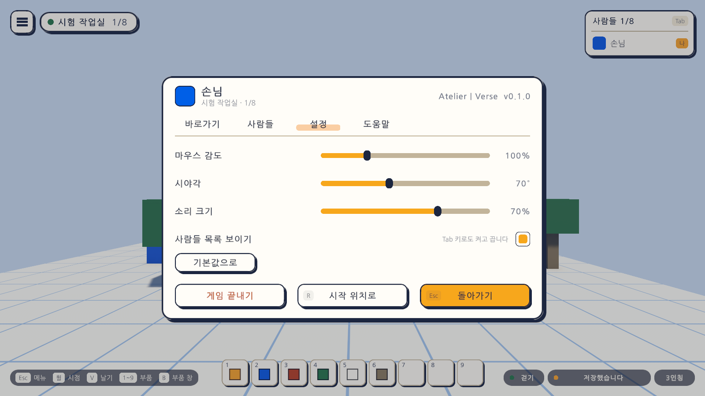
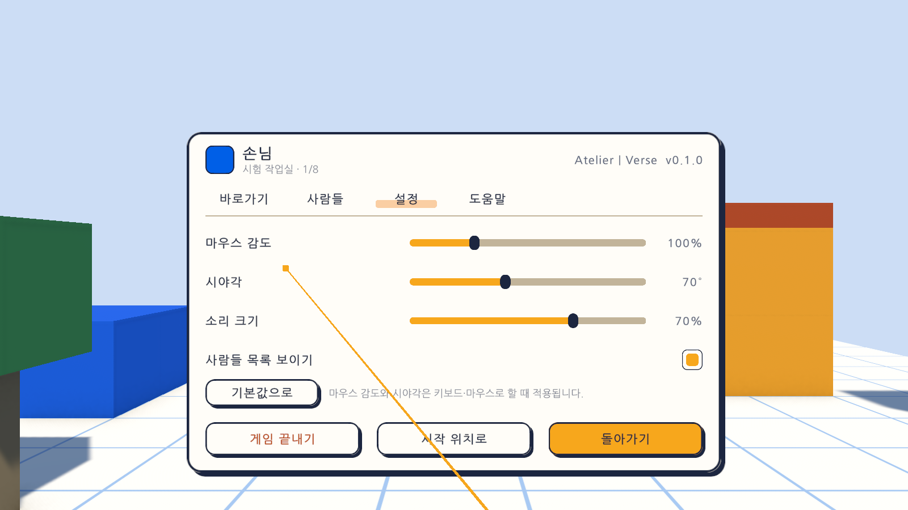

# 19일차 개발 일지 — 기본 소리

- **날짜**: 2026-10-10
- **단계**: 1-A 혼자 만들기
- **목표**: 소리가 전혀 없던 게임에 기본 소리를 넣는다. 걷기, 블록을 놓고 지우고 칠하기, 단추와 창, 알림에 소리가 나고, 소리 크기를 설정에서 바꾼다
- **검사 기준**: 일이 실제로 일어났을 때만 그 소리가 난다(놓지 못했는데 놓는 소리가 나지 않는다). 블록과 발의 소리는 그 자리에서 난다. 소리 크기를 0으로 하면 조용하고, 껐다 켜도 정한 크기가 남는다
- **결과**: ✅ 완료(자동 검사 487개 통과, Windows 빌드와 실행 확인 통과). **소리를 귀로 들어 보지는 못했다.** 어느 때에 어느 소리가 올라오는지와 소리의 길이·크기는 검사했지만, 듣기 좋은지는 사용자가 들어 보아야 안다

---

## 오늘 한 일 요약

18일차까지는 소리가 하나도 없었다. 오늘은 소리 22가지를 넣고, 설정에 **소리 크기**를 더했다.

소리 파일은 내려받지 않았다. 소리는 게임을 켤 때 **코드로 만든다**(짧은 음과 걸러 낸 잡음을 섞어서). 그래서 저장소에 들어간 소리 파일은 아래의 미리 듣기 파일 하나뿐이고, 그것도 게임이 쓰는 파일이 아니라 들어 보기 위한 것이다.

### 먼저 들어 보기

[`sounds-preview.wav`](sounds-preview.wav)(13초)에 22가지 소리가 0.6초마다 하나씩 차례로 들어 있다. 게임을 켜지 않고 이 파일을 열면 된다.

| 차례 | 시각 | 소리 | 나는 때 | 나는 곳 |
|---|---|---|---|---|
| 1 | 0.0초 | 발소리 | 땅 위를 걸을 때 한 걸음마다 | 발밑 |
| 2 | 0.6초 | 뛰기 | 뛰어오를 때 | 발밑 |
| 3 | 1.2초 | 내려앉기 | 어느 높이 이상에서 떨어져 땅에 닿을 때 | 발밑 |
| 4 | 1.8초 | 날기 켜기 | `V`로 날기를 켤 때 | 화면 |
| 5 | 2.4초 | 날기 끄기 | 날기를 끌 때 | 화면 |
| 6 | 3.0초 | 놓기 | 블록을 놓았을 때 | 그 블록 |
| 7 | 3.6초 | 지우기 | 블록을 지웠을 때 | 그 블록 |
| 8 | 4.2초 | 칠하기 | 블록의 색을 바꿨을 때 | 그 블록 |
| 9 | 4.8초 | 옮기기 | 잡은 블록을 다른 자리에 내려놓았을 때 | 그 블록 |
| 10 | 5.4초 | 돌리기 | 놓을 블록을 한 칸(15도) 돌릴 때 | 화면 |
| 11 | 6.0초 | 잡기 | 놓인 블록을 잡았을 때 | 화면 |
| 12 | 6.6초 | 놓아주기 | 잡은 블록을 제자리에 두거나 잡기를 그만둘 때 | 화면 |
| 13 | 7.2초 | 맞추기 | 맞추기 도우미의 단계를 바꿀 때 | 화면 |
| 14 | 7.8초 | 되돌리기 | 되돌렸을 때(높은 음에서 낮은 음으로) | 화면 |
| 15 | 8.4초 | 다시 실행 | 다시 실행했을 때(낮은 음에서 높은 음으로) | 화면 |
| 16 | 9.0초 | 단추 | 단추나 켜고 끄는 칸을 눌렀을 때 | 화면 |
| 17 | 9.6초 | 고르기 | 부품 칸에서 다른 부품을 골랐을 때 | 화면 |
| 18 | 10.2초 | 창 열기 | 메뉴·부품 창·맵 목록 같은 창이 열릴 때 | 화면 |
| 19 | 10.8초 | 창 닫기 | 창이 닫힐 때 | 화면 |
| 20 | 11.4초 | 경고 | 경고 알림이 뜰 때(놓을 수 없는 자리 등) | 화면 |
| 21 | 12.0초 | 오류 | 오류 알림이 뜰 때(맵을 지우지 못했을 때 등) | 화면 |
| 22 | 12.6초 | 찰칵 | 맵의 대표 그림을 찍었을 때 | 화면 |

"나는 곳"이 발밑이나 블록인 소리는 **그 자리에서 난다**. 멀리 놓은 블록의 소리는 작게, 옆에 놓은 블록의 소리는 옆에서 들린다. "화면"인 소리는 어디에 있든 같게 들린다.

## 정한 것

시작 전에 말씀드린 가안대로 만들었다. 바꾸자고 하시면 바꾼다.

| 정한 것 | 만든 대로 |
|---|---|
| 소리의 느낌 | 짧고 부드럽게. 가장 긴 소리가 0.22초다. 블록을 놓는 소리는 나무를 두드리는 듯한 "톡" |
| 소리 크기 | 설정의 미끄럼 막대 하나. 처음 값은 70%, 0%면 "끔" |
| 배경 음악과 주변 소리 | 넣지 않음 |
| 부품마다 다른 소리 | 넣지 않음. 어떤 모양과 색이든 같은 소리 |
| VR의 손 진동 | 넣지 않음. 소리만 |
| 소리 파일 | 내려받지 않고 코드로 만듦 |

만들면서 더 정한 것:

- **화면의 소리는 한 번에 하나만 난다.** 단추를 눌렀더니 창이 닫히고 부품이 골라지는 것처럼 여러 일이 한꺼번에 일어나면, 가장 뜻이 큰 소리 하나만 남긴다. 차례는 오류 → 경고 → 찰칵 → 고르기 → 창 열기·닫기 → 되돌리기·다시 실행 → 맞추기 → 잡기·놓아주기 → 돌리기 → 날기 → 단추다. 그래서 되돌리기 단추를 누르면 단추 소리가 아니라 되돌리는 소리만 난다.
- **보통 알림에는 소리를 내지 않는다.** "저장했습니다" 같은 알림은 조용하고, 경고와 오류만 소리가 난다.
- **맵을 불러올 때는 블록 소리가 나지 않는다.** 블록이 수십 개 놓이는 소리가 한꺼번에 나지 않게 했다.
- **발소리는 실제로 움직인 거리로 센다.** 벽에 막혀 제자리걸음을 하면 나지 않는다. 걸을 때는 1.6, 달릴 때는 2.1(블록 한 변이 1)마다 한 번이다. 날 때는 나지 않는다.
- **자주 되풀이되는 소리는 낼 때마다 높낮이를 조금 달리한다.** 발소리와 놓기·지우기·칠하기·옮기기·내려앉기가 그렇다. 같은 소리가 기계처럼 되풀이되는 느낌을 줄이려는 것이다.
- **소리 크기의 막대를 움직이면 그 크기로 "고르기" 소리가 난다.** 얼마나 큰지 바로 들어 보라는 뜻이다.

## 작업 내역

### 1. 소리 만들기 (`SfxSynth`)

- 소리마다 만드는 법이 한 줄씩 있다. 음 하나가 올라가거나 내려가는 것(뛰기, 잡기, 창 열기), 두 음을 잇는 것(되돌리기, 맞추기, 경고), 걸러 낸 잡음(날기, 칠하기, 찰칵), 음과 잡음을 섞은 것(발소리, 놓기)이 있다.
- **만들 때마다 똑같이 만들어진다.** 잡음도 정해진 씨앗으로 만든다. 그래서 테스트로 길이와 크기를 확인할 수 있다.
- 모든 소리는 처음과 끝이 0이다. 처음이나 끝이 0이 아니면 "딱" 하는 잡음이 난다.
- 가장 큰 값을 0.26~0.6으로 낮춰 두었다. 여러 소리가 겹쳐도 찢어지지 않게 하려는 것이다.

### 2. 소리 내기 (`Sfx`, `SfxPlayer`)

- `Sfx.Play(소리)`는 화면의 소리, `Sfx.PlayAt(소리, 자리)`는 자리가 있는 소리를 부탁한다. 부탁을 받는 쪽이 없어도 탈이 없다(테스트나 소리 없는 화면).
- `SfxPlayer`가 게임 화면에 붙어 부탁을 듣고 실제로 낸다. 시작할 때 22가지 소리를 만들어 두고, 소리를 내는 부품 10개를 돌려 가며 쓴다. 10개가 모두 소리를 내고 있으면 가장 오래된 것이 끊긴다.
- 자리가 있는 소리는 2.5 안에서는 그대로 들리고 28에서 들리지 않게 된다(블록 한 변이 1).
- 소리 크기 설정은 게임 전체의 소리 크기(`AudioListener.volume`)로 넣는다.

### 3. 어느 때 어느 소리를 낼지 (`GameSounds`)

- **소리를 고르는 일은 이 한곳에서만 한다.** 블록을 놓는 코드, 캐릭터의 몸, 화면의 코드는 "무슨 일이 일어났다"만 알리고 소리는 알지 못한다. 나중에 소리를 바꾸거나 VR의 손 진동을 더할 때 이곳만 고치면 된다.
- 이를 위해 알리는 자리를 더했다.
  - `EditHistory.Edited`: 놓기·지우기·칠하기·옮기기·되돌리기·다시 실행이 **실제로 이루어졌을 때** 무엇을 했는지와 어느 블록인지 알린다. 이루어지지 않은 것(막힌 자리, 이미 같은 색)은 알리지 않는다.
  - `BlockBuilder.Happened`: 돌리기, 잡기, 놓아주기, 맞추기 단계 바꾸기.
  - `CharacterMotor.Stepped`·`Jumped`·`Landed`: 한 걸음, 뛰어오름, 내려앉음.
- 화면의 모든 단추와 켜고 끄는 칸에 누르는 소리를 단다. 부품 칸의 칸은 빼는데, 칸을 누르면 고르는 소리가 따로 나기 때문이다.
- 창이 열리고 닫히는 것은 "창이 하나라도 열려 있는가"가 바뀔 때로 안다. 메뉴에서 맵 목록으로 넘어가는 것처럼 창에서 창으로 바뀔 때는 열기·닫기 소리가 나지 않고 단추 소리만 난다.

### 4. 소리 크기 설정 (`GameSettings.SoundVolume`, `SettingsPanel`)

- 설정 탭에 "소리 크기" 막대가 생겼다(마우스 감도, 시야각 다음). 0%에서 100%까지이고, 0%면 값 대신 "끔"이라고 보인다.
- 값은 이 기기에 저장되고 "기본값으로"를 누르면 70%로 돌아간다.

### 5. 소리 미리 듣기 파일 (`SoundPreview`)

- 22가지 소리를 순서대로 이어 붙여 WAV 파일 하나로 내보내는 에디터 도구다(메뉴 `Atelier Verse/소리 미리 듣기 파일 만들기`). 이 일지의 `sounds-preview.wav`가 그 결과다.
- 넣은 까닭: 이번 작업을 한 쪽(Claude)은 소리를 들을 수 없다. 사용자가 게임을 켜서 22가지 상황을 하나씩 만들지 않고도 소리를 한 번에 들어 볼 수 있게 했다. 소리를 고친 뒤에는 이 도구로 파일을 다시 만든다.

### 6. VR

- VR에서도 같은 소리가 같은 때에 난다. 오른손으로 놓은 블록의 소리는 그 블록의 자리에서 난다. 부품 판의 단추와 칸도 같다(되돌리기 단추는 되돌리는 소리, 칸은 고르는 소리).
- 설정의 소리 크기 막대는 VR에서도 광선으로 끌어 바꾼다. 마우스 감도와 시야각이 키보드·마우스에만 적용된다는 안내는 "기본값으로" 단추 옆으로 옮겼다.
- 손 진동은 넣지 않았다.

### 7. 그 밖

- `Day19Setup`(메뉴 `Atelier Verse/19일차 셋업 실행`): 캐릭터 프리팹에 소리를 듣는 부품이 하나뿐인지 확인하고, 게임 화면 프리팹을 다시 조립해 `SfxPlayer`와 `GameSounds`를 붙인다.
- 대표 그림을 찍으면 찰칵 소리가 난다(`GameUi`).

## 검사

| 항목 | 방법 | 결과 |
|---|---|---|
| 스크립트 컴파일 | 명령줄 실행 로그 | 오류 없음 |
| 19일차 셋업 적용 | 명령줄에서 `ProjectSetupRunner` 실행 | 적용됨 |
| 소리 만들기 | 편집 모드 테스트 `SfxSynthTests` 91개(새로. 소리 22가지마다 4가지 검사와 그 밖 3개) | 통과 |
| 편집 기록의 알림 | 편집 모드 테스트 `EditHistoryTests`에 2개 더함 | 통과 |
| 소리 크기 설정 | 편집 모드 테스트 `ViewAndSettingsTests`에 2개 더함 | 통과 |
| 소리 미리 듣기 파일 | 편집 모드 테스트 `SoundPreviewTests` 2개(새로) | 통과 |
| 그 밖의 편집 모드 테스트 | 183개 | 통과 |
| PC에서 어느 때 어느 소리가 올라오는지 | 플레이 모드 테스트 `SoundPlayTests` 14개(새로) | 통과 |
| VR에서 소리 | 플레이 모드 테스트 `XrSoundPlayTests` 1개(새로, 가상 기기) | 통과 |
| 그 밖의 플레이 모드 테스트 | 192개 | 통과 |
| 소리 파일의 꼴 | `sounds-preview.wav`를 읽어 칸마다 길이·가장 큰 값을 셈 | 22칸, 20~220밀리초, 가장 큰 값 0.26~0.60 |
| Windows 빌드와 평소 실행 | `node scripts/build-windows.mjs --run` | 성공, 예외 없음 |
| `-vr` 실행(VR 프로그램 없는 PC) | `node scripts/build-windows.mjs --skip-build --run --vr` | 키보드·마우스로 돌아옴, 예외 없음 |
| 화면 모양 | 테스트가 찍은 그림 38장 가운데 설정 화면(PC, VR)을 눈으로 확인 | 위 그림 |
| **소리를 귀로 듣기** | - | **하지 못함.** 스피커에서 실제로 소리가 나는지, 듣기 좋은지, 크기가 서로 어울리는지 |
| **헤드셋에서의 소리** | - | **하지 못함.** 이 컴퓨터에 VR 프로그램이 없다. 소리가 나는 방향이 맞게 들리는지 |
| **사람이 직접 해 보기** | - | **하지 못함** |

편집 모드 테스트는 모두 280개, 플레이 모드 테스트는 207개다. 플레이 모드 207개는 그림 찍기 18개를 포함한 수이고, `-captureDir` 없이 돌리면 그 18개는 건너뛴다. 편집 모드 테스트와 빌드는 마지막 코드 상태에서 돌렸다. 플레이 모드 테스트를 돌린 뒤에 더한 것은 에디터 도구(`SoundPreview`)와 그 편집 모드 테스트뿐이고, 게임이 실행될 때 쓰는 코드는 그 뒤로 바뀌지 않았다.

**자동 검사가 확인한 것과 확인하지 못한 것을 나눠 적는다.** 플레이 모드 테스트는 "소리를 내 달라는 부탁"이 올라왔는지를 본다. 스피커에서 나온 소리를 듣는 것이 아니다. 소리 부품이 그 부탁을 받아 재생을 시작한 횟수까지는 확인하지만, 그 뒤는 Unity와 이 컴퓨터의 소리 장치의 몫이다.

새로 넣은 테스트가 확인하는 것은 다음과 같다.

| 묶음 | 확인하는 것 |
|---|---|
| 소리 만들기 | 소리마다 0.015~0.3초이고 처음과 끝이 0, 끝이 갑자기 끊기지 않음. 가장 큰 값이 0.2~0.7이고 비어 있지 않음. 만들 때마다 같음. 22가지가 서로 다름. 재생할 수 있는 클립이 됨 |
| 게임 화면 | 소리를 내는 부품과 소리마다의 클립이 있고, 소리를 듣는 부품이 씬에 하나뿐임 |
| 블록 | 놓고 칠하고 지우면 그 블록의 자리에서 소리가 남. 되돌리기와 다시 실행은 자리 없이 남. 돌리기·맞추기·잡기·놓아주기·옮기기에 저마다의 소리가 남 |
| 일어나지 않은 일 | 놓을 수 없으면 경고 소리만 나고 놓는 소리는 나지 않음. 맵을 불러올 때는 블록 소리가 나지 않음 |
| 발소리 | 걸으면 나고, 서 있거나 날 때는 나지 않음. 벽에 막혀 제자리걸음을 하면 나지 않음. 뛰면 뛰는 소리, 내려앉으면 내려앉는 소리 |
| 화면 | 부품 고르기, 창 열기·닫기, 단추, 날기 켜고 끄기. 여러 일이 한꺼번에 일어나도 화면의 소리는 하나만 남. 경고와 오류 알림에만 소리가 나고 오류가 경고보다 먼저임 |
| 설정 | 막대를 움직이면 게임 전체의 소리 크기에 바로 적용되고 저장됨. 0이면 "끔". 기본값으로 돌아감 |
| VR | 방아쇠로 놓은 블록의 자리에서 소리가 남. 부품 판의 되돌리기 단추는 되돌리는 소리 하나만, 칸은 고르는 소리 하나만 남 |
| 미리 듣기 파일 | WAV 파일의 머리가 바르고(압축 없음, 한 줄기, 16비트), 소리가 순서대로 제 칸에 있고 칸의 나머지는 조용함 |

### 검사에서 찾은 문제와 수정

이번에는 테스트에서 실패가 나오지 않았다. 다만 위에 적은 대로 가장 중요한 확인(귀로 듣기)을 하지 못했으므로, 문제가 없다는 뜻이 아니라 **자동으로 볼 수 있는 범위에서는 없었다**는 뜻이다.

## 직접 확인하는 방법

1. 먼저 이 폴더의 `sounds-preview.wav`를 열어 22가지 소리를 차례로 듣는다. 거슬리는 소리, 너무 크거나 작은 소리, 서로 헷갈리는 소리가 있으면 위 표의 차례 번호로 알려 주면 된다.
2. `unity/Builds/Windows/AtelierVerse.exe`를 켠다(또는 에디터에서 Sandbox 씬을 재생한다).
3. 걸어 본다. 발소리가 걸음에 맞게 나는지, 달리면(`Shift`) 빨라지는지, 날면(`V`) 나지 않는지 본다.
4. 블록을 가까이와 멀리에 놓아 본다. 멀리 놓은 블록의 소리가 작게 들리는지, 옆에 놓으면 옆에서 들리는지 본다.
5. 블록을 지우고, 칠하고, 잡아서 옮기고(`G`), 돌려 본다(`R`·`T`). 되돌리기와 다시 실행도 해 본다.
6. 놓을 수 없는 자리(다른 블록과 겹치는 자리)에 놓아 본다. 놓는 소리 대신 경고 소리가 나는지 본다.
7. `Esc` → 설정에서 "소리 크기"를 움직여 본다. 움직일 때마다 그 크기로 소리가 나는지, 0%에서 조용한지 본다.
8. 껐다 켜서 정한 소리 크기가 남아 있는지 본다.

## 알아 둘 점

- **소리를 들어 보지 못하고 만들었다.** 높이·길이·크기를 숫자로 정했을 뿐이다. 특히 잡음으로 만든 소리(날기 켜고 끄기, 칠하기, 찰칵)는 "쉬익" 하는 소리가 거슬릴 수 있다. 들어 보고 알려 주면 숫자를 고친다.
- **소리 크기는 하나다.** 발소리만 줄이거나 단추 소리만 끄는 것은 아직 없다.
- **소리 크기 설정은 게임 전체의 소리 크기다.** 나중에 배경 음악이나 다른 사람의 목소리를 넣으면 그것도 함께 줄어든다. 그때 소리의 갈래마다 크기를 나눠야 한다.
- **모든 부품이 같은 소리를 낸다.** 판이든 기둥이든, 어떤 색이든 같다.
- **계단이나 경사를 오를 때의 발소리는 평지와 같다.** 수평으로 움직인 거리만 센다.
- **VR에서 손 진동은 없다.** 블록을 놓을 때 손에 오는 반응은 소리뿐이다.
- 소리는 게임을 켤 때마다 다시 만든다. 22가지를 만드는 데 걸리는 시간은 재지 않았다. 빌드한 실행 파일은 전과 같이 켜졌다.
- `sounds-preview.wav`는 게임이 쓰는 파일이 아니다. 지워도 게임에는 영향이 없다. 소리를 고치면 이 파일은 저절로 바뀌지 않으므로 에디터 메뉴로 다시 만들어야 한다.

## 다음 일차

`docs/BACKLOG.md` 2절의 순서대로 **설정 늘리기**를 한다. 창과 전체 화면, 화면 품질, 마우스 위아래 뒤집기를 설정에 넣는다. 그다음이 끌어서 여러 개 놓기다. 사용자가 소리를 들어 본 결과나 헤드셋으로 켜 본 결과가 있으면 그것부터 고친다.
