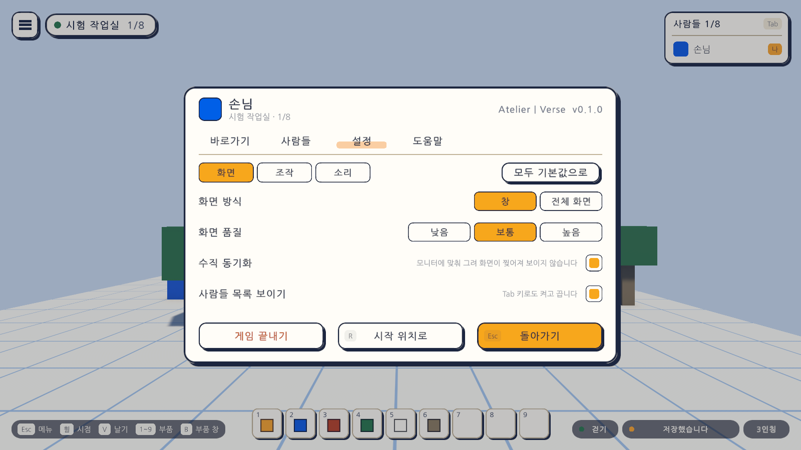
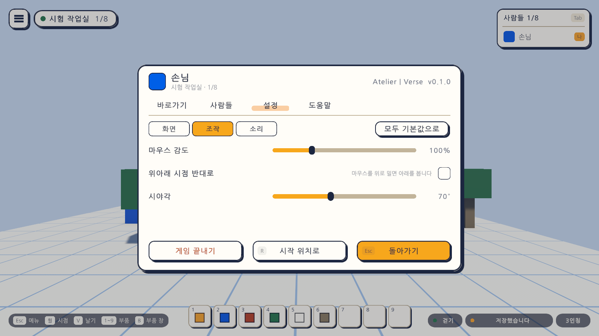
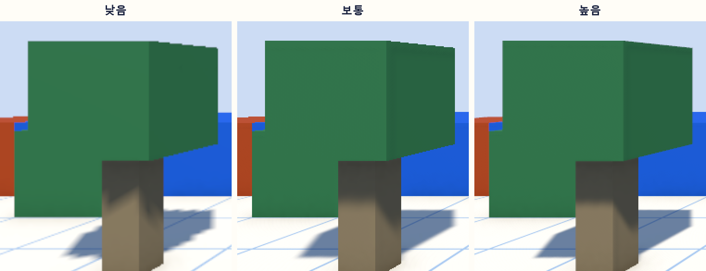
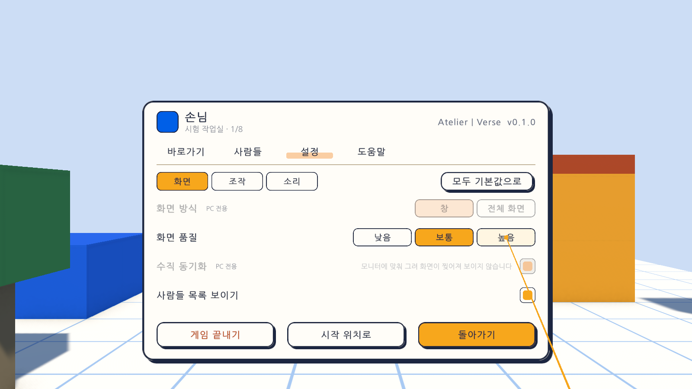

# 20일차 개발 일지 — 설정 늘리기

- **날짜**: 2026-10-10
- **단계**: 1-A 혼자 만들기
- **목표**: 설정에 화면에 관한 것을 넣는다. 창과 전체 화면, 화면 품질, 수직 동기화, 위아래 시점 반대로. 줄이 늘어나므로 설정을 갈래로 나눈다
- **검사 기준**: 고르면 바로 적용되고 껐다 켜도 남는다. 처음 값에서는 화면의 모습이 19일차와 같다. VR에서는 키보드·마우스에만 해당하는 줄을 누를 수 없다. 빌드한 실행 파일에서 품질 세 단계와 전체 화면이 실제로 된다
- **결과**: ✅ 완료(자동 검사 520개 통과, Windows 빌드와 실행 확인 통과). 실행 파일에서 품질 세 단계가 적용되는 것, 전체 화면이 되었다가 창으로 돌아오는 것, 수직 동기화가 듣는 것을 로그로 확인했다. **설정 화면의 단추를 손으로 눌러 보는 확인은 하지 못했다.** VR 쪽은 가상 기기로만 확인
- **알려 둘 일**: 실행 파일을 자동으로 켜 보는 동안 **이 컴퓨터의 실제 맵에 블록 두 개가 더 놓였다**(22개 → 24개). 아래 "검사에서 찾은 문제와 수정"의 5번에 적었다. 맵 파일은 건드리지 않고 그대로 두었다

---

## 오늘 한 일 요약

19일차까지 설정에는 네 줄(마우스 감도, 시야각, 소리 크기, 사람들 목록 보이기)뿐이었고 화면에 관한 설정이 없었다. 오늘 넷을 더하고, 설정을 **화면 / 조작 / 소리** 세 갈래로 나눴다.

| 새 설정 | 갈래 | 고르는 것 | 처음 값 |
|---|---|---|---|
| 화면 방식 | 화면 | 창 / 전체 화면 | 창(전과 같음) |
| 화면 품질 | 화면 | 낮음 / 보통 / 높음 | 보통(19일차까지의 모습 그대로) |
| 수직 동기화 | 화면 | 켬 / 끔 | **켬(전에는 꺼져 있었다)** |
| 위아래 시점 반대로 | 조작 | 켬 / 끔 | 끔 |

전부터 있던 설정은 갈래로 옮겼다. 사람들 목록 보이기는 화면, 마우스 감도와 시야각은 조작, 소리 크기는 소리 갈래에 있다. "기본값으로" 단추는 "모두 기본값으로"가 되어 갈래의 칸 옆으로 올라갔다.

### 화면 품질마다의 모습

빌드한 실행 파일을 품질마다 켜서 찍은 그림에서 같은 자리를 잘라 두 배로 키운 것이다.

낮음은 가장자리가 계단처럼 보이고 그림자의 경계가 뭉개진다. 높음은 가장자리가 매끄럽고 그림자가 또렷하다. 보통은 19일차까지 보던 그대로다.

| | 낮음 | 보통 | 높음 |
|---|---|---|---|
| 그리는 크기 | 화면의 75%로 그려 늘림 | 화면 그대로 | 화면 그대로 |
| 가장자리 매끄럽게 하기 | 없음 | 없음 | 4배 |
| 그림자의 세밀함 | 1024 | 2048 | 4096 |
| 부드러운 그림자 | 끔 | 켬 | 켬 |
| 그림자가 보이는 거리 | 30 | 50 | 70 |

화면의 글자와 단추(메뉴, 부품 칸)는 PC에서 품질과 상관없이 또렷하게 그려진다. 줄어드는 것은 3차원 장면뿐이다.

## 정한 것

시작 전에 말씀드린 가안대로 만들었다. 바꾸자고 하시면 바꾼다.

| 정한 것 | 만든 대로 |
|---|---|
| 설정의 갈래 | 화면 / 조작 / 소리. 화면 시안의 설정 화면이 나뉜 방식을 따름 |
| 화면 품질의 단계 | 낮음 / 보통 / 높음. 보통이 지금까지의 모습. 시안의 "자동"은 넣지 않음 |
| 수직 동기화 | 계획에 없던 것을 더함. 처음 값은 켬 |
| VR에서 | 키보드·마우스나 창에만 해당하는 줄은 흐리게 하고 누를 수 없음. "PC 전용" 딱지 |

만들면서 더 정한 것:

- **전체 화면은 테두리 없는 전체 화면이다.** 모니터의 해상도 그대로 화면을 가득 채운다. 다른 창으로 오갈 때 화면이 깜빡이지 않는다. 해상도를 고르는 것은 없다.
- **창으로 돌아오면 전체 화면으로 가기 전의 창 크기가 된다.** 그 크기를 모르면(전체 화면으로 켜진 채 시작했으면) 1600×900이고, 모니터가 작으면 모니터의 9할에 들어가게 줄인다.
- **화면 방식은 설정에 따로 적어 두지 않는다.** 지금 어느 방식인지는 창에 물어본다. 다음에 켤 때의 방식과 크기는 Unity가 스스로 기억한다. 그래서 설정 밖에서 방식이 바뀌어도 설정 화면이 따라 보인다.
- **"모두 기본값으로"는 전체 화면이면 창으로 돌아온다.** 창일 때는 끌어서 맞춘 창의 크기를 건드리지 않는다.
- **설정의 갈래는 보던 것이 남는다.** 다른 탭에 갔다 오거나 메뉴를 닫았다 열어도 보던 갈래가 보인다. 게임을 다시 켜면 화면 갈래부터다.
- **VR에서 누를 수 있는 것은 화면 품질, 사람들 목록 보이기, 소리 크기다.** 화면 방식·수직 동기화·마우스 감도·위아래 시점 반대로·시야각 다섯 줄은 PC 전용이다.

## 작업 내역

### 1. 설정의 갈래 (`SettingsPanel`, `ChoiceBar`)

- 설정 탭의 위에 갈래를 고르는 칸이 있고, 그 아래에 고른 갈래의 줄만 보인다. 한 갈래에 네 줄까지 들어간다.
- `ChoiceBar`는 나란히 놓인 칸 가운데 하나를 고르는 줄이다. 고른 칸은 노란색이 된다. 갈래의 칸, "창 / 전체 화면", "낮음 / 보통 / 높음"이 모두 이것이다.

### 2. 화면 방식 (`ScreenControl`)

- 창을 직접 부르지 않고 `IScreenDevice`라는 약속을 거친다. 실제 창(`UnityScreenDevice`)과 테스트의 가짜 창이 이 약속을 지킨다. 테스트는 가짜 창으로 "무엇을 부탁하는지"를 본다.
- 전체 화면으로 갈 때 창의 크기를 적어 두고, 돌아올 때 그 크기를 모니터에 맞춰 쓴다(`FitWindow`).
- **켤 때는 아무것도 바꾸지 않는다.** 명령줄로 창 크기를 준 실행(빌드 확인)을 덮어쓰지 않기 위해서다.
- 방식을 바꾸는 것은 그 프레임이 끝난 뒤에 이루어진다. 바꾼 직후 0.5초는 부탁한 방식을 지금 방식으로 알려 주어, 설정 화면의 칸이 눌렀다가 되돌아갔다가 다시 바뀌지 않게 했다.

### 3. 화면 품질 (`GraphicsQuality`, `GraphicsApplier`, `Day20Setup`)

- 20일차 셋업이 품질 단계 둘("PC Low", "PC High")과 그 단계의 그리기 설정 둘(`Assets/Settings/PC_Low_RPAsset`, `PC_High_RPAsset`)을 만든다. 보통은 전부터 쓰던 단계("PC")와 그리기 설정을 그대로 쓴다. 그래서 설정을 바꾸지 않으면 화면이 전과 같다.
- 품질 단계는 번호가 아니라 **이름으로** 찾는다. 기기마다 단계의 수와 차례가 다르기 때문이다(Quest에는 PC의 단계가 없다).
- `GraphicsApplier`가 게임 화면에 붙어, 켜질 때와 설정이 바뀔 때 품질과 수직 동기화를 적용한다.

### 4. 수직 동기화

- 켜면 모니터가 보여 줄 수 있는 만큼만 그린다. 화면이 찢어져 보이지 않고, 그래픽 카드가 필요 없이 돌지 않는다.
- **19일차까지는 초당 그리는 횟수에 제한이 없었다.** 코드에 제한을 두는 곳이 없었고 품질 단계에도 꺼져 있었다. 오늘부터 처음 값이 켬이므로, 설정을 건드리지 않아도 모니터의 주사율까지만 그린다. 이 컴퓨터(60Hz)의 실행 파일에서 초당 59.7번으로 재었다.
- 수직 동기화는 품질 단계마다 따로 적히는 값이라, 품질을 바꾸면 그 단계에 적힌 값으로 돌아간다. 품질을 바꾼 뒤에 다시 맞추게 했다.

### 5. 위아래 시점 반대로 (`DesktopPlayerController`)

- 켜면 마우스를 위로 밀 때 아래를 본다. 좌우는 바뀌지 않는다. 도는 양은 같다.

### 6. VR

- 키보드·마우스나 창에만 해당하는 줄은 흐리게 보이고 광선으로 눌러도 듣지 않는다. 줄의 이름 옆에 "PC 전용" 딱지가 보인다. 19일차의 안내 글("마우스 감도와 시야각은 키보드·마우스로 할 때 적용됩니다")은 이 딱지로 바꿨다.
- 갈래의 칸과 화면 품질의 칸, 소리 크기의 막대는 광선으로 누른다.
- 그림은 글자를 확인하려고 가까이 당겨 찍은 것이며, 헤드셋에서 보이는 크기가 아니다.

### 7. 빌드를 확인하는 도구

- `scripts/build-windows.mjs --quality low|normal|high`: 그 품질로 한 번 켜 본다. 설정은 바꾸지 않는다. 그림은 `smoke-품질.png`로 남고, 로그에서 그 품질 단계로 그렸는지 확인한다.
- `--screen-check`: 실행 중에 전체 화면으로 갔다가 창으로 돌아오게 하고, 그때마다의 실제 화면 방식과 크기를 로그에 적는다. 설정 화면의 단추와 같은 길(`ScreenControl`)을 쓴다. **화면이 1.5초쯤 전체 화면이 된다.**
- 확인 실행은 끝나기 전에 초당 몇 번 그렸는지를 로그에 적는다.
- **확인 실행(`-quitAfter`)은 키보드·마우스 입력을 받지 않는다**(`CheckRunInput`). 아래 5번 문제 때문에 넣었다.

### 8. 그 밖

- `Day20Setup`(메뉴 `Atelier Verse/20일차 셋업 실행`): 그리기 설정 둘과 품질 단계 둘을 만들고, 세 단계의 수직 동기화를 켠 것으로 적고, 게임 화면 프리팹을 다시 조립한다.

## 검사

| 항목 | 방법 | 결과 |
|---|---|---|
| 스크립트 컴파일 | 명령줄 실행 로그 | 오류 없음 |
| 20일차 셋업 적용 | 명령줄에서 `ProjectSetupRunner` 실행 | 적용됨. 다시 적용해도 품질 설정 파일이 같음 |
| 화면 방식의 규칙 | 편집 모드 테스트 `ScreenControlTests` 9개(새로, 가짜 창) | 통과 |
| 화면 품질과 품질 단계 | 편집 모드 테스트 `GraphicsQualityTests` 8개(새로) | 통과 |
| 새 설정의 값 | 편집 모드 테스트 `ViewAndSettingsTests`에 3개, `BootstrapArgsTests`에 1개 더함 | 통과 |
| 그 밖의 편집 모드 테스트 | 280개 | 통과 |
| PC에서 늘어난 설정 | 플레이 모드 테스트 `SettingsPlayTests` 10개(새로) | 통과 |
| VR에서의 설정 | 플레이 모드 테스트 `XrSettingsPlayTests` 1개(새로, 가상 기기) | 통과 |
| 확인 실행의 입력 막기 | 플레이 모드 테스트 `CheckRunPlayTests` 1개(새로) | 통과 |
| 그 밖의 플레이 모드 테스트 | 207개(VR 메뉴의 테스트 둘과 그림 찍는 테스트 둘은 바뀐 설정 화면에 맞춰 고침) | 통과 |
| 테스트가 프로젝트 설정을 바꾸지 않는지 | 테스트 앞뒤의 품질 설정 파일을 견줌 | 같음 |
| Windows 빌드와 평소 실행 | `node scripts/build-windows.mjs --run` | 성공, 예외 없음 |
| **실행 파일에서 품질 세 단계** | `--quality low`, `normal`, `high`로 한 번씩 | 로그에 `낮음(PC Low)`, `보통(PC)`, `높음(PC High)`. 그림이 위의 비교 그림처럼 다름 |
| **실행 파일에서 화면 방식** | `--screen-check` | 로그: 창 1280x720 → 전체 화면 3440x1440 → 창 1280x720 |
| **실행 파일에서 수직 동기화** | 확인 실행의 로그 | 평균 초당 59.7번 그림(모니터 60Hz) |
| 전체 화면에서의 화면 배치 | 실행 파일을 3440×1440 전체 화면으로 켜서 찍은 그림 | 왼쪽 위·오른쪽 위·아래의 요소가 제자리에 있음(메뉴는 열어 보지 않음) |
| `-vr` 실행(VR 프로그램 없는 PC) | `node scripts/build-windows.mjs --skip-build --run --vr` | 키보드·마우스로 돌아옴, 예외 없음 |
| 화면 모양 | 테스트가 찍은 그림 40장 가운데 설정 화면(PC 세 갈래, VR)을 눈으로 확인 | 위 그림 |
| **설정 화면의 단추를 손으로 누르기** | - | **하지 못함.** 실행 파일의 확인은 단추가 부르는 것과 같은 코드를 직접 부른 것이다 |
| **수직 동기화를 끈 때의 횟수** | - | **재지 않음.** 켠 때만 재었다 |
| **헤드셋에서의 설정** | - | **하지 못함.** 이 컴퓨터에 VR 프로그램이 없다 |

편집 모드 테스트는 모두 301개, 플레이 모드 테스트는 219개다. 플레이 모드 219개는 그림 찍기 18개를 포함한 수이고, `-captureDir` 없이 돌리면 그 18개는 건너뛴다. 테스트와 빌드는 마지막 코드 상태에서 돌렸다.

새로 넣은 테스트가 확인하는 것은 다음과 같다.

| 묶음 | 확인하는 것 |
|---|---|
| 화면 방식의 규칙 | 창을 모니터에 들어가게 맞춤(비율을 지키며 줄임, 가장 작은 크기는 지킴). 전체 화면은 모니터의 크기이고 돌아오면 전의 크기. 이미 그 방식이면 창을 건드리지 않음. 적어 둔 크기가 없으면 처음 크기. 기본값으로 돌리면 창으로 |
| 품질 단계 | 품질을 이름으로 찾음. 프로젝트에 세 단계가 있고 저마다 다른 그리기 설정을 씀. 보통은 전부터 쓰던 것. 품질이 높을수록 그림자가 세밀하고 높음만 가장자리를 매끄럽게 함. 세 단계 모두 수직 동기화가 켠 것으로 적혀 있음 |
| 품질 적용 | 품질과 수직 동기화를 적용하고 같은 값이면 건드리지 않음. 품질을 바꿔도 끈 수직 동기화가 남음. **돌려놓으면 단계와 단계마다의 수직 동기화가 바꾸기 전과 같음** |
| 설정의 갈래 | 세 갈래이고 고른 갈래만 보임. 다른 탭에 갔다 오거나 메뉴를 닫았다 열어도 보던 갈래가 남음. 설정마다 제 갈래에 들어 있음 |
| 화면 방식 | 칸을 누르면 전체 화면(모니터의 크기)이 되고, 창으로 돌아오면 전의 크기. 설정 밖에서 바뀌어도 칸이 따라 보임. 켤 때는 창을 건드리지 않음 |
| 화면 품질 | 설정을 바꾸지 않았으면 보통(전부터의 그리기 설정). 칸을 누르면 그리기 단계가 바뀌고, 다시 켜면 고른 품질로 시작 |
| 수직 동기화 | 켜고 끄면 바로 적용. 품질을 바꿔도 남음 |
| 위아래 시점 반대로 | 켜면 마우스를 위로 밀 때 아래를 봄. 도는 양은 같고 좌우는 그대로. 설정의 칸으로 켜고 끔 |
| 모두 기본값으로 | 품질은 보통, 수직 동기화는 켬, 시점은 그대로, 전체 화면이면 처음 크기의 창으로 |
| VR | PC 전용 다섯 줄이 흐리고 광선으로 눌러도 듣지 않으며 딱지가 보임. 화면 품질과 갈래의 칸은 광선으로 누름. 소리 크기의 막대도 광선으로 누름(전부터 있던 테스트를 옮김) |
| 확인 실행 | 입력을 막으면 화면을 눌러도 마우스를 잡지 않고, 블록이 놓이지 않고, 걷지 않고, 메뉴가 열리지 않음. 그동안 새로 꽂힌 기기도 듣지 않음. 풀면 다시 들음 |

### 검사에서 찾은 문제와 수정

1. **테스트를 돌리면 프로젝트의 품질 설정 파일이 바뀌었다.** 에디터에서는 실행 중에 바꾼 품질 단계와 수직 동기화가 프로젝트 설정 파일에 그대로 남는다. 첫 테스트 뒤에 "낮음" 단계의 수직 동기화가 꺼진 것으로 바뀌어 있었다. 테스트만의 문제가 아니라, 에디터에서 게임을 켜고 설정을 바꾸기만 해도 저장소의 파일이 바뀌는 문제였다. 단계를 떠날 때 그 단계의 값을 원래대로 돌려놓고, 에디터에서 실행을 끝낼 때 바꾸기 전의 상태로 돌아가게 고쳤다(`GraphicsQuality.Restore`). 테스트 앞뒤의 파일이 같은지 견주어 확인했다.
2. **테스트 실행이 시작하자마자 끝났는데 통과로 보였다.** 한 번은 Unity가 2초 만에 끝났고(까닭은 로그에 남지 않았다), 앞 실행의 결과 파일이 남아 있어 "실패 0개"로 읽혔다. 끝낸 값이 이상한 것을 보고 알아챘다. 그 뒤로는 실행마다 새 이름의 결과 파일을 쓰고, 돌리기 전에 그 파일이 없는지 확인한다.
3. **VR 메뉴의 테스트 하나가 실패했다.** 없앤 안내 글을 찾고 있었다. "PC 전용" 딱지를 찾게 고쳤다. 마우스 감도의 막대를 광선으로 누르던 테스트는, 그 막대가 VR에서 눌리지 않게 되었으므로 소리 크기의 막대로 옮겼다.
4. **빌드 스크립트가 로그에서 품질을 적용했다는 줄을 찾지 못했다.** 찾는 식의 글자가 빠져 있었다. 고친 뒤 품질마다 다시 돌려 확인했다.
5. **실행 파일을 자동으로 켜 보는 동안 이 컴퓨터의 실제 맵에 블록 두 개가 놓였다.** 맵 파일의 블록이 22개에서 24개가 되었다(파란 블록 하나, 붉은 블록 하나. 15시 39분). 테스트는 임시 폴더를 쓰므로 테스트가 아니고, 실행 확인 창 다섯 개가 잇달아 뜨던 때였다. 확인하는 창은 다른 창 위에 뜨므로, **그때의 키보드와 마우스 누름이 게임에 들어간 것으로 보인다**(무엇이 눌렸는지는 기록이 없어 확인하지 못했다). 확인 실행에서는 키보드·마우스·게임패드 입력을 받지 않게 고쳤다(`CheckRunInput`). 그 뒤의 확인 실행에서는 맵 파일이 바뀌지 않았다. **맵 파일은 건드리지 않고 그대로 두었다.** 두 블록이 원하지 않은 것이면 게임에서 지우거나, 지워 달라고 하면 지운다.

## 직접 확인하는 방법

1. `unity/Builds/Windows/AtelierVerse.exe`를 켠다. **맵에 놓은 적 없는 파란 블록과 붉은 블록이 하나씩 있는지 본다**(위 5번).
2. `Esc` → 설정. "화면" 갈래에서 "전체 화면"을 눌러 화면이 가득 차는지, "창"을 눌러 전의 크기로 돌아오는지 본다.
3. "화면 품질"을 낮음과 높음으로 바꿔 본다. 블록의 가장자리와 그림자가 달라지는지 본다. 바꿀 때 화면이 잠깐 멈출 수 있다.
4. "수직 동기화"를 끄고 켜 본다. 시점을 빠르게 돌릴 때 화면이 가로로 찢어져 보이는지가 달라진다.
5. "조작" 갈래에서 "위아래 시점 반대로"를 켜고, 메뉴를 닫아 마우스를 위로 밀어 본다.
6. 설정을 몇 개 바꾼 뒤 "모두 기본값으로"를 누른다. 전체 화면이었으면 창으로 돌아오는지 본다.
7. 전체 화면으로 둔 채 껐다 켜서 전체 화면으로 시작하는지 본다.

에디터에서 Sandbox 씬을 재생해도 되지만, **에디터에서는 전체 화면이 되지 않는다.** 화면 방식은 실행 파일에서 확인한다.

## 알아 둘 점

- **이 컴퓨터의 실제 맵에 블록 두 개가 더 있다.** 위 5번. 바뀌기 바로 전의 파일은 남기지 못했다. 블록이 22개이던 때의 옛 판 사본(`local.map.json.v2.bak`, 18일차에 생긴 것)은 그대로 있다.
- **수직 동기화의 처음 값이 켬이라, 설정을 건드리지 않아도 전과 다르다.** 전에는 그릴 수 있는 만큼 그렸고 이제는 모니터의 주사율까지만 그린다. 보이는 모습은 같다.
- **"모두 기본값으로"는 설정 탭에 보이지 않는 것도 처음으로 돌린다.** 부품 칸에 넣어 둔 부품의 배치와 맞추기 도우미의 단계가 그렇다(전부터 그랬다). 맵은 바뀌지 않는다.
- **화면 품질은 Quest에서 듣지 않는다.** Quest에는 PC의 품질 단계가 없다. Quest 빌드를 만들 때 정한다.
- **VR에서 품질을 낮추면 눈앞의 판(메뉴)도 함께 흐려진다.** VR의 판은 3차원 장면 안에 있기 때문이다. PC의 화면 요소는 흐려지지 않는다. 헤드셋에서는 확인하지 못했다.
- 화면 품질의 "자동"(기기 성능에 맞추기)은 없다. 성능을 재는 일이 먼저 필요하다.
- 창의 크기를 고르는 줄은 없다. 창의 가장자리를 끌어 맞춘다. 해상도를 고르는 것도 없다.
- 품질을 바꾸는 순간 화면이 잠깐 멈출 수 있다(그리기 설정을 통째로 바꾼다).
- 가로로 넓은 모니터(3440×1440)의 전체 화면에서 메뉴와 창들이 어떻게 보이는지는 확인하지 못했다. 늘 보이는 화면 요소만 그림 한 장으로 보았다.
- 확인 실행(`-quitAfter`)은 이제 키보드와 마우스를 받지 않는다. 자동 확인으로 켠 창을 눌러도 아무 일이 없는 것이 정상이다.

## 다음 일차

`docs/BACKLOG.md` 2절의 순서대로 **끌어서 여러 개 놓기와 칠하기**를 한다. 넓은 바닥과 벽을 하나씩 놓지 않고 끌어서 한 번에 놓고, 한 번에 묶어 되돌린다. 사용자가 소리를 들어 본 결과나 헤드셋으로 켜 본 결과, 오늘의 설정을 눌러 본 결과가 있으면 그것부터 고친다.
