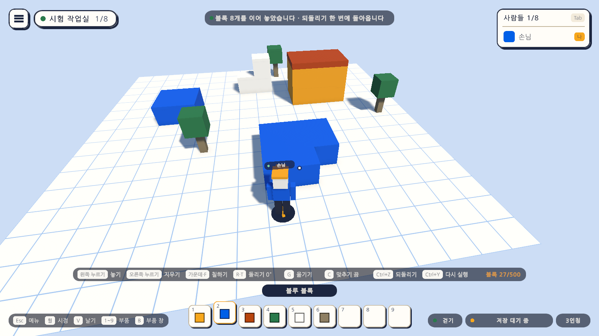

# 21일차 개발 일지 — 끌어서 여러 개 놓기와 칠하기

- **날짜**: 2026-10-10
- **단계**: 1-A 혼자 만들기
- **목표**: 넓은 바닥과 벽을 블록 하나마다 누르지 않고 만들 수 있게 한다. 단추를 누른 채 끌면 이어서 놓이고, 지워지고, 칠해진다. 한 번 끈 것은 한 번에 되돌린다
- **검사 기준**: 끌어서 놓은 블록이 줄을 맞춰 빈틈없이 놓이고 서로 겹치지 않는다. 누르고 있어도 탑이 쌓이거나 뒤의 블록까지 지워지지 않는다. 되돌리기 한 번에 끈 것이 모두 돌아온다. 짧게 누르면 전처럼 하나만 놓인다
- **결과**: ✅ 완료(자동 검사 551개 통과, Windows 빌드와 실행 확인 통과). **손으로 끌어 보는 확인은 하지 못했다.** 쓰기 편한지는 사용자가 해 보아야 안다. VR 쪽은 가상 기기로만 확인

---

## 오늘 한 일 요약

20일차까지는 블록 하나를 놓을 때마다 한 번씩 눌러야 했다. 오늘부터는 **단추를 누른 채 조준을 옮기면** 이어서 된다.

그림은 놓기 단추를 한 번 누른 채 앞으로, 옆으로, 다시 몸 쪽으로 끌어 놓은 것이다(놓은 뒤 3인칭으로 물러나 내려다본 모습). 캐릭터 앞의 파란 블록 여덟 개가 그것이다. 화면 위의 알림이 몇 개를 놓았는지와 한 번에 되돌릴 수 있음을 알려 준다.

| 하는 일 | PC | VR | 규칙 |
|---|---|---|---|
| 끌어서 놓기 | 마우스 왼쪽을 누른 채 | 오른손 방아쇠를 당긴 채 | 첫 블록을 놓은 **그 면 위에**, 첫 블록에 줄을 맞춰 이어 놓인다 |
| 끌어서 지우기 | 마우스 오른쪽을 누른 채 | 오른손 옆 단추를 쥔 채 | 처음 가리킨 면과 **같은 면에 있는 블록만** 지워진다 |
| 끌어서 칠하기 | 가운데 단추나 `F`를 누른 채 | 왼손 방아쇠를 당긴 채 | 지나가는 블록이 모두 칠해진다 |
| 한 번에 되돌리기 | `Ctrl+Z` | 부품 판의 되돌리기 | 한 번 끈 것이 통째로 돌아온다 |

## 정한 것

시작 전에 말씀드린 가안대로 만들었다. 바꾸자고 하시면 바꾼다.

| 정한 것 | 만든 대로 |
|---|---|
| 끌어서 놓는 자리 | 첫 블록을 놓은 면 위. 첫 블록에서 블록의 크기만큼씩 떨어진 자리(줄)에만 놓임 |
| 끌어서 지우는 블록 | 처음 가리킨 면과 같은 면에 있는 것만 |
| 건너뛰는 자리 | 이미 블록이 있는 자리, 맵 밖, 캐릭터나 다른 물체와 겹치는 자리 |
| 되돌리기 | 한 번 끈 것이 기록 하나 |
| 네모로 한꺼번에 채우기 | 넣지 않음 |

**"같은 면" 규칙을 둔 까닭.** 규칙 없이 "가리킨 블록 위에 계속 놓기"로 하면, 방금 놓은 블록이 조준을 가려 그 위에 또 놓이고 또 놓여 내 쪽으로 탑이 쌓인다. 지우기는 블록이 사라지면 뒤의 블록이 조준에 들어와, 누르고 있는 동안 벽을 뚫고 들어간다. 면을 하나 정해 두면 바닥은 바닥대로, 벽은 벽대로 이어진다.

만들면서 더 정한 것:

- **누른 뒤 0.12초는 끌기로 보지 않는다.** 짧게 누르면서 시점을 휙 돌려도 하나만 놓이고 하나만 지워진다. 그보다 오래 누르고 있으면 그때의 조준까지 한꺼번에 따라잡는다.
- **조준이 블록 반 개만큼 옮겨져야 다음 블록이 놓인다.** 누른 채 손이 조금 떨리는 것으로는 더 놓이지 않는다.
- **부품과 돌린 각도는 끌기를 시작할 때의 것으로 굳는다.** 끄는 도중에 숫자 키를 누르거나 돌려도 줄은 그대로다.
- **끄는 동안에는 사이를 가리는 블록을 보지 않는다.** 조준이 가리키는 방향이 그 면과 만나는 곳을 본다. 방금 놓은 블록에 가려 줄이 끊기지 않게 하려는 것이다.
- **맵 밖이거나 블록 수가 다 찼을 때는 끌기 한 번에 한 번만 알린다.** 끄는 내내 경고가 쏟아지지 않는다.
- **끌기가 끝나면 둘 이상을 했을 때 알린다.** "블록 8개를 이어 놓았습니다 · 되돌리기 한 번에 돌아옵니다".
- **끄는 도중에 메뉴를 열거나 되돌리기를 누르면 끌기가 끝난다.** 메뉴를 열었으면 그때까지 한 것이 한 묶음으로 남고, 되돌리기를 눌렀으면 그때까지 한 것이 돌아온다. 단추를 다시 눌러야 다시 끌린다.
- **칠하기는 빈 곳에서 눌러도 끌기가 된다.** 누른 채 블록 위로 가져가면 칠해진다. 이미 그 색인 블록은 건드리지 않고 알림도 올리지 않는다.
- **소리는 같은 종류가 0.05초 안에 한 번만 난다.** 여러 블록이 한꺼번에 놓여도 소리가 쏟아지지 않는다. 묶음을 되돌릴 때는 되돌리는 소리가 한 번 난다.

## 작업 내역

### 1. 기록의 묶음 (`EditHistory`)

- `BeginGroup`과 `EndGroup` 사이의 편집은 기록 하나가 된다. 되돌리면 묶음 전체가 뒤에서부터 돌아오고, 다시 실행하면 앞에서부터 다시 된다.
- 묶음에는 놓기·지우기·칠하기가 섞여도 된다. 빈 묶음은 기록을 남기지 않는다.
- **묶음을 되돌리거나 다시 실행하다 하나라도 막히면 하기 전의 상태로 돌려놓는다.** 반쯤만 돌아온 상태로 남지 않는다.
- 기록의 상한(100)은 묶음을 하나로 센다.
- 묶음이 열려 있는 동안 되돌리기를 부르면 묶음을 먼저 닫는다.

### 2. 줄을 맞추는 계산 (`PlacementMath`)

- `FaceAxes`: 가리킨 면 위에서 블록을 늘어놓을 두 방향을 정한다. 블록의 세 축 가운데 면을 뚫고 나오는 축을 빼고 남은 축을 따른다. 바닥에서는 돌린 블록의 가로와 세로가 되어, 15도 돌린 블록도 돌린 채로 면이 서로 닿게 이어진다.
- `Extent`: 부품이 한 방향으로 차지하는 길이. 판·기둥처럼 크기가 다른 부품은 그 크기만큼씩 떨어져 놓인다.
- `LatticeCell`, `LatticeCenter`: 면 위의 점이 줄의 몇 번째 칸인지와 그 칸의 가운데.
- `CellsBetween`: 한 프레임에 조준이 여러 칸을 건너뛰어도 사이의 칸이 비지 않게, 지나온 칸을 차례로 돌려준다.

### 3. 끌기 (`BlockBuilder`)

- 단추를 누른 그 프레임에 전처럼 하나를 놓거나 지우거나 칠하고, 기록의 묶음을 열어 끌기를 시작한다. 단추를 놓으면 묶음을 닫는다.
- **끌어서 놓기**: 조준 광선이 처음 가리킨 면과 만나는 점이 줄의 다른 칸으로 옮겨 가면, 지난 칸에서 그 칸까지 지나온 칸에 블록을 놓는다. 그동안 미리 보기 블록은 다음에 놓일 칸에 보이고, 이미 놓인 칸에서는 감춘다.
- **끌어서 지우기**: 조준이 닿은 곳이 처음 가리킨 면 위에 있고(블록 한 변의 8% 안에서) 면의 방향이 같을 때만 그 블록을 지운다.
- **끌어서 칠하기**: 조준이 닿은 블록을 고른 색으로 칠한다.
- 블록 하나를 놓을 때는 전과 같이 블록끼리 겹쳐도 된다. 끌어서 놓을 때만 이미 있는 블록과 겹치는 자리를 건너뛴다(사이를 가리는 블록을 보지 않으므로, 건너뛰지 않으면 블록의 속에 놓인다).

### 4. 소리 (`GameSounds`)

- 블록 소리(놓기, 지우기, 칠하기, 옮기기)는 같은 종류가 0.05초 안에 한 번만 난다.

### 5. 도움말

- 도움말 아래의 안내 글에 "놓기 · 지우기 · 칠하기는 누른 채 끌면 이어서 됩니다."를 더했다. PC와 VR에 같이 보인다.

### 6. VR

- PC와 같은 코드다. 방아쇠를 당긴 채 손을 옮기면 이어 놓이고, 옆 단추를 쥔 채 옮기면 같은 면의 블록이 지워진다.
- 손이 떨릴 때 줄이 어긋나는지, 팔을 뻗어 끄는 것이 편한지는 헤드셋에서 보아야 안다.

### 7. 맵 파일을 읽고 쓸 때 다시 해 보기 (`MapStorage`)

- 맵 파일을 읽거나 쓰다가 실패하면 조금 기다렸다(0.025초, 0.05초, 0.075초) 네 번까지 다시 해 본다. 끝내 안 되면 전과 같이 실패로 알린다.
- 넣은 까닭은 아래 "검사에서 찾은 문제와 수정"의 5번이다. 끌기와는 상관없지만, 게임에서 "맵 정보를 저장하지 못했습니다"로 나타날 수 있는 일이라 오늘 고쳤다.

### 8. 그 밖

- `Day21Setup`(메뉴 `Atelier Verse/21일차 셋업 실행`): 도움말의 안내 글이 든 게임 화면 프리팹을 다시 조립한다. 새 자산은 없다.

## 검사

| 항목 | 방법 | 결과 |
|---|---|---|
| 스크립트 컴파일 | 명령줄 실행 로그 | 오류 없음 |
| 21일차 셋업 적용 | 명령줄에서 `ProjectSetupRunner` 실행 | 적용됨 |
| 기록의 묶음 | 편집 모드 테스트 `EditHistoryTests`에 9개 더함 | 통과 |
| 줄을 맞추는 계산 | 편집 모드 테스트 `PlacementMathTests`에 5개 더함 | 통과 |
| 맵 파일 다시 해 보기 | 편집 모드 테스트 `MapLibraryTests`에 2개 더함(파일을 잠깐 잡았다 놓는 경우, 계속 잡고 있는 경우) | 통과 |
| 그 밖의 편집 모드 테스트 | 301개 | 통과 |
| PC에서 끌기 | 플레이 모드 테스트 `DragPlayTests` 13개(새로) | 통과 |
| VR에서 끌기 | 플레이 모드 테스트 `XrDragPlayTests` 2개(새로, 가상 기기) | 통과 |
| 그 밖의 플레이 모드 테스트 | 219개. 하나씩 놓고 지우고 칠하는 전부터의 테스트가 그대로 통과 | 통과 |
| 테스트가 프로젝트 설정을 바꾸지 않는지 | 테스트 앞뒤의 품질 설정 파일을 견줌 | 같음 |
| Windows 빌드와 평소 실행 | `node scripts/build-windows.mjs --run` | 성공, 예외 없음 |
| `-vr` 실행(VR 프로그램 없는 PC) | `node scripts/build-windows.mjs --skip-build --run --vr` | 키보드·마우스로 돌아옴, 예외 없음 |
| 실제 맵 파일 | 확인 실행 앞뒤의 파일 시각과 크기를 견줌 | 바뀌지 않음(확인 실행은 20일차부터 입력을 받지 않음) |
| 화면 모양 | 테스트가 찍은 그림 41장 가운데 끌어 놓은 모습과 도움말을 눈으로 확인 | 위 그림 |
| **손으로 끌어 보기** | - | **하지 못함.** 테스트는 가상 마우스로 단추를 누른 채 시점을 바꾼다. 마우스를 쥐고 끌 때의 느낌, 0.12초와 블록 반 개라는 값이 알맞은지 |
| **헤드셋에서 끌기** | - | **하지 못함.** 이 컴퓨터에 VR 프로그램이 없다 |

편집 모드 테스트는 모두 317개, 플레이 모드 테스트는 234개다. 플레이 모드 234개는 그림 찍기 19개를 포함한 수이고, `-captureDir` 없이 돌리면 그 19개는 건너뛴다. 편집 모드 테스트와 빌드는 마지막 코드 상태에서 돌렸다. 플레이 모드 전체를 돌린 뒤에 바꾼 것은 그림을 찍는 테스트의 구도뿐이고, 그 테스트가 든 묶음(`DragPlayTests`, `XrDragPlayTests` 15개)은 바꾼 뒤에 다시 돌렸다.

새로 넣은 테스트가 확인하는 것은 다음과 같다.

| 묶음 | 확인하는 것 |
|---|---|
| 기록의 묶음 | 묶음의 편집이 되돌리기 한 번에 함께 돌아오고 같은 번호로 다시 놓임. 놓기·지우기·칠하기가 섞여도 됨. 빈 묶음은 기록이 없음. 묶음을 연 채 되돌리면 그때까지가 돌아옴. 상한은 묶음을 하나로 셈. 묶음 안의 편집은 하나씩 알리고 묶음을 되돌릴 때는 한 번만 알림. **다시 실행하다 막히면 하기 전의 상태로 둠.** 기록을 비우면 열린 묶음도 버림 |
| 줄을 맞추는 계산 | 바닥에서는 돌린 블록의 가로세로를 따름. 벽에서는 벽을 따라가는 방향과 위아래. 부품이 차지하는 길이가 크기와 각도를 따름. 점이 몇 번째 칸인지와 칸의 가운데. 지나온 칸을 빠짐없이, 겹치지 않게 담음 |
| 끌어서 놓기 | 누른 채 조준을 옮기면 첫 블록에 줄을 맞춰 이어 놓이고 서로 겹치지 않음. 한 프레임에 여러 칸을 건너뛰어도 사이가 비지 않음. 맞추기 도우미가 켜져 있으면 모눈에 맞음 |
| 하나만 놓이는 경우 | 짧게 누르면 하나. 누른 채 조금 흔들려도 하나. **짧게 누르는 사이에 조준이 크게 움직여도 하나** |
| 건너뛰기 | 이미 블록이 있는 칸은 건너뛰고 그 뒤는 이어 놓임. 맵 밖의 칸은 건너뛰고 한 번만 알림 |
| 끌어서 지우기 | 같은 면의 블록만 지워지고, **누르고 있어도 뒤의 블록은 남음** |
| 끌어서 칠하기 | 지나가는 블록이 모두 칠해지고, 이미 칠한 블록을 다시 지나가도 편집이 늘지 않음 |
| 한 번에 되돌리기 | 놓기·지우기·칠하기 모두 되돌리기 한 번에 돌아옴. 끌기가 끝날 때까지는 기록이 닫히지 않음 |
| 끌기가 끝나는 경우 | 끄는 도중에 메뉴를 열면 끝나고 그때까지가 한 묶음. 끄는 도중에 되돌리면 그때까지가 돌아오고, 누른 채 더 옮겨도 놓이지 않음 |
| 소리 | 여러 블록이 한꺼번에 놓여도 소리가 블록마다 나지 않음. 묶음을 되돌릴 때는 한 번만 남 |
| VR | 방아쇠를 당긴 채 손을 옮기면 사이의 칸까지 이어 놓이고 한 번에 되돌아옴. 옆 단추를 쥔 채 옮기면 같은 면의 블록이 이어 지워짐 |
| 맵 파일 | 다른 프로그램이 파일을 0.04초 잡았다 놓아도 기다렸다 저장함. 계속 잡고 있으면 저장하지 못했다고 알리고 파일은 그대로임 |

### 검사에서 찾은 문제와 수정

1. **끄는 도중에 되돌리면 "블록 3개를 이어 놓았습니다"라고 알렸다.** 방금 되돌려 없어진 것을 놓았다고 알린 셈이다. 테스트를 쓰다가 알아챘다. 되돌리기로 끌기가 끝날 때는 알리지 않게 고쳤다.
2. **짧게 누르면서 시점을 휙 돌리면 여러 개가 놓일 수 있었다.** 테스트가 실패한 것이 아니라, 손으로 쓸 때를 따져 보다 알았다. 누른 뒤 0.12초는 끌기로 보지 않게 하고 테스트를 더했다.
3. **새 테스트 셋이 "기기의 값이 없다"는 오류로 실패했다.** 게임의 문제가 아니라 테스트의 문제였다. 물리 갱신을 기다린 바로 그 순간에는 가상 키를 누를 수 없다. 한 프레임을 더 기다리게 고쳤다.
4. **첫 그림이 알아볼 수 없었다.** 놓은 블록이 화면을 가득 채웠다. 두 번 고쳐, 3인칭으로 물러나 내려다보게 했다.
5. **오늘 고친 것과 상관없는 테스트 둘이 한 실행에서 한 번씩 실패했다**(18일차의 맵 정보 고치기, 17일차의 VR에서 맵 열기). 그 전에도 그 뒤에도 통과하던 것들이다. 둘 다 맵 파일을 쓰고 곧바로 다시 읽거나 쓰는 곳이었다. 실패한 까닭을 기록에서 찾지는 못했고(실패를 조용히 "못 했다"로 돌려주게 되어 있다), **방금 쓴 파일을 다른 프로그램이 잠깐 잡고 있었던 것으로 짐작한다.** 맵 파일을 읽고 쓸 때 다시 해 보게 고쳤고, 파일을 잠깐 잡았다 놓는 테스트를 더했다. 고친 뒤 전체를 다시 돌려 모두 통과했다. 다만 한 번 통과한 것으로 까닭이 맞았다고 단정할 수는 없다. 또 실패하면 다시 본다.

## 직접 확인하는 방법

1. `unity/Builds/Windows/AtelierVerse.exe`를 켠다(또는 에디터에서 Sandbox 씬을 재생한다).
2. 부품을 고르고 바닥을 가리킨 뒤, **마우스 왼쪽을 누른 채** 시점을 위로(멀리) 천천히 든다. 블록이 앞으로 한 줄로 이어 놓이는지 본다.
3. 누른 채로 `A`나 `D`로 옆으로 걸어 본다. 곧은 줄이 옆으로 이어지는지 본다.
4. 단추를 놓고 `Ctrl+Z`를 한 번 누른다. 방금 끈 것이 모두 돌아오는지 본다.
5. 블록을 빠르게 하나씩 눌러 놓아 본다. 뜻하지 않게 두 개씩 놓이지 않는지 본다.
6. 한 줄로 놓은 블록의 윗면을 가리키고 **마우스 오른쪽을 누른 채** 옆으로 옮겨 본다. 줄이 지워지는지, 한자리에 대고 누르고 있어도 아래나 뒤의 블록이 남는지 본다.
7. 다른 색을 고르고 **가운데 단추(또는 `F`)를 누른 채** 블록들 위를 지나가 본다.
8. 놓은 블록의 옆면을 가리키고 왼쪽을 누른 채 끌어 본다. 그 면을 따라 벽처럼 붙어 놓이는지 본다.

## 알아 둘 점

- **1인칭에서 시점만 좌우로 돌리며 끌면 줄이 휜다.** 조준이 캐릭터를 가운데로 둥글게 움직이기 때문이다. 곧은 줄은 누른 채 옆으로 걷거나(`A`·`D`), 시점을 위아래로만 움직이면 된다.
- **끌어서 위로 쌓을 수는 없다.** 첫 블록을 놓은 면 위에서만 이어진다. 한 층을 깔고, 그 윗면에서 다시 끌면 다음 층이 놓인다.
- **끌어서 놓은 블록은 공중에도 놓인다.** 블록의 윗면에서 끌기 시작해 그 블록 밖으로 나가면, 같은 높이로 허공에 이어진다(지붕이나 다리를 만들 때 쓸 수 있다).
- **끌어서 지우기는 면이 고르지 않으면 지워지지 않는다.** 칸에 맞추지 않고 놓은 블록은 면의 높이가 조금씩 달라, 처음 가리킨 면과 같지 않으면 남는다. 그런 블록은 하나씩 눌러 지운다.
- **끄는 동안에는 사이를 가리는 블록을 보지 않으므로**, 벽 너머의 바닥에도 놓일 수 있다(손이 닿는 거리 6 안에서).
- **되돌리기는 끈 것 전체다.** 열 개를 끌어 놓고 마지막 하나만 되돌릴 수는 없다. 하나만 지우려면 눌러 지운다.
- 네모로 한꺼번에 채우기, 곧은 줄로 묶기(한 방향으로만 끌기)는 없다.
- 화면 아래의 조작 안내("왼쪽 누르기 놓기")는 그대로다. 끌 수 있다는 것은 도움말에만 적혀 있다.
- 20일차에 알린 이 컴퓨터의 실제 맵의 블록 두 개는 그대로 두었다.
- 맵 파일을 읽고 쓰다 실패했을 때 다시 해 보는 동안(가장 길게 0.15초) 화면이 잠깐 멈춘다. 실패하지 않으면 전과 같다.

## 다음 일차

`docs/BACKLOG.md` 2절의 순서대로 **맵 사본 만들기와 휴지통에서 되살리기**를 한다. 지금은 만든 맵을 바탕으로 다른 맵을 시작할 수 없고, 지운 맵은 휴지통 폴더로 옮겨질 뿐 화면에서 되살릴 수 없다. 그다음이 맵의 분위기와 크기(하늘 색, 해의 방향, 바닥 크기)다. 사용자가 끌기·소리·설정을 써 본 결과나 헤드셋으로 켜 본 결과가 있으면 그것부터 고친다.
