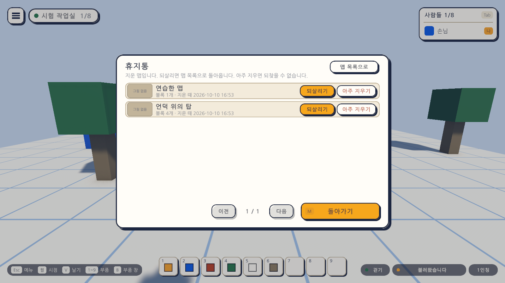
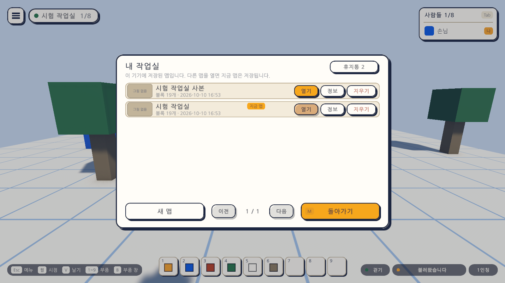
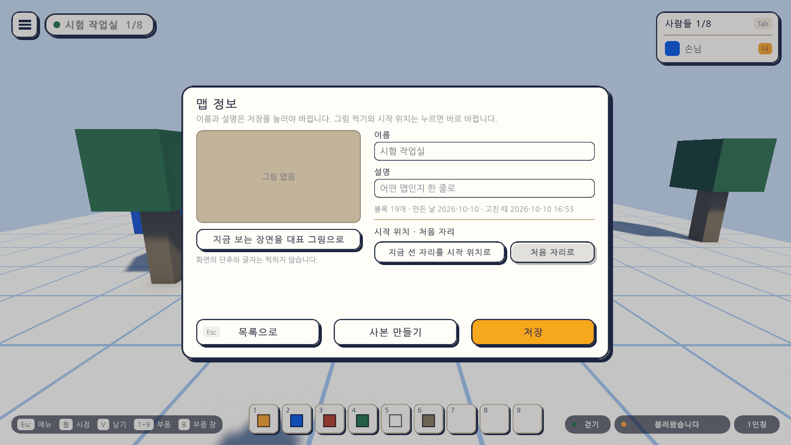

# 22일차 개발 일지 — 맵 사본 만들기와 휴지통에서 되살리기

- **날짜**: 2026-10-10
- **단계**: 1-A 혼자 만들기
- **목표**: 만든 맵을 바탕으로 다른 맵을 시작할 수 있게 하고, 지운 맵을 화면에서 되살릴 수 있게 한다
- **검사 기준**: 사본에는 원래 맵의 블록·설명·시작 위치·대표 그림이 그대로 들어 있고 원래 맵은 바뀌지 않는다. 지운 맵이 휴지통에 보이고, 되살리면 같은 내용으로 돌아온다. 아주 지우기는 한 번 눌러서는 지워지지 않는다
- **결과**: ✅ 완료(자동 검사 571개 통과, Windows 빌드와 실행 확인 통과). 화면의 단추를 손으로 눌러 보는 확인은 하지 못했다. VR 쪽은 가상 기기로만 확인

---

## 오늘 한 일 요약

21일차까지 맵 관리에는 빈 곳이 둘 있었다. 만든 맵을 베껴 새 맵을 시작할 수 없었고, 지운 맵은 휴지통 폴더로 옮겨질 뿐 화면에서 되찾을 수 없었다. 오늘 둘을 채웠다.

| 하는 일 | 방법 |
|---|---|
| 사본 만들기 | 맵 목록(`M`)에서 줄의 "정보" → 아래의 "사본 만들기" |
| 휴지통 보기 | 맵 목록의 오른쪽 위 "휴지통" 단추. 든 맵의 수가 함께 보인다("휴지통 2") |
| 되살리기 | 휴지통의 줄에서 "되살리기" |
| 아주 지우기 | 휴지통의 줄에서 "아주 지우기"를 **두 번** 누른다. 되찾을 수 없다 |
| 맵 목록으로 돌아가기 | 같은 자리의 "맵 목록으로" 단추, 또는 `Esc` |

휴지통은 맵 목록과 같은 창에 보인다. 줄마다 맵의 이름, 블록 수, 지운 때가 보이고 오른쪽에 "되살리기"와 "아주 지우기"가 있다.

## 정한 것

시작 전에 말씀드린 가안대로 만들었다. "아주 지우기"를 넣을지는 답이 없으셨으므로, 말씀드린 대로 두 번 눌러 확인하는 방식으로 넣었다. 빼자고 하시면 뺀다.

| 정한 것 | 만든 대로 |
|---|---|
| 사본 만들기의 자리 | 맵 정보 창의 아래 가운데 |
| 사본의 내용 | 블록, 설명, 시작 위치, 대표 그림이 같음. 이름 뒤에 " 사본" |
| 휴지통을 보는 곳 | 맵 목록 창의 오른쪽 위 단추. 같은 창 안에서 바뀜 |
| 아주 지우기 | 넣음. 같은 줄을 3초 안에 두 번 눌러야 지워짐 |
| VR | 모두 광선으로 누름(글자를 쓰는 일이 없다) |

만들면서 더 정한 것:

- **사본을 만들어도 지금 맵에 그대로 있다.** 사본을 열지 않고, 맵 목록으로 돌아가 사본이 있는 쪽을 보인다. 사본에서 작업하려면 그 줄의 "열기"를 누른다.
- **지금 열려 있는 맵의 사본에는 아직 저장되지 않은 변경도 들어간다.** 사본을 만들기 전에 먼저 저장한다. "지금 보이는 모습 그대로"가 사본이 된다.
- **사본의 이름은 "이름 사본"이다.** 같은 이름이 있으면 "이름 사본 2"처럼 번호가 붙는다. 이름이 길면 " 사본"이 잘리지 않게 앞을 줄인다.
- **되살리면 지우기 전의 번호표로 돌아온다.** 그 사이에 같은 번호표의 맵이 생겼으면 새 번호표로 돌아온다. 있는 맵을 덮어쓰지 않는다.
- **되살려도 그 맵을 열지 않고 휴지통을 계속 보인다.** 여러 개를 이어서 되살릴 수 있다. 알림이 "맵 목록에 있습니다"라고 알려 준다.
- **휴지통은 저절로 비워지지 않는다.** 한꺼번에 비우는 단추도 없다. 하나씩 아주 지운다.
- **맵이 50개(상한)이면 사본을 만들 수도 되살릴 수도 없고, 까닭을 알린다.**
- **읽을 수 없는 휴지통의 파일은 되살릴 수 없다고 보인다.** 아주 지울 수는 있다.
- **지웠을 때의 알림을 고쳤다.** "파일은 휴지통 폴더에 남아 있습니다" → "휴지통에서 되살릴 수 있습니다".

## 작업 내역

### 1. 맵 파일 층 (`MapLibrary`)

- `Duplicate`: 맵 파일을 읽어 새 번호표로 쓰고 대표 그림을 베낀다. 만든 때와 고친 때는 지금이다. 원래 파일은 읽기만 한다.
- `ListTrash`: 휴지통 폴더의 맵을 최근에 지운 것부터 돌려준다. 지우기 전의 번호표와 지운 때는 파일 이름(`번호표-날짜-시각`)에서 읽는다. 번호표에도 날짜가 들어 있을 수 있어, 맨 끝의 날짜와 시각을 지운 때로 본다.
- `Restore`: 휴지통의 파일을 맵 폴더로 옮긴다. 대표 그림도 함께 옮긴다.
- `Purge`: 휴지통의 맵 파일과 대표 그림을 없앤다. **휴지통에 있는 것만 지울 수 있다.** 맵 목록의 맵을 이것으로 바로 지울 수는 없다.
- `Count`: 파일을 읽지 않고 맵의 수를 센다.
- 휴지통의 파일을 가리키는 이름은 영문 소문자·숫자·줄표만 받고 `번호표-날짜-시각` 꼴이어야 한다. 폴더를 벗어나는 이름(`../` 등)은 받지 않는다.

### 2. 자동 저장 (`MapAutoSave`)

- `Duplicate`, `ListTrash`, `Restore`, `Purge`를 더했다. 못 했을 때의 까닭(맵이 가득 참, 저장하지 못함)을 여기서 알린다.
- 지금 맵의 사본을 만들 때는 남은 변경을 먼저 저장한다.

### 3. 맵 목록 창의 휴지통 (`MapListView`)

- 같은 창이 맵 목록과 휴지통을 번갈아 보인다. 제목("내 작업실" ↔ "휴지통"), 안내 글, 줄의 단추(열기·정보·지우기 ↔ 되살리기·아주 지우기), 오른쪽 위 단추의 글자("휴지통 2" ↔ "맵 목록으로")가 함께 바뀐다.
- 휴지통에서는 "새 맵" 단추를 감춘다. 비어 있으면 "휴지통이 비어 있습니다"가 보인다.
- 두 번 눌러 확인하는 것은 지우기와 아주 지우기가 같은 코드를 쓴다. 다른 목록에 다녀오면 확인이 풀린다.
- 휴지통의 맵도 대표 그림이 있으면 줄에 보인다.

### 4. 맵 정보 창의 사본 만들기 (`MapInfoView`)

- 아래 가운데에 "사본 만들기" 단추가 생겼다. 글자 칸에 쓰던 이름이 아니라 **저장되어 있는 맵**을 베낀다.

### 5. 화면의 흐름 (`GameUi`)

- 휴지통에서 `Esc`는 맵 목록으로 돌아가고, `M`은 창을 닫는다. 창을 다시 열면 맵 목록부터 보인다.
- 사본을 만들면 맵 목록으로 돌아가 사본이 있는 쪽을 보인다. 만들지 못했으면 맵 정보 창에 그대로 있는다.

### 6. VR

- 휴지통 단추, 되살리기, 아주 지우기, 사본 만들기를 모두 오른손 광선으로 누른다. 글자를 쓰는 일이 없어 PC와 할 수 있는 일이 같다.

### 7. 그 밖

- `Day22Setup`(메뉴 `Atelier Verse/22일차 셋업 실행`): 휴지통 단추와 사본 만들기 단추가 든 게임 화면 프리팹을 다시 조립한다. 새 자산은 없다.

## 검사

| 항목 | 방법 | 결과 |
|---|---|---|
| 스크립트 컴파일 | 명령줄 실행 로그 | 오류 없음 |
| 22일차 셋업 적용 | 명령줄에서 `ProjectSetupRunner` 실행 | 적용됨 |
| 사본·휴지통·되살리기·아주 지우기의 파일 규칙 | 편집 모드 테스트 `MapLibraryTests`에 10개 더함 | 통과 |
| 그 밖의 편집 모드 테스트 | 317개 | 통과 |
| PC에서 사본과 휴지통 | 플레이 모드 테스트 `MapTrashPlayTests` 9개(새로) | 통과 |
| VR에서 사본과 휴지통 | 플레이 모드 테스트 `XrMapsPlayTests`에 1개 더함(가상 기기) | 통과 |
| 그 밖의 플레이 모드 테스트 | 234개. 맵 목록·맵 정보의 전부터의 테스트가 그대로 통과 | 통과 |
| 테스트가 프로젝트 설정을 바꾸지 않는지 | 테스트 앞뒤의 품질 설정 파일을 견줌 | 같음 |
| Windows 빌드와 평소 실행 | `node scripts/build-windows.mjs --run` | 성공, 예외 없음 |
| `-vr` 실행(VR 프로그램 없는 PC) | `node scripts/build-windows.mjs --skip-build --run --vr` | 키보드·마우스로 돌아옴, 예외 없음 |
| 실제 맵 폴더 | 테스트와 확인 실행 앞뒤의 폴더를 견줌 | 바뀌지 않음. 휴지통 폴더도 생기지 않음 |
| 화면 모양 | 테스트가 찍은 그림 44장 가운데 휴지통, 맵 목록, 맵 정보를 눈으로 확인 | 위 그림 |
| **실행 파일에서 손으로 눌러 보기** | - | **하지 못함.** 테스트는 단추의 누름 동작을 직접 부른다. 실제 맵으로 사본을 만들고 지우고 되살려 보지 않았다 |
| **헤드셋에서의 창** | - | **하지 못함.** 이 컴퓨터에 VR 프로그램이 없다 |

편집 모드 테스트는 모두 327개, 플레이 모드 테스트는 244개다. 플레이 모드 244개는 그림 찍기 20개를 포함한 수이고, `-captureDir` 없이 돌리면 그 20개는 건너뛴다. 테스트와 빌드는 마지막 코드 상태에서 돌렸다.

새로 넣은 테스트가 확인하는 것은 다음과 같다.

| 묶음 | 확인하는 것 |
|---|---|
| 사본(파일) | 블록·설명·시작 위치·대표 그림이 같고 이름에 " 사본"이 붙음. 만든 때는 지금. 원래 맵은 그대로. 거듭 만들면 번호가 붙고 긴 이름은 " 사본"이 잘리지 않게 줄임. 맵이 가득 찼거나 원래 맵을 읽지 못하면 만들지 않음 |
| 휴지통(파일) | 지우기 전의 번호표와 지운 때를 파일 이름에서 읽음(번호표에 날짜가 든 경우, 같은 때에 둘을 지운 경우 포함). 최근에 지운 것이 앞. 휴지통의 꼴이 아닌 파일은 넣지 않음. 읽을 수 없는 파일도 보임 |
| 되살리기(파일) | 같은 번호표·내용·대표 그림으로 돌아오고 고친 때가 바뀌지 않음. 같은 번호표의 맵이 이미 있으면 새 번호표로(덮어쓰지 않음). 맵이 가득 찼으면 하지 않고 휴지통에 그대로 둠 |
| 아주 지우기(파일) | 맵 파일과 대표 그림이 없어지고 다른 맵은 그대로. 아주 지운 것은 되살릴 수 없음. **맵 목록의 맵은 이것으로 지울 수 없음** |
| 가리키는 이름 | 폴더를 벗어나는 이름, 지운 때가 붙지 않은 이름, 대문자, 너무 긴 이름은 받지 않음 |
| 사본(화면) | 맵 정보의 단추로 사본이 생기고 맵 목록으로 돌아옴. 지금 맵에 그대로 있음. **저장하지 않았던 변경이 사본에 들어 있음.** 사본을 열면 같은 블록이 보이고, 사본을 고쳐도 원래 맵은 그대로 |
| 휴지통(화면) | 지우면 단추에 수가 보임. 휴지통에서 이름과 지운 때가 보이고 되살리기·아주 지우기만 보임. 되살리면 맵 목록에 돌아오고 휴지통을 계속 보임. 비면 비었다고 보임 |
| 지금 맵 | 지금 열려 있는 하나뿐인 맵을 지워도 휴지통에서 되살려 같은 블록으로 다시 열 수 있음 |
| 아주 지우기(화면) | 한 번 누르면 "한 번 더"가 되고 파일은 그대로. 두 번째에 없어짐. 한 번 누르고 맵 목록에 다녀오면 확인이 풀림 |
| 키 | 휴지통에서 `Esc`는 맵 목록으로, `M`은 창 닫기. 다시 열면 맵 목록부터 |
| 가득 찼을 때 | 맵이 50개이면 사본도 되살리기도 하지 않고 알림. 사본은 맵 정보 창에 그대로, 되살리지 못한 맵은 휴지통에 그대로 |
| VR | 휴지통 단추·되살리기·맵 목록으로·정보·사본 만들기를 광선으로 누름 |

### 검사에서 찾은 문제와 수정

1. **사본이 맵 목록의 맨 앞에 오지 않을 수 있었다.** 목록은 저장한 때의 차례인데 때를 초까지만 적는다. 지금 맵의 사본을 만들면 원래 맵도 같은 초에 저장되어(사본을 만들기 전에 먼저 저장하므로) 차례가 번호표로 정해진다. 테스트를 쓰다가 알아챘다. 맨 앞이라고 믿지 않고, 사본이 있는 쪽을 찾아 보이게 고쳤다.
2. **셋업이 적용되지 않은 채 넘어갈 뻔했다.** 셋업 실행기에 22일차를 더하는 스크립트가 제 실수로 실패했는데, 셋업을 돌린 로그에 "22일차 셋업을 적용했습니다"가 없는 것을 보고 알았다. 게임 코드의 문제는 아니다. 고쳐서 다시 적용했다.

## 직접 확인하는 방법

1. `unity/Builds/Windows/AtelierVerse.exe`를 켠다(또는 에디터에서 Sandbox 씬을 재생한다).
2. `M`으로 맵 목록을 열고 지금 맵의 줄에서 "정보"를 누른 뒤 "사본 만들기"를 누른다. 맵 목록에 "이름 사본"이 생겼는지 본다.
3. 사본의 "열기"를 눌러 같은 블록이 있는지 본다. 블록을 몇 개 고친 뒤 원래 맵을 다시 열어, 원래 맵은 그대로인지 본다.
4. 맵 목록에서 사본의 "지우기"를 두 번 누른다. 오른쪽 위 단추가 "휴지통 1"이 되는지 본다.
5. "휴지통 1"을 눌러 지운 맵이 보이는지 본다. "되살리기"를 누르고 "맵 목록으로"를 눌러 돌아왔는지 본다.
6. 다시 지운 뒤 휴지통에서 "아주 지우기"를 한 번만 눌러 본다. "한 번 더"로 바뀌고 지워지지 않는지, 3초 뒤에 원래대로 돌아가는지 본다.

**실제 맵으로 "아주 지우기"를 해 보실 때는 먼저 사본을 만들어 두시기를 권한다.** 아주 지운 맵은 이 게임으로 되찾을 수 없다.

## 알아 둘 점

- **아주 지운 맵은 되찾을 수 없다.** 파일이 실제로 없어진다(Windows의 휴지통으로 가지 않는다).
- **휴지통은 저절로 비워지지 않는다.** 지운 맵이 계속 쌓인다. 휴지통의 맵은 맵의 수(50개)에 들어가지 않는다.
- **되살린 맵은 맵 목록의 뒤쪽에 있을 수 있다.** 목록은 저장한 때의 차례이고, 되살린다고 그때가 바뀌지 않는다.
- **이 컴퓨터의 실제 맵 폴더에는 아직 휴지통이 없다.** 맵을 지운 적이 없기 때문이다. 처음 지울 때 생긴다.
- 20일차에 알린 실제 맵의 블록 두 개는 그대로 두었다. 이제 맵 정보 창에서 사본을 만들어 지금 상태를 남겨 둘 수 있다.
- 옛 판에서 올려 읽을 때 남긴 사본 파일(`.v1.bak`, `.v2.bak`)은 사본 만들기나 지우기를 따라가지 않는다. 처음 만들어진 자리에 그대로 있다.
- 사본의 대표 그림은 원래 맵의 것이다. 사본을 고친 뒤에는 다시 찍어야 한다.
- 맵 목록과 휴지통은 한 쪽에 여섯 줄이다. 휴지통에 든 것이 많으면 쪽을 넘긴다.

## 다음 일차

`docs/BACKLOG.md` 2절의 순서대로 **맵의 분위기와 크기**를 한다. 하늘 색, 해의 방향, 바닥 크기를 맵마다 정하게 한다. 맵 파일에 항목이 늘어 맵 형식의 판이 오른다(3판 → 4판). 사용자가 끌기·소리·설정을 써 본 결과나 헤드셋으로 켜 본 결과가 있으면 그것부터 고친다.
