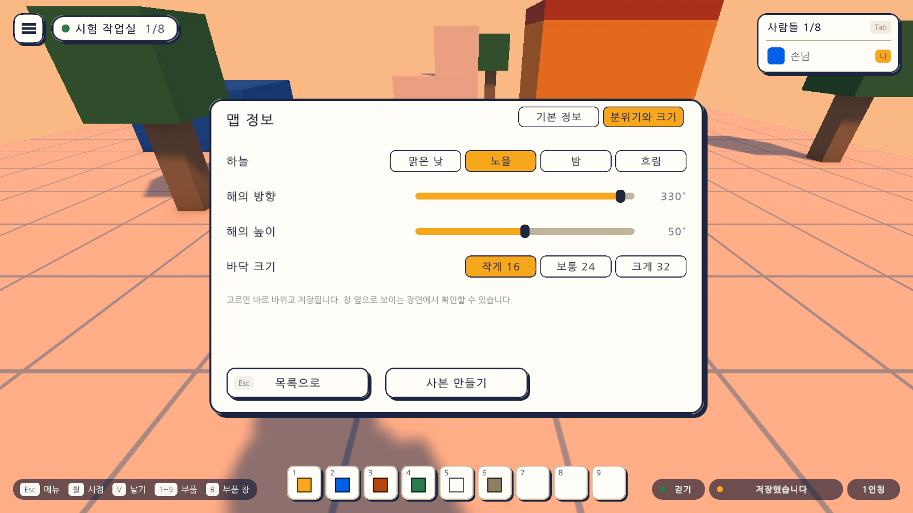
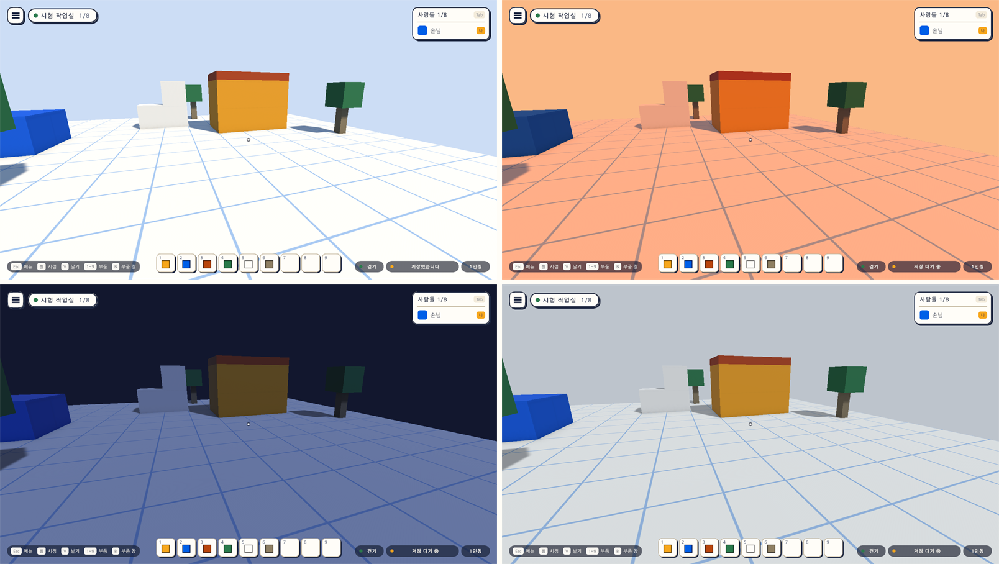
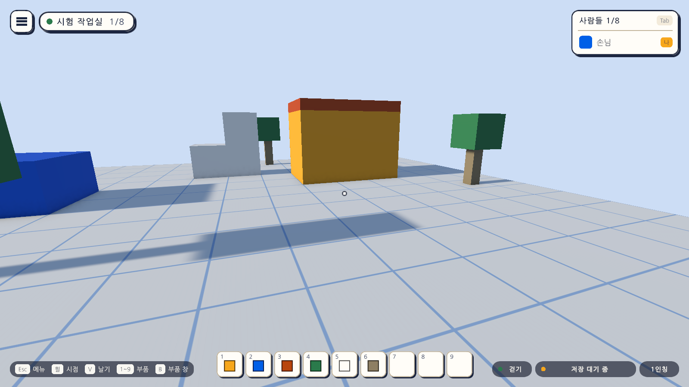
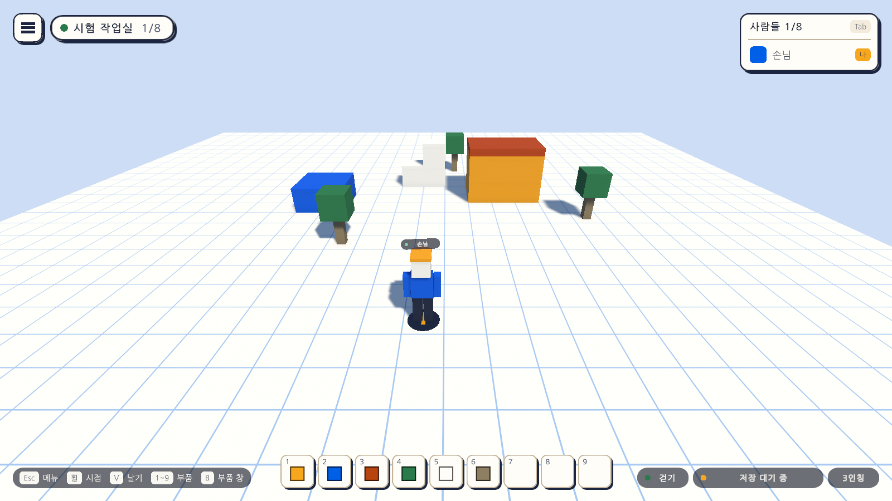
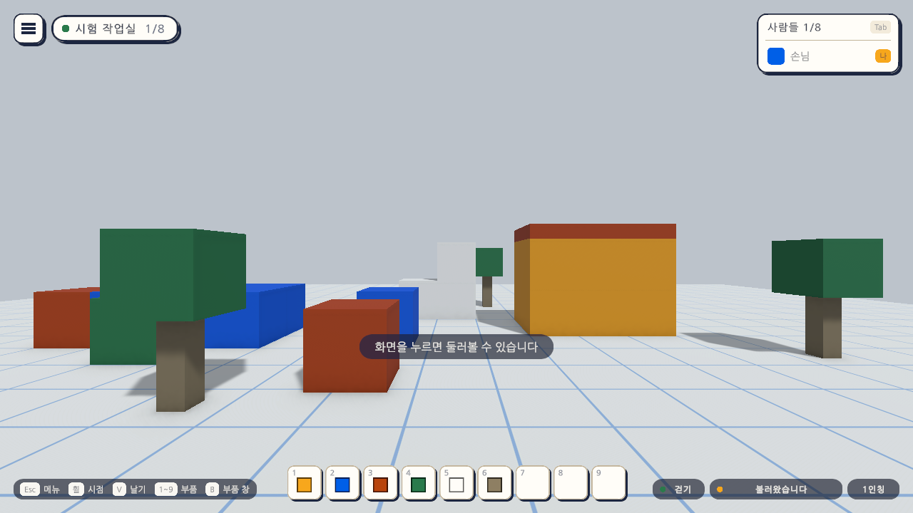

# 23일차 개발 일지 — 맵의 분위기와 크기

- **날짜**: 2026-10-10
- **단계**: 1-A 혼자 만들기
- **목표**: 맵마다 하늘, 해의 방향과 높이, 바닥의 크기를 정할 수 있게 한다
- **검사 기준**: 고른 하늘·해·바닥이 바로 보이고 맵 파일에 저장되어 다시 켜도 남는다. 맵마다 따로다. 분위기를 정하지 않은 전의 맵은 22일차까지와 똑같이 보인다. 바닥을 줄일 때 바깥에 블록이나 시작 위치가 남으면 줄이지 않고 까닭을 알린다
- **결과**: ✅ 완료(자동 검사 601개 통과, Windows 빌드와 실행 확인 통과). 화면의 단추를 손으로 눌러 보는 확인은 하지 못했다. VR 쪽은 가상 기기로만 확인

---

## 오늘 한 일 요약

22일차까지 모든 맵은 같은 하늘, 같은 해, 같은 크기(가로세로 16)의 바닥이었다. 오늘부터 맵마다 정한다.

| 하는 일 | 방법 |
|---|---|
| 정하는 곳 | 맵 목록(`M`)에서 지금 맵의 줄의 "정보" → 오른쪽 위의 "분위기와 크기" |
| 하늘 | 맑은 낮, 노을, 밤, 흐림 가운데 하나 |
| 해의 방향 | 막대. 15도씩 한 바퀴. 그림자가 눕는 쪽이 바뀐다 |
| 해의 높이 | 막대. 10도에서 90도까지 5도씩. 낮을수록 그림자가 길다 |
| 바닥 크기 | 작게 16, 보통 24, 크게 32(한 변의 길이. 블록 한 변이 1) |

고르면 바로 바뀌고 저장된다. 고르는 동안에는 창 뒤의 어두운 막이 걷혀, 창 옆으로 보이는 장면에서 바로 확인할 수 있다.

하늘 넷(왼쪽 위부터 맑은 낮, 노을, 밤, 흐림). 같은 자리에서 찍었다.

해를 낮추고 방향을 돌린 모습(방향 90도, 높이 20도).

바닥을 32로 넓힌 모습.

## 정한 것

시작 전에 말씀드린 가안대로 만들었다.

| 정한 것 | 만든 대로 |
|---|---|
| 하늘 | 네 가지에서 고름. 색을 직접 고르는 화면은 넣지 않음 |
| 해 | 방향과 높이를 막대로 |
| 바닥 크기 | 16, 24, 32 가운데 하나. 높이(12)는 그대로 |
| 줄일 때 바깥에 블록이나 시작 위치가 남으면 | 줄이지 않고 까닭을 알림. 블록을 지우거나 옮겨 주지 않음 |
| 고치는 곳 | 맵 정보 창을 "기본 정보"와 "분위기와 크기" 두 갈래로 나눔 |
| 맵 형식 | 3판 → 4판. 3판의 파일은 사본을 남기고 올려 읽음 |
| 정하지 않은 맵 | 22일차까지의 모습 그대로(맑은 낮, 해는 방향 330도·높이 50도, 바닥 16) |

만들면서 더 정한 것:

- **하늘마다 햇빛의 색과 세기, 그늘의 밝기가 함께 정해져 있다.** 하늘만 고르면 된다. 노을은 붉은 햇빛, 밤은 푸르고 약한 빛, 흐림은 희고 부드러운 빛이다.
- **"분위기와 크기"에는 저장 단추가 없다.** 고르는 대로 저장되기 때문이다. 이름과 설명의 "저장"은 "기본 정보"에서만 보인다.
- **지금 열려 있는 맵만 고칠 수 있다.** 다른 맵의 정보를 보면 그 맵의 값은 보이지만 흐리게 잠겨 있고 "이 맵을 연 뒤에 바꿀 수 있습니다"라고 알린다. 고른 결과를 바로 볼 수 없는 맵을 고치게 하지 않으려는 것이다.
- **새 맵은 맑은 낮과 16으로 시작한다.** 지금 맵의 분위기를 이어받지 않는다. 사본은 원래 맵의 분위기와 크기를 그대로 갖는다.
- **바닥을 넓혀도 놓을 수 있는 블록의 수(500)는 그대로다.**
- **줄일 수 없을 때는 고른 칸이 원래 크기로 돌아온다.** 알림은 "바깥에 블록 3개가 남아 바닥을 줄일 수 없습니다 · 그 블록을 먼저 옮기거나 지우세요"처럼 남는 수를 알려 준다.
- **파일의 바닥 크기가 16·24·32가 아니면 가장 가까운 크기로 읽는다.** 그 크기 밖의 블록은 다른 범위 밖의 블록처럼 읽지 않고 그 수를 알린다.

## 작업 내역

### 1. 맵 형식 4판 (`MapDocument`, `MapEnvironment`)

- 맵 파일에 `environment`(하늘의 이름 `sky`, 해의 방향 `sunYaw`, 해의 높이 `sunPitch`)가 생겼다.
- 파일의 범위(`bounds`)를 이제 실제로 쓴다. 3판까지는 참고용이었고 모든 맵이 같은 크기였다.
- 3판의 파일은 분위기가 없으므로 맑은 낮으로 읽는다. 원래 파일은 `.v3.bak`으로 남는다.
- 읽은 값은 다듬는다. 모르는 하늘은 맑은 낮, 방향은 0 이상 360 미만, 높이는 10~90도, 숫자가 아니면 처음 값.
- `MapSky`에 하늘 넷의 값이, `MapSize`에 고를 수 있는 크기와 범위 계산이 있다.

### 2. 범위 바꾸기 (`BlockMap`, `BlockWorld`)

- `BlockMap.Resize`: 범위를 바꾼다. 새 범위 밖에 남는 블록이 하나라도 있으면 바꾸지 않고 그 수를 알려 준다. 블록의 크기까지 본다(가운데는 안이어도 면이 벗어나면 밖).
- `BlockWorld.SetFloorSize`: 바닥의 한 변으로 범위를 바꾸고, 바뀌었다고 알린다. 맵을 읽을 때 파일의 범위에 맞춘다.

### 3. 씬에 보이기 (`WorldEnvironment`, 새로)

- 하늘은 카메라의 바탕색이다. PC와 VR의 카메라를 함께 맞춘다.
- 해의 방향·색·세기를 맞추고, 그늘진 면의 밝기(둘레의 빛)를 하늘에 맞게 바꾼다.
- 맑은 낮은 씬의 처음 값을 그대로 쓴다. 다른 하늘에 갔다가 돌아오면 처음 값으로 되돌린다.
- 바닥은 판을 늘리고 모눈 무늬를 그만큼 되풀이한다. 모눈 한 칸은 늘 블록 한 변이다.

### 4. 지금 맵 고치기 (`MapAutoSave`)

- `SetSky`, `SetSun`, `SetFloorSize`를 더했다. 바로 보이고 다른 변경처럼 잠시 뒤에 저장된다.
- 맵을 열거나 새로 만들 때 그 맵의 분위기와 크기를 씬에 보인다.

### 5. 맵 정보 창 (`MapInfoView`, `GameUi`)

- 오른쪽 위에 갈래를 고르는 칸("기본 정보", "분위기와 크기")이 생겼다. 전에 있던 것은 모두 "기본 정보"에 있다.
- "분위기와 크기"를 보는 동안에는 창 뒤의 어두운 막을 걷는다. 창 밖을 눌러도 마우스가 잡히지 않는 것은 그대로다.
- 창을 닫았다 열면 "기본 정보"부터 보인다.

### 6. VR

- 갈래의 칸, 하늘, 해의 막대, 바닥 크기를 오른손 광선으로 누른다. 글자를 쓰는 일이 없어 PC와 할 수 있는 일이 같다.

### 7. 그 밖

- `Day23Setup`(메뉴 `Atelier Verse/23일차 셋업 실행`): 씬에 `WorldEnvironment`를 두어 해·바닥·블록 세계에 잇고, 게임 화면 프리팹을 다시 조립한다. 바닥에서 "움직이지 않는 물체" 표시를 뗀다(실행 중에 넓이가 바뀌므로).
- 빌드 도구 `scripts/build-windows.mjs`에 `--sky`, `--floor`, `--sky-check`를 더했다. 실행 파일을 그 하늘과 바닥으로 켜 보는 확인이다(이번 실행에 보이는 것만 바꾸고 맵에는 적지 않는다).
- 맵 형식 문서 `docs/MAP-FORMAT.md`를 4판으로 고쳤다.

## 검사

| 항목 | 방법 | 결과 |
|---|---|---|
| 스크립트 컴파일 | 명령줄 실행 로그 | 오류 없음 |
| 23일차 셋업 적용 | 명령줄에서 실행 | 적용됨 |
| 분위기와 크기의 규칙, 4판, 범위 바꾸기 | 편집 모드 테스트 17개 더함(`MapEnvironmentTests` 9개 새로, `MapDocumentTests` 4개, `BlockMapTests` 3개, `MapLibraryTests` 1개) | 통과 |
| 그 밖의 편집 모드 테스트 | 327개 | 통과 |
| PC에서 분위기와 크기 | 플레이 모드 테스트 `EnvironmentPlayTests` 12개(새로) | 통과 |
| VR에서 분위기와 크기 | 플레이 모드 테스트 `XrMapInfoPlayTests`에 1개 더함(가상 기기) | 통과 |
| 그 밖의 플레이 모드 테스트 | 244개. 전부터의 테스트가 그대로 통과 | 통과 |
| 테스트가 프로젝트 설정을 바꾸지 않는지 | 테스트 앞뒤의 품질 설정 파일을 견줌 | 같음 |
| Windows 빌드와 평소 실행 | `node scripts/build-windows.mjs --run` | 성공, 예외 없음 |
| **정하지 않은 맵이 전과 같게 보이는지(실행 파일)** | 22일차 실행 파일의 그림과 23일차 실행 파일의 그림을 점마다 견줌 | 같음(평균 차이 0.009%, 눈에 띄게 다른 점 없음) |
| **다른 하늘에 갔다가 돌아왔을 때(실행 파일)** | `--sky-check`: 밤 → 맑은 낮 → 원래 하늘. 그늘의 밝기 값이 처음과 같은지 로그로 보고, 평소 실행의 그림과 견줌 | 같음(평균 차이 0.010%). 처음에는 달랐다. 아래 "검사에서 찾은 문제" 1번 |
| 실행 파일에서 하늘과 넓힌 바닥 | `--sky night`, `--sky sunset --floor 24`, `--sky cloudy --floor 32` | 그 하늘과 그 넓이로 보임, 예외 없음 |
| `-vr` 실행(VR 프로그램 없는 PC) | `node scripts/build-windows.mjs --skip-build --run --vr` | 키보드·마우스로 돌아옴, 예외 없음 |
| 실제 맵이 4판으로 오르는 것 | 평소 실행 앞뒤의 실제 맵 파일을 견줌 | 블록 24개·이름·설명·시작 위치가 그대로. 분위기는 맑은 낮, 범위는 16. 원래 파일은 `.v3.bak`으로 남음(내용이 원래와 같음) |
| 확인 실행이 실제 맵을 바꾸지 않는지 | 4판으로 오른 뒤의 확인 실행 10번 앞뒤로 파일을 견줌(하늘과 바닥을 명령줄로 바꿔 켠 것 포함) | 바뀌지 않음 |
| 화면 모양 | 테스트가 찍은 그림 51장 가운데 오늘의 7장을 눈으로 확인 | 위 그림 |
| **실행 파일에서 손으로 눌러 보기** | - | **하지 못함.** 테스트는 단추와 막대의 값을 직접 바꾼다. 실행 파일의 확인은 명령줄로 하늘과 바닥을 정해 켠 것이다 |
| **하늘의 색이 보기 좋은지** | - | **사람의 눈으로 정해야 함.** 값은 그림을 보며 제가 정했다 |
| **헤드셋에서의 창과 하늘** | - | **하지 못함.** 이 컴퓨터에 VR 프로그램이 없다 |

편집 모드 테스트는 모두 344개, 플레이 모드 테스트는 257개다. 플레이 모드 257개는 그림 찍기 21개를 포함한 수이고, `-captureDir` 없이 돌리면 그 21개는 건너뛴다. 테스트와 빌드는 마지막 코드 상태에서 돌렸다.

실행 파일을 흐림과 바닥 32로 켠 그림(`--sky cloudy --floor 32`):

새로 넣은 테스트가 확인하는 것은 다음과 같다.

| 묶음 | 확인하는 것 |
|---|---|
| 하늘의 값 | 넷이고 첫째가 맑은 낮. **맑은 낮의 값이 22일차까지 씬에 적혀 있던 값과 같음**(하늘의 색, 햇빛의 색과 세기, 해의 방향). 밤이 가장 어두움 |
| 읽은 값 다듬기 | 모르는 하늘, 음수나 한 바퀴를 넘는 방향, 땅 아래나 머리 위를 넘는 높이, 숫자가 아닌 값 |
| 크기 | 16·24·32만 받음. 파일의 범위는 가장 가까운 크기로 읽음 |
| 4판 | 3판의 파일을 맑은 낮과 16으로 올려 읽고 설명·시작 위치·블록은 그대로. 분위기와 크기가 저장되고 다시 읽힘. **저장할 때 분위기가 처음 값으로 돌아가지 않음** |
| 범위 바꾸기 | 넓히면 밖이던 자리에 놓임. 줄일 때 밖에 남는 블록이 있으면 바꾸지 않고 수를 알림. 블록을 지워서 맞추지 않음 |
| 보이는 것 | 하늘을 고르면 PC와 VR의 카메라 바탕색, 햇빛, 그늘의 밝기가 바뀜. 해를 바꾸면 해가 그쪽에 섬. 바닥을 넓히면 판과 모눈 무늬가 함께 늘어남 |
| 맑은 낮으로 돌아오기 | 노을과 밤을 거쳐 돌아오면 그늘의 밝기가 처음과 같고, **처음에 찍은 그림과 돌아와서 찍은 그림이 같음** |
| 줄이기 | 바깥에 블록이 남으면 줄이지 않고 수를 알림. 블록을 다 치워도 시작 위치가 바깥이면 줄이지 않음. 시작 위치를 되돌리면 줄어듦 |
| 맵마다 | 새 맵은 맑은 낮과 16. 맵을 오가면 그 맵의 하늘·해·바닥이 보임. 다시 켜도 남음. 파일에 4판으로 적힘 |
| 3판의 맵 열기 | 전과 같은 모습으로 열리고 `.v3.bak`이 원래 내용 그대로 남음 |
| 창 | 갈래를 오가면 내용과 어두운 막, 저장 단추가 바뀜. 맵의 지금 값이 골라져 있음. 막대의 한 칸이 한 단계. 줄일 수 없으면 까닭을 알리고 칸이 원래 크기로 돌아옴 |
| 다른 맵 | 열려 있지 않은 맵의 값은 보이지만 눌리지 않고, 눌러도 어느 맵도 바뀌지 않음 |
| VR | 갈래의 칸·하늘·해의 막대·바닥 크기를 광선으로 누름 |

### 검사에서 찾은 문제와 수정

1. **실행 파일에서만, 다른 하늘에 갔다가 맑은 낮으로 돌아오면 그늘이 새까맣게 남았다.** 에디터의 테스트는 모두 통과했는데, 실행 파일을 켜서 "밤으로 갔다가 돌아오기"를 시켜 보고 그림을 견주니 달랐다. 까닭은 "씬의 처음 그늘 밝기"를 기억해 두는 때였다. 씬이 열리는 순간에 기억했는데, 실행 파일에서는 그 순간에 값이 아직 0이고 바로 다음 순간부터 제 값이 된다(에디터에서는 처음부터 제 값이라 드러나지 않았다). 기억하는 때를 한 박자 뒤로 옮겨 고쳤고, 기억한 값이 비어 있으면 0을 되돌려 놓지 않게도 했다. 고친 뒤에는 실행 파일의 그림이 같다. 이 확인(`--sky-check`)은 빌드 도구에 남겨 두었다.
2. **"분위기와 크기"에 저장 단추가 그대로 보였다.** 바로 아래에 "고르면 바로 바뀌고 저장됩니다"라고 적혀 있어 헷갈릴 수 있었다. 찍힌 그림을 보고 알았다. 그 갈래에서는 감췄다.

## 직접 확인하는 방법

1. `unity/Builds/Windows/AtelierVerse.exe`를 켠다(또는 에디터에서 Sandbox 씬을 재생한다).
2. `M`으로 맵 목록을 열고 지금 맵의 줄에서 "정보"를 누른 뒤, 오른쪽 위의 "분위기와 크기"를 누른다.
3. 하늘을 하나씩 눌러 본다. 창 옆으로 보이는 하늘과 블록의 색이 바로 바뀌는지 본다. "맑은 낮"으로 돌아왔을 때 처음과 같은지 본다.
4. 해의 방향과 높이 막대를 끌어 본다. 그림자가 따라 움직이는지 본다.
5. 바닥 크기를 "크게 32"로 바꾸고 창을 닫는다. 넓어진 자리까지 걸어가 블록을 놓아 본다.
6. 그 블록을 둔 채 다시 "작게 16"을 눌러 본다. 줄지 않고 까닭을 알리는지 본다.
7. 게임을 껐다 켜서 고른 하늘과 바닥이 남아 있는지 본다.

## 알아 둘 점

- **이 컴퓨터의 실제 맵이 4판으로 올라갔다.** 오늘 실행 파일을 확인하면서 열렸기 때문이다. 내용은 그대로이고(블록 24개, 맑은 낮, 바닥 16), 올리기 전의 파일은 같은 폴더에 `local.map.json.v3.bak`으로 남아 있다. **22일차까지의 실행 파일은 4판의 파일을 읽지 못한다.**
- 20일차에 알린 실제 맵의 블록 두 개는 그대로 두었다.
- **하늘은 한 가지 색이다.** 구름, 별, 해와 달의 모양은 없다. 밤에도 블록이 스스로 빛나지는 않는다.
- **바닥 밖은 여전히 낭떠러지가 아니라 빈 곳이다.** 바닥의 끝에는 벽이 없다. 떨어지면 전처럼 시작 위치로 돌아온다.
- **바닥을 넓혀도 그림자가 그려지는 거리는 그대로다**(화면 품질 낮음 30, 보통 50, 높음 70). 바닥 32의 끝에서 끝은 45쯤이라, 화면 품질이 낮음이면 멀리 있는 블록의 그림자가 보이지 않는다.
- **높이는 고를 수 없다.** 모든 맵이 12다.
- **대표 그림은 저절로 다시 찍히지 않는다.** 하늘을 바꾼 뒤에는 "기본 정보"에서 다시 찍어야 맵 목록의 그림이 바뀐다.
- 해의 막대는 끄는 동안 계속 바뀌고, 손을 뗀 뒤 잠시 뒤에 저장된다.
- 분위기와 크기를 바꾼 것은 `Ctrl+Z`로 되돌릴 수 없다. 되돌리기는 블록에만 듣는다.

## 다음 일차

`docs/BACKLOG.md` 2절의 순서대로 **영역 고르기와 복사·붙여넣기, 네모로 채우기**를 한다. 사용자가 끌기·소리·설정·휴지통·분위기를 써 본 결과나 헤드셋으로 켜 본 결과가 있으면 그것부터 고친다.
